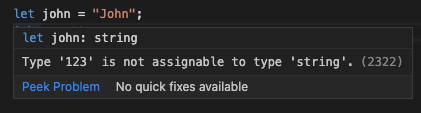

# Day 11: TypeScript Data Type

10 ngày qua, chúng ta đã cùng nhau khám phá một số concept của **Angular** và chúng ta đã cũng đã cùng nhau viết một số đoạn code rồi đúng không? Và những đoạn code này chính là **TypeScript** (**TS**). Khi làm việc với **Angular** thì **TS** là một kiến thức rất quan trọng mà các bạn cần phải nắm được. Và hôm nay, ngày 11, chúng ta sẽ cùng nhau khám phá về những điều cơ bản của **TS** nhé.

> Kiến thức nền của **TS** rất quan trọng để chúng ta đi sâu vào những concept khó nhai hơn của **Angular**, điển hình là `Dependency Injection`

## TypeScript là gì?

**TS** là một **superset** của **JavaScript** (**JS**). Khi các bạn cài đặt **TS** vào hệ thống của mình, các bạn sẽ có quyền truy xuất đến được 1 **Command Line Interface** (**CLI**) gọi là **TypeScript Compiler** (`tsc`). Nhiệm vụ của `tsc` chính là _compile_ code **TS** về **JS** để trình duyệt (hoặc runtime environment như **NodeJS**) có thể hiểu và xử lý được.

Để có cái nhìn bao quát hơn về **superset**, các bạn xem hình sau:


Theo như hình minh hoạ thì **TS** = **JS** + **something else**.

## TypeScript - "something else"

Đầu tiên và quan trọng nhất là **TS** cung cấp **Static Types**. **JS** là một ngôn ngữ mang tính chất `Dynamic` và vì thế nên **JS** rất _thoải mái_, nếu không muốn nói là _quá thoải mái_. Các bạn xem qua ví dụ sau:

```javascript
let john = 'John';
john = 123;
```

Các bạn có thấy gì lạ không? Đó là biến `john` được khởi tạo là 1 chuỗi `"John"` và sau đó lại được gán cho 1 số `123`. Điều này hoàn toàn hợp lệ trong **JS**. Nhìn qua thì có vẻ _thoải mái_, nhưng rất dễ dẫn đến những lỗi ngớ ngẩn khi các bạn phát triển phần mềm, nếu như không cẩn thận.

Cùng 1 đoạn code trên nhưng trong **TS** thì **TS** trước tiên sẽ _tự cung cấp type_ cho biến `john` (khi được gán giá trị `"John"`) một `primitive type` là `string` vì giá trị `"John"` là dạng chuỗi (`string`). Khi giá trị `123` được gán cho biến `john` thì **TS** sẽ bắt lỗi tại thời điểm code được _compile_ (**Compilation Time Error**) vì `123` (`number`) thì không thể gán cho 1 biến có type là `string` được.

> Từ đoạn này trở xuống, mình sẽ gọi việc _tự cung cấp type_ là **infer**



> Lỗi trên là **Compilation Time Error**. Các bạn sẽ thường gặp lỗi này ở thời điểm _viết code_. Tuy nhiên, việc các bạn nhận được error ở thời điểm _viết code_ thì đó là nhờ TextEditor/IDE trợ giúp chứ trên thực tế, đoạn error trên vẫn là 1 **Compilation Time Error** nhé.

#### Default Types

Sau đây là danh sách các **default types** trong **TS**

```typescript
let someString: string;
let someNumber: number;
let someBoolean: boolean;
let something: any;
let someStringArray: string[]; // tương tự cho number[], boolean[], any[]
let someObject: object;
let someNull: null;
let someUndefined: undefined;
let someUnknown: unknown;
let someNever: never;
let someTyple: [string, number];
let someVoidFunction: () => void; // một hàm không trả về giá trị gì sau khi thực thi
let someFunction: () => string; // một hàm trả về giá trị có type "string" sau khi thực thi
```

> `someVoidFunction` và `someFunction` đều có type là `Function` nhưng mình ghi cả 2 để cho các bạn thấy được type `void`.

#### Interface/Type

**TS** cung cấp `Interface` và `Type` để các bạn có thể định nghĩa được **type** cho một đối tượng (`object`)

```typescript
interface User {
  firstName: string;
  lastName: string;
  age: number;
  job?: string;
}

// hoặc dùng type. Chỉ nên dùng 1 trong 2 cho cùng 1 tên (ở đây là User)
type User = {
  firstName: string;
  lastName: string;
  age: number;
  job?: string;
};

const john: User = {
  firstName: 'John',
  lastName: 'Doe',
  age: 20,
  job: 'Student',
};
const susan: User = {
  firstName: 'Sue',
  lastName: 'Smith',
  age: 40,
};
```

Ở đoạn code trên, các bạn sẽ thấy chúng ta khai báo một `interface User` bao gồm `firstName`, `lastName`, `age`, và `job`. Các bạn hiểu nôm na `interface` giống như một cái _khuôn bánh_ vậy, các bạn muốn _bánh_ của mình có hình dạng như thế nào thì chúng ta sẽ sử dụng cái _khuôn_ có hình dạng như vậy. Kế tiếp, các bạn để ý cú pháp `job?: string` nhé. Đây gọi là `Optional Property`. Ở trong `User`, `job` là một property **không-bắt-buộc**, nghĩa là có cũng được, không có cũng không sao trong khi 3 properties còn lại là **bắt buộc phải có**.

Việc sử dụng `interface` sẽ giúp cho trình soạn thảo (`text editor`) gợi ý cho object của các bạn có những properties gì trên object đó. Khi type `john.`, `text edior` sẽ gợi ý được : `firstName`, `lastName`, `age`, và `job` cho các bạn lựa chọn khi truy xuất. Điều này giảm thiểu việc sai lỗi chính tả khi các bạn viết code.

> `Interface` và `Type` trong nhiều trường hợp có thể sử dụng qua lại được. Tuy nhiên, các bạn nên chọn 1 trong 2 và giữ chuẩn này trong toàn bộ dự án của mình. `Interface` và `Type` có 1 số điểm khác biệt, các bạn có thể xem thêm tại: [interface-vs-type](https://medium.com/@martin_hotell/interface-vs-type-alias-in-typescript-2-7-2a8f1777af4c)

#### Class

`class` là cú pháp xuất hiện trong **ES6** (và xuất hiện rất nhiều ở những ngôn ngữ lập trình hướng đối tượng khác). Trong **JS**, `class` thực chất chỉ là _syntactic sugar_ cho **Prototypal Inheritance** ([Prototypal Programming](https://en.wikipedia.org/wiki/Prototype-based_programming), hay các bạn hay gọi trong **JS** là **prototype chain**).

**TS** đem lại support hàng đầu cho `class` với hệ thống typings khá mạnh mẽ. Để hiểu rõ hơn về `class`, các bạn cần có kiến thức về **Object Oriented Programming** ([**OOP**](https://en.wikipedia.org/wiki/Object-oriented_programming)). Ở đây, chúng ta sẽ chỉ khám phá qua các cú pháp dùng `class` trong **TS**

```typescript
class User {
  firstName: string;
  lastName: string;
  age: number;
  job?: string;

  constructor(firstName: string, lastName: string, age: number, job?: string) {
    this.firstName = firstName;
    this.lastName = lastName;
    this.age = age;
    this.job = job;
  }
}
```

**TS** cũng hỗ trợ **Access Modifier** cho `class` với các keywords như: `public`, `private`, và `protected`. Kết hợp với các **Access Modifer**, các bạn có thể khai báo `class User` với cú pháp ngắn gọn sau

```typescript
class User {
  constructor(
    public firstName: string,
    public lastName: string,
    public age: number,
    public job?: string
  ) {}
}
```

> Tới đây, chắc chắn sẽ có thắc mắc là dùng `class` hay dùng `interface`. Các bạn đọc qua bài viết này nhé: [class-vs-interface-typescript](https://ultimatecourses.com/blog/classes-vs-interfaces-in-typescript)

#### Generics

`Generics` là một trong những tính năng cực kỳ tốt mà **TS** mang lại. `Generics` sẽ gíup các bạn viết code theo hướng **Abstraction** dễ dàng hơn, theo sát hơn **SOLID Principles** ([**SOLID**](https://en.wikipedia.org/wiki/SOLID))

```typescript
abstract class BaseService<T> {
  protected model: Model<T>;

  find(): T[] {
    return this.model.findAll();
  }

  findOne(id: number): T {
    return this.model.findById(id);
  }
}

class DogService extends BaseService<Dog> {
  constructor(dogModel: Model<Dog>) {
    super();
    this.model = dogModel;
  }
}

class CatService extends BaseService<Cat> {
  constructor(catModel: Model<Cat>) {
    super();
    this.model = catModel;
  }
}
```

Ví dụ trên là một trong những cách áp dụng **Abstraction** vào code của các bạn. Ở đây, mình viết 2 hàm `find()` và `findOne()` trong `abstract class BaseService`. Cú pháp `<T>` chính là `Generics`, hay còn gọi là `Type Parameter`. `BaseService` nhận vào 1 `Type Parameter` gọi là `T`. Cũng như parameter thông thường, các bạn có thể đặt bất cứ tên gì: `<T>`, `<K>`, `<Type>`, `<Props>` ..v.v.. Khi mình cho `DogService` và `CatService extends BaseService`, thì trên `DogService` sẽ có 2 hàm: `find()` và `findOne()` với đúng type `Dog` mà mình ko cần phải viết lại 2 hàm trên trong `DogService`. (tương tự, `CatService` cũng vậy, và với đúng type là `Cat`). Trên đây chỉ là một ví dụ nhỏ. Để hiểu và áp dụng nhiều, các bạn phải luyện tập và hiểu **Object-Oriented Programming**

## Tại sao lại là TypeScript?

Như những gì đã nhắc đến ở trên, **TS** giúp developers phát triển phần mềm một cách tường minh hơn với những `type definition` mà **TS** cũng như các thư viện dùng cho **TS** cung cấp. Với khả năng áp dụng tính thừa kế với những `syntax` quen thuộc trong **OOP** như: `abstract`, `class`, và `type parameter <T>`, **TS** giúp developers có thể phát triển ứng dụng một cách nhanh, tường minh, chính xác, dễ bảo trì và mở rộng hơn.

Trong thời gian trở lại đây, **TS** luôn có thứ hạng rất cao (hạng 1 hoặc hạng 2) về **Ngôn ngữ được yêu thích** trong những cuộc khảo sát có tiếng tăm như [**StackOverflow Survey**](https://insights.stackoverflow.com/survey/2020#technology-most-loved-dreaded-and-wanted-languages-loved).

Nhưng cũng như bất cứ thứ gì trên đời (bất cứ không nhỉ? 🤨) thì đều có mặt tốt mặt xấu. **TS** mang lại nhiều lợi ích, nhưng cũng mang lại không ít phiền toái. Điển hình như: code nhiều hơn vì những định nghĩa `types` (type definition), `conditional check` nghiêm khắc hơn gây khó khăn và các thư viện bên ngoài phải có `type defs` (`d.ts` file) để hỗ trợ **TS**, nếu không thì cũng như không…: [TypeScript Tax](https://medium.com/javascript-scene/the-typescript-tax-132ff4cb175b). Nhưng lợi ích của **TS** mang lại thực sự là lớn hơn so với phiền phức. Việc **Angular** chọn **TS** làm ngôn ngữ chính cũng giúp chúng ta thấy được tầm quan trọng về **structure**, **maintainability**, và **scalability** của chính **Angular**.

## Summary

Như vậy ngày hôm nay chúng ta đã tìm hiểu thêm về **What** **How** và **Why** của **TypeScript**. Với những kiến thức nền này và cộng thêm luyện tập, các bạn sẽ cảm thấy tự tin hơn khi làm việc cùng **Angular** trong các ngày cũng như các dự án của bản thân trong thời gian sắp tới.

## Author

[Chau Tran](https://github.com/nartc)

`#100DaysOfCodeAngular` `#100DaysOfCode` `#AngularVietNam100DoC_Day11`
