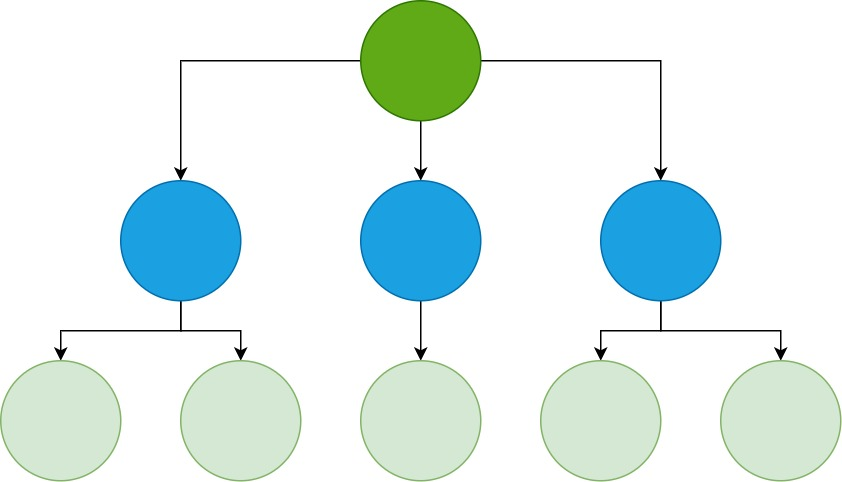

# Day 16: Dependency Injection trong Ứng Dụng Angular

Trong Day 15 chúng ta đã tìm hiểu và thấy rằng Dependency Injection được sử dụng trong ứng dụng Angular để tạo ra các Service, và các Service này được inject vào các class (ví dụ: component, directive, service) khác thông qua constructor injection. Vậy ngoài để tạo ra Service thì nó còn có thể sử dụng ở những đâu nữa.

## Inject parent component to child component

Angular application là một component tree có dạng như sau.


Do Angular support DI đến tận level của từng Component, nên chúng ta hoàn toàn có thể inject parent component vào child component như ví dụ sau.

Giả sử chúng ta đang xây dựng Tabs Component để thao tác với các tab. Chúng ta sẽ có hai component bao gồm `TabGroupComponent` để quản lý các tab panel và `TabPanelComponent` tương ứng với mỗi panel.

```html
<app-tab-group>
  <app-tab-panel title="Tab 1">content tab 1</app-tab-panel>
  <app-tab-panel title="Tab 2">content tab 2</app-tab-panel>
  <app-tab-panel title="Tab 3">content tab 3</app-tab-panel>
  <!-- More tab panel -->
</app-tab-group>
```

Lúc này mỗi khi có một tab panel được thêm vào hay xóa đi thì tab group phải biết được để có thể xử lý tương ứng như: hiển thị các tab title, handle event khi select tab nào đó từ tab title.

Và trong mỗi component của Angular chúng ta sẽ được cung cấp sẵn hai lifecycle method quan trọng để biết khi nào một component được tạo ra và sắp bị destroy đó là `OnInit` và `OnDestroy`. Đây chính là những thời điểm thích hợp để `TabPanelComponent` có thể tương tác lại với `TabGroupComponent`.

Đến thời điểm hiện tại, bạn hoàn toàn có thể sử dụng `EventEmitter` để notify cho parent component biết được các thời điểm tương ứng. Nhưng cũng có một cách khác, đó chính là inject parent component vào child component và thực hiện các hành động tương ứng.

Giả sử bạn cài đặt **tab-group.component.ts** như sau:
```ts
@Component({
  selector: 'app-tab-group',
  templateUrl: './tab-group.component.html',
  styleUrls: ['./tab-group.component.css']
})
export class TabGroupComponent implements OnInit {
  tabPanelList: TabPanelComponent[] = [];

  @Input() tabActiveIndex = 0;
  @Output() tabActiveChange = new EventEmitter<number>();
  constructor() { }

  ngOnInit() {
  }

  selectItem(idx: number) {
    this.tabActiveIndex = idx;
    this.tabActiveChange.emit(idx);
  }

  addTabPanel(tab: TabPanelComponent) {
    this.tabPanelList.push(tab);
  }
  removeTabPanel(tab: TabPanelComponent) {
    let index = -1;
    const tabPanelList: TabPanelComponent[] = [];
    this.tabPanelList.forEach((item, idx) => {
      if (tab === item) {
        index = idx;
        return;
      }
      tabPanelList.push(item);
    });
    this.tabPanelList = tabPanelList;
    if (index !== -1) {
      this.selectItem(0);
    }
    
  }

}
```

Và đây là phần UI cho **tab-group.component.html**:
```html
<div class="tab-header">
  <div class="tab-item-header" role="presentation" *ngFor="let tab of tabPanelList; index as idx" (click)="selectItem(idx)">
    {{tab.title}}
  </div>

</div>

<div class="tab-body">
  <ng-container *ngFor="let tab of tabPanelList; index as idx">
    <div *ngIf="idx === tabActiveIndex">
      <ng-container *ngTemplateOutlet="tab.panelBody"></ng-container>
    </div>
  </ng-container>
</div>
```
Việc của chúng ta bây giờ chỉ là inject và call các method để register và remove:

```ts
@Component({
  selector: 'app-tab-panel',
  template: `
<ng-template>
  <ng-content></ng-content>
</ng-template>
  `,
  styles: ['']
})
export class TabPanelComponent implements OnInit, OnDestroy {
  @Input() title: string;
  @ViewChild(TemplateRef, {static: true}) panelBody: TemplateRef<unknown>;
  constructor(private tabGroup: TabGroupComponent) { }

  ngOnInit() {
    this.tabGroup.addTabPanel(this);
  }
  ngOnDestroy() {
    this.tabGroup.removeTabPanel(this);
  }

}
```

## Provide một tab group khác có cùng APIs

Như bạn có thể thấy, tab group của chúng ta ở trên có UI cực kỳ đơn giản, hoặc trong trường hợp bạn muốn có UI riêng, đúng như design system (bootstrap, ant design, etc) đang dùng trong application thì sao? Chả lẽ chúng ta không reuse được gì ở trên.

Đây là nơi tỏa sáng của DI. Bạn chỉ cần đơn giản là provide một provider để override là được.

**bs-tab-group.component.ts**
```ts
@Component({
  selector: 'app-bs-tab-group',
  templateUrl: './bs-tab-group.component.html',
  styleUrls: ['./bs-tab-group.component.css'],
  providers: [
    {
      provide: TabGroupComponent,
      useExisting: BsTabGroupComponent
    }
  ]
})
export class BsTabGroupComponent extends TabGroupComponent {
}
```
**bs-tab-group.component.html**
```html
<ul class="nav nav-tabs" role="tablist">
  <li class="nav-item" role="presentation" *ngFor="let tab of tabPanelList; index as idx" (click)="selectItem(idx)">
    <a class="nav-link" [class.active]="idx === tabActiveIndex" role="tab" aria-selected="true">{{tab.title}}</a>
  </li>

</ul>

<div class="tab-content">
  <ng-container *ngFor="let tab of tabPanelList; index as idx">
    <div class="tab-pane active" role="tabpanel" *ngIf="idx === tabActiveIndex">
      <ng-container *ngTemplateOutlet="tab.panelBody"></ng-container>
    </div>
  </ng-container>
</div>
```

Template khi sử dụng:
```html
<app-bs-tab-group>
  <app-tab-panel title="Tab 1">content tab 1</app-tab-panel>
  <app-tab-panel title="Tab 2">content tab 2</app-tab-panel>
  <app-tab-panel title="Tab 3">content tab 3</app-tab-panel>
</app-bs-tab-group>
```

Hoàn toàn hợp lệ, không có lỗi gì xảy ra cả.

Kỹ thuật này được sử dụng rất nhiều trong chính bản thân của Angular Framework như đối với phần Form ở đây: [ngForm](https://github.com/angular/angular/blob/9.1.x/packages/forms/src/directives/ng_form.ts), [ngModelGroup](https://github.com/angular/angular/blob/9.1.x/packages/forms/src/directives/ng_model_group.ts), etc.

## Forward Reference

Trong những phần code của Form ở trên bạn thấy người ta sử dụng thêm `forwardRef` vậy khi nào cần sử dụng nó.

Như các bạn cũng biết, một class ở trong ES2015/TypeScript chỉ có thể refer đến nó khi nó đã được khai báo. Nếu chúng ta refer đến nó trước khi được khai báo thì sẽ trả về error (hoặc undefined khi code transpile sang ES5 với `var` keyword).

Bây giờ giả sử bạn tách phần provider ở decorator ra một variable đặt ở trước khi khai báo class.

```ts
const BsTabGroupProvider = {
  provide: TabGroupComponent,
  useExisting: BsTabGroupComponent
}

@Component({
  selector: 'app-bs-tab-group',
  templateUrl: './bs-tab-group.component.html',
  styleUrls: ['./bs-tab-group.component.css'],
  providers: [
    BsTabGroupProvider
  ]
})
export class BsTabGroupComponent extends TabGroupComponent {
}
```

Bạn sẽ nhận được một Error như sau:
> Error in src/app/bs-tab-group/bs-tab-group.component.ts (6:16)
>
> Class 'BsTabGroupComponent' used before its declaration.

Do đó chúng ta cần dùng đến closure, đó là tạo một function nó sẽ được call sau khi chúng ta tạo xong class, và nó sẽ có thể refer đến class đó ở thời điểm được gọi.

```ts
const BsTabGroupProvider = {
  provide: TabGroupComponent,
  useExisting: forwardRef(() => BsTabGroupComponent)
}
```
Bạn có thể thắc mắc là tại sao sử dụng trực tiếp trong decorator thì lại không lỗi? Câu trả lời là vì bản thân Class Decorator sẽ được call sau khi mà bạn đã tạo xong class.

Bạn có thể tưởng tượng nó sẽ hoạt động giống như sau:
```ts
@SomeDecorator
class SomeClass {}
```
Sẽ tương đương với call một function như sau.
```ts
let SomeClass = class SomeClass {}
SomeClass = SomeDecorator(SomeClass);
```

## Provider syntax

Như chúng ta đã tìm hiểu qua thì chúng ta có các các provide một provider với các dạng như sau:

> Lưu ý: code phía dưới đây sẽ tương tự cho `@NgModule`, `@Component`, `@Directive`.

- useClass:
```ts
@NgModule({
  providers: [SomeClass]
})
```

Tương đương với cú pháp:
```ts
@NgModule({
  providers: [{ provide: SomeClass, useClass: SomeClass}]
})
```

- useExisting:
```ts
@Component({
  providers: [
    {
      provide: SomeClass,
      useExisting: OtherClass
    }
  ]
})
```

- useFactory:
```ts
@Component({
  providers: [
    {
      provide: SomeClass,
      useFactory: function() {
        return aValue;
      }
    }
  ]
})
```

- useValue:
```ts
@Component({
  providers: [
    {
      provide: SomeToken,
      useValue: someValue
    }
  ]
})
```
## Summary

Như vậy, trong Day 16 này bạn sẽ cần tìm hiểu một số kỹ thuật sử dụng DI trong Angular, như thế sẽ giúp bạn hiểu sâu hơn về DI trong Angular và có thể tạo những phần code dễ reuse, flexible hơn.

Để tìm hiểu sâu hơn, các bạn cần theo dõi thêm một số nguồn sau đây:

- https://www.tiepphan.com/thu-nghiem-voi-angular-dependency-injection-trong-angular/
- https://angular.io/guide/glossary#injector
- https://angular.io/guide/dependency-injection
- https://blog.thoughtram.io/angular/2015/05/18/dependency-injection-in-angular-2.html

## Code sample
https://stackblitz.com/edit/angular-ivy-100-days-of-code-day-16?file=src%2Fapp%2Ftab-panel%2Ftab-panel.component.ts

Mục tiêu của Day 17 là **ContentChild & ContentChildren**.

## Author

[Tiep Phan](https://github.com/tieppt)

`#100DaysOfCodeAngular` `#100DaysOfCode` `#AngularVietNam100DoC_Day16`
