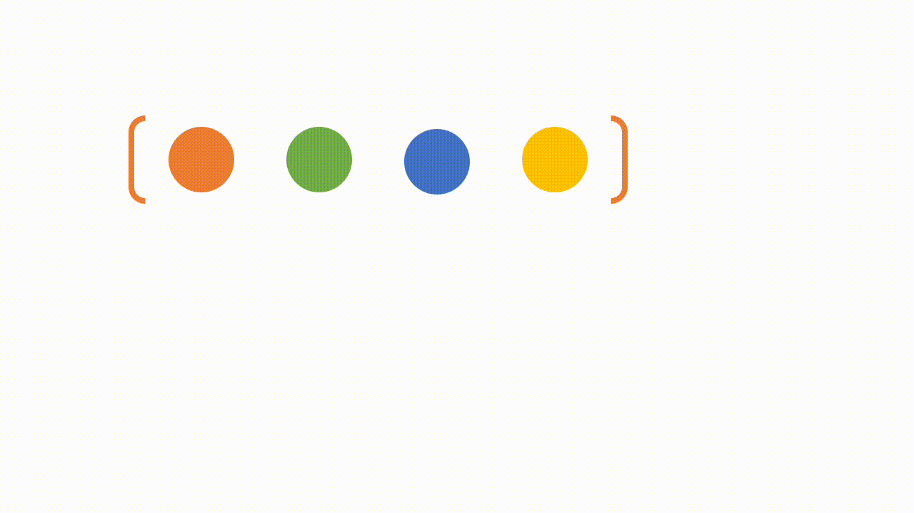

# Day 19: Giới thiệu RxJS và Observable trong Angular

Khi bạn tìm hiểu về Angular, bạn sẽ thấy rằng nó có phụ thuộc vào một library là RxJS. Có khá nhiều concept trong Angular sử dụng đến RxJS như là Forms, HttpClient, hay như là QueryList, EventEmitter, etc.

Đây vừa là một điểm mạnh, cũng vừa là điểm yếu của Angular. Vì RxJS xử lý asynchronous rất mạnh, nhưng bù lại bạn sẽ phải học thêm một số các concept khác xoay quanh stream. Thinking in streams.

> RxJS is a library for composing asynchronous and event-based programs by using observable sequences.

> In RxJS and in reactive programming in general, the fundamental unit of work is the stream. Think in terms of streams (think reactively) and design code in a way that, instead of holding on to data, you allow it to flow through and apply transformations along the way until it reaches your desired state.


## Observable

Trong lập trình đồng bộ thông thường, chúng ta có một kiểu dữ liệu có thể lưu trữ nhiều phần tử đó chính là Array.

Riêng đối với JavaScript các bạn thấy rằng, chúng ta có thể chaining một số array method như `map`, `filter`, hay các method phụ trợ khá như `reduce`, `every`, `some`, etc. Những gì mà JS cung cấp sẽ giúp chúng ta thao tác với Array dễ dàng hơn.

Trong thực tế, JS còn có một topic nâng cao nữa là lập trình bất đồng bộ, những thứ như Event, Promise, những thứ mà có thể xảy ra ở bất kỳ thời điểm nào ở trong tương lai mà chúng ta không biết trước. Chúng ta chỉ có thể gửi cho nó một lời nhắc và khi có sự kiện phát sinh thì chương trình sẽ gọi lại lời nhắc đó cho chúng ta (callback).

Callback là một phương pháp để chúng ta thực hiện tương tác lại các task bất đồng bộ. Kể cả Promise bạn sẽ vẫn dùng callback để handle `onFulfilled` và `onRejected`.

Nhưng hạn chế của Promise là nó chỉ delivery một value duy nhất, nên nó không thể dùng chung cho những thứ có thể delivery nhiều value (ví dụ như DOM event).

Observable tỏa sáng không chỉ bởi vì nó có thể handle nhiều value asynchronous, mà còn vì mặt kiến trúc của nó khi coi mọi thứ là các streams, do đó `data` sẽ được chảy qua các luồng xử lý để có thể biến đổi thành các dạng mà bạn mong muốn ở đầu cuối của stream.

Observable có thể coi là một Array của các value theo thời gian:



Hiện tại Observable chưa chính thức tồn tại trong JS, nhưng bạn có thể sử dụng RxJS để có thể có những thành phần chính như `Observable`, `Observer`, `Subject`, etc. Và một loạt các `operators` đi kèm để xử lý stream được dễ dàng hơn.


## Use-case throttle

Thông thường để xử lý một số event xảy ra quá nhanh và nhiều, trong khi chúng ta có thể bỏ qua một số value ở trung gian. Chẳng hạn bạn tạo một ứng dụng, ứng dụng đó có một button và bạn không muốn người dùng click vào button đấy nhanh quá (e.g: 500ms), nếu họ click quá nhanh thì bỏ qua và chỉ tương tác khi lần click gần nhất đã cách đó hơn khoảng thời gian quy định ở trên.

Bây giờ chúng ta thử implement giải pháp thông thường và giải pháp với RxJS xem sao. Các bạn hãy khoan đi vào chi tiết những phần code RxJS dưới đây:
```ts
const btnjsThrottle = document.querySelector("#jsThrottle");
const btnrxjsThrottle = document.querySelector("#rxjsThrottle");
// PURE JS version
let count = 0;
let rate = 500;
let lastClick = Date.now() - rate;
btnjsThrottle.addEventListener('click', () => {
  if (Date.now() - lastClick >= rate) {
    console.log(`Clicked ${++count} times`);
    lastClick = Date.now();
  }
});

// RxJS version
import { fromEvent } from 'rxjs';
import { throttleTime, scan } from 'rxjs/operators';

fromEvent(btnrxjsThrottle, 'click')
  .pipe(
    throttleTime(500),
    scan(count => count + 1, 0)
  )
  .subscribe(count => console.log(`RxJS: Clicked ${count} times`));
```

Với cách sử dụng RxJS cho bài toán trên quả không tệ, và nếu cần transform thêm nữa thì chúng ta hoàn toàn có thể handle được.

## RxJS core concepts

### Observable
- Observable: đại diện cho ý tưởng về một tập hợp các giá trị hoặc các sự kiện trong tương lai. Khi các giá trị hoặc sự kiện phát sinh trong tương lai, Observable sẽ điều phối nó đến Observer.
- Observable chỉ là một function (class) mà nó có một số yêu cầu đặc biệt. Nó nhận đầu vào là một Function, mà Function này nhận đầu vào là một Observer và trả về một function để có thể thực hiện việc cancel quá trình xử lý. Thông thường (RxJS 5 trở lên) chúng ta đặt tên function đó là unsubscribe.
> Observables are functions that tie an observer to a producer. That’s it. They don’t necessarily set up the producer, they just set up an observer to listen to the producer, and generally return a teardown mechanism to remove that listener. The act of subscription is the act of “calling” the observable like a function, and passing it an observer.

### Observer
- Observer là một tập hợp các callbacks tương ứng cho việc lắng nghe các giá trị (next, error, hay complete) được gửi đến bởi Observable.

### Subscription
- Subscription là kết quả có được sau khi thực hiện một Observable, nó thường dùng cho việc hủy việc tiếp tục xử lý.

### Operators
- Operators là các pure functions cho phép lập trình functional với Observable.
### Subject
- Subject để thực hiện việc gửi dữ liệu đến nhiều Observers (multicasting).
### Schedulers
- Một scheduler sẽ điều khiển khi nào một subscription bắt đầu thực thi, và khi nào sẽ gửi tín hiệu đi.

## Working with Observables
### Creating Observables

Để create một Observable chúng ta chỉ cần gọi constructor và truyền vào một function (gọi là **subscribe**), trong đó **subscribe function** sẽ nhận đầu vào là một Observer.

```ts
const observable = new Observable(function subscribe(observer) {
  const id = setTimeout(() => {
    observer.next('Hello Rxjs');
    observer.complete();
  }, 1000);
});
```

Để có thể clean up chúng ta sẽ return về một function trong **subscribe function** như sau:

```ts
const observable = new Observable(function subscribe(observer) {
  const id = setTimeout(() => {
    observer.next('Hello Rxjs');
    observer.complete();
  }, 1000);
  return function unsubscribe() {
    clearTimeout(id);
  }
});
```

### Invoking Observable
Các Observable hầu hết sẽ giống như một function, tức là nếu bạn có một Observable thì nó chỉ như khai báo một function, do đó những gì bên trong function sẽ không được chạy cho đến khi bạn invoke function đó (lazy computation).

Để invoke một Observable bạn chỉ cần `subscribe` vào nó là được. Và sau khi subscribe thì nó sẽ trả về một Subscription.

```ts
const subscription = observable.subscribe({
  next: (value) => {
    console.log(value);
  },
  error: (error) => {
    console.log(error);
  },
  complete: () => {
    console.log('Done');
  }
});
```

Ở trong ví dụ trên chúng ta đã cung cấp đầy đủ 3 hàm callback cho một Observer, bạn hoàn toàn có thể không cung cấp một callback nào hoặc cung cấp một vài callback cũng được.

### Executing Observables

Phần code khi chúng ta khởi tạo Observable `new Observable(function subscribe(observer) {...})` chính là “Observable execution”.

Sau khi chúng ta invoke một Observable thì nó bắt đầu chạy, và khi có một signal nào (`next`, `error`, `complete`) gửi đi thì những gì chúng ta cung cấp cho Observer phía trên sẽ được gọi để tương tác lại tín hiệu đó.

Có ba kiểu giá trị mà một Observable Execution có thể gửi đi:

- “Next” notification: gửi đi một giá trị, có thể là bất kỳ kiểu dữ liệu nào như Number, a String, an Object, etc.
- “Error” notification: gửi đi một JavaScript Error hoặc exception.
- “Complete” notification: không gửi đi một giá trị nào, nhưng nó gửi đi một tín hiệu để báo rằng stream này đã completed, mục đích để Observer có thể thực hiện một hành động nào đó khi stream completed.

Next notifications thường được sử dụng rộng rãi, nó cực kỳ quan trọng, vì nó gửi đi dữ liệu cần thiết cho một Observer.

Error và Complete notifications có thể chỉ xảy ra duy nhất một lần trong một Observable Execution. 

> Lưu ý rằng, chỉ có 1 trong 2 loại tín hiệu trên được gửi đi, nếu đã complete thì không có error, nếu có error thì không có complete. (Chúng không thuộc về nhau :D). Và nếu đã gửi đi complete, hoặc error signal, thì sau đó không có dữ liệu nào được gửi đi nữa. Tức là stream đã close.

> In an Observable Execution, zero to infinite Next notifications may be delivered. If either an Error or Complete notification is delivered, then nothing else can be delivered afterwards.


### Disposing Observable Executions

Bởi vì quá trình thực thi Observable có thể lặp vô hạn, hoặc trong trường hợp nào đó bạn muốn thực hiện hủy việc thực thi vì việc này không còn cần thiết nữa - dữ liệu đã lỗi thời, có dữ liệu khác thay thế. Các bạn có thể liên tưởng tới việc *close websocket stream*, *removeEvenListener* cho một element nào đó đã bị loại bỏ khỏi DOM chẳng hạn.

Observable có cơ chế tương ứng, cho phép chúng ta hủy việc thực thi. Đó là khi subscribe được gọi, một Observer sẽ bị gắn với một *Observable execution* mới được tạo, sau đó nó sẽ trả về một object thuộc type Subscription. Kiểu dữ liệu này có một method `unsubscribe` khi chúng ta gọi đến, nó sẽ thực hiện cơ chế để hủy việc thực thi.

> Lưu ý: nếu bạn tự tạo Observable (bằng new Observable chẳng hạn) thì bạn phải tự thiết lập cơ chế để hủy.

> When you subscribe, you get back a Subscription, which represents the ongoing execution. Just call `unsubscribe()` to cancel the execution.

```ts
const subscription = observable.subscribe({
  next: (value) => {
    console.log(value);
  },
  error: (error) => {
    console.log(error);
  },
  complete: () => {
    console.log('Done');
  }
});

setTimeout(() => {
  subscription.unsubscribe();
}, 500)
```


## Observers
Observer là một Consumer những dữ liệu được gửi bởi Observable. Observer là một object chứa một tập 3 callbacks tương ứng cho mỗi loại notification được gửi từ Observable: `next`, `error`, `complete`.

Một Observer có dạng như sau:
```ts
const observer = {
  next: x => console.log('Observer got a next value: ' + x),
  error: err => console.error('Observer got an error: ' + err),
  complete: () => console.log('Observer got a complete notification'),
};
```

Observer được cung cấp là tham số đầu vào của subscribe để kích hoạt Observable execution.
```ts
observable.subscribe(observer);
```
> Observers are just objects with three callbacks, one for each type of notification that an Observable may deliver.

Observe có thể chỉ có một số callbacks trong bộ 3 callbacks kể trên (có thể là một object không có callback nào trong bộ kể trên, trường hợp này ít dùng đến).

Ngoài cách dùng như trên, `observable.subscribe` sẽ chuẩn hóa các callbacks thành Observer object tương ứng, bạn có thể truyền vào các hàm rời rạc nhau, nhưng cần lưu ý truyền đúng thứ tự callback.

Cách dùng này hiện tại không khuyến cáo sử dụng, chỉ dùng cách truyền function nếu bạn có một hàm để handle `Next` notification.
```ts
observable.subscribe(
  x => console.log('Observer got a next value: ' + x),
  err => console.error('Observer got an error: ' + err),
  () => console.log('Observer got a complete notification')
);

// tương đương với

const observer = {
  next: x => console.log('Observer got a next value: ' + x),
  error: err => console.error('Observer got an error: ' + err),
  complete: () => console.log('Observer got a complete notification'),
};

observable.subscribe(observer);
```

> Lưu ý: Nếu bạn không muốn truyền error handler function vào, hãy truyền `null`/`undefined`:
```ts
observable.subscribe(
  x => console.log('Observer got a next value: ' + x),
  null,
  () => console.log('Observer got a complete notification')
);
```

# Subscription
Subscription là một object đại diện cho một nguồn tài nguyên có khả năng hủy được, thông thường trong Rxjs là hủy Observable execution. Subscription có chứa một method quan trọng unsubscribe (từ Rxjs 5 trở lên), khi method này được gọi, execution sẽ bị hủy.

Ví dụ: chúng ta có một đồng hồ đếm thời gian, mỗi giây sẽ gửi đi một giá trị, giả sử sau khi chạy 5s chúng ta cần hủy phần thực thi này.

```ts
const observable = interval(1000);
const subscription = observable.subscribe(x => console.log(x));

setTimeout(() => {
  subscription.unsubscribe();
}, 5000);

```

> A Subscription essentially just has an unsubscribe() function to release resources or cancel Observable executions.

Một Subscription có thể chứa trong nó nhiều Subscriptions con, khi Subscription unsubscribe, các Subscriptions con cũng sẽ unsubscribe.

Ở Subscription cha, chúng ta có thể gọi method add để thêm các Subscriptions con mà phụ thuộc Subscription cha này.

```ts
const foo = interval(500);
const bar = interval(700);

const subscription = foo.subscribe(x => console.log('first: ' + x));
const childSub = bar.subscribe(x => console.log('second: ' + x));

subscription.add(childSub);

setTimeout(() => {
  // Unsubscribes BOTH `subscription` and `childSub`
  subscription.unsubscribe();
}, 2000);
```
## Summary

Vậy là qua Day 19 hy vọng các bạn đã hiểu được cơ bản về RxJS và Observable.

Để tìm hiểu sâu hơn, các bạn cần theo dõi thêm một số nguồn sau đây:

- https://www.tiepphan.com/rxjs-reactive-programming/
- https://rxjs.dev/guide/overview
- https://angular.io/guide/observables

## Code sample

https://stackblitz.com/edit/rxjs-racgao?file=index.ts

Mục tiêu của Day 20 là **RxJS Creation Operators**.

## Author

[Tiep Phan](https://github.com/tieppt)

`#100DaysOfCodeAngular` `#100DaysOfCode` `#AngularVietNam100DoC_Day19`

