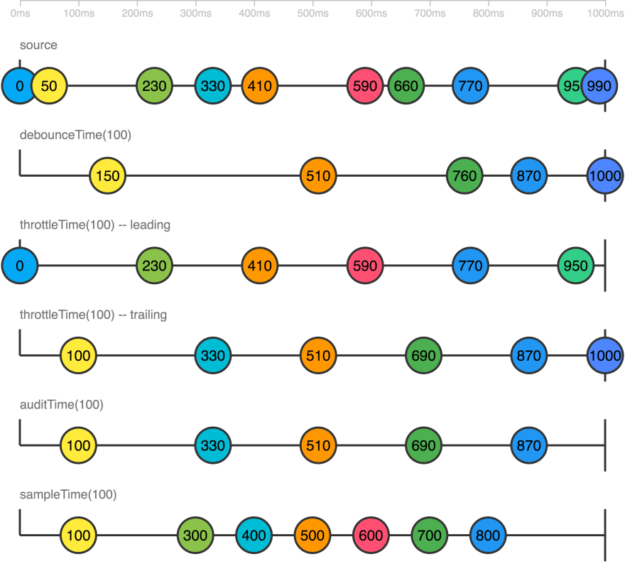

# Day 22: RxJS Filtering Operators

Hôm nay chúng ta sẽ tiếp tục tìm hiểu về thêm về **RxJS Operators**, điển hình là **Filtering Operators**. Đúng với tên gọi của chúng, các `operators` này được dùng để lược/lọc các giá trị được `emit` từ `Observable` gốc, giống như bạn lược/lọc qua phần tử của 1 `Array` vậy.

### filter()

`filter<T>(predicate: (value: T, index: number) => boolean, thisArg?: any): MonoTypeOperatorFunction<T>`

Như `signature` trên thì `filter()` sẽ nhận vào 1 `predicate` là 1 `function` mà `function` này phải trả về giá trị `truthy` hoặc `falsy`. Nếu như `truthy` thì `filter()` sẽ emit giá trị của `Observable` tại thời điểm đó. Ngược lại nếu như `falsy`, thì `filter()` sẽ không emit giá trị đó. Cách hoạt động giống như `Array.prototype.filter()` vậy.


```typescript
from([1, 2, 3, 4, 5, 6])
  .pipe(
    filter((x) => x % 2 === 0) // số chẵn
  )
  .subscribe(console.log); // output: 2, 4, 6
```

### first()

`first<T, D>(predicate?: (value: T, index: number, source: Observable<T>) => boolean, defaultValue?: D): OperatorFunction<T, T | D>`

Giống như cái tên, `first()` sẽ emit giá trị đầu tiên của 1 `Observable` rồi `complete`. `first()` sẽ throw `EmptyError` nếu như `Observable` tự `complete` trước khi emit 1 giá trị nào (ví dụ như `EMPTY` chẳng hạn, là 1 `Observable` rỗng. Hoặc `of()` mà không nhận vào giá trị nào).


```typescript
from([1, 2, 3, 4, 5, 6])
  .pipe(first())
  .subscribe(console.log, null, () => console.log('complete')); // output: 1 -> complete

of() // an empty Observable
  .pipe(first())
  .subscribe(null, console.log, null); // Error: EmptyError
```

Ngoài ra, `first()` còn có thể nhận vào 2 tham số optional: `predicate` và `defaultValue`. Nếu như bạn truyền vào `predicate` thì `first()` sẽ throw `Error` nếu như `Observable` đã `complete` mà chưa có giá trị nào thoả được điều kiện của `predicate`. Nếu như bạn truyền vào `predicate` và không muốn có `Error` thì hãy truyền thêm vào `defaultValue`.

> Nếu bạn nào từng làm qua **.NET LINQ** thì `first(predicate, defaultValue)` hoạt động tương tự `FirstOrDefault`

```typescript
from([1, 2, 3, 4, 5, 6])
  .pipe(first((x) => x > 3))
  .subscribe(console.log, null, () => console.log('complete')); // output: 4 -> complete

from([1, 2, 3, 4, 5, 6])
  .pipe(first((x) => x > 6)) // without default value
  .subscribe(null, console.log, null); // Error: Error

from([1, 2, 3, 4, 5, 6])
  .pipe(
    first((x) => x > 6),
    'defaultValue'
  ) // with default value
  .subscribe(console.log, null, () => console.log('complete')); // output: 'defaultValue' -> complete
```

### last()

`last<T, D>(predicate?: (value: T, index: number, source: Observable<T>) => boolean, defaultValue?: D): OperatorFunction<T, T | D>`

Hoàn toàn ngược lại với `first()`, `last()` sẽ emit giá trị cuối cùng của `Observable` trước khi `Observable` này `complete`. Tất các behaviors mà `first()` có thì `last()` cũng có. Nghĩa là:

- Throw `EmptyError` nếu như `Observable` tự `complete` trước khi emit bất kỳ 1 giá trị nào.
- Cũng nhận vào 2 tham số optional: `predicate` và `defaultValue`.
- Throw `Error` nếu như **chỉ** có `predicate` và không có giá trị nào thoả điều kiện.
- Emit `defaultValue` nếu như có `predicate` và `defaultValue` và không có giá trị nào thoả điều kiện.


```typescript
from([1, 2, 3, 4, 5, 6])
  .pipe(last())
  .subscribe(console.log, null, () => console.log('complete')); // output: 6 -> complete

of() // an empty Observable
  .pipe(last())
  .subscribe(null, console.log, null); // Error: EmptyError
```

### find()

`find<T>(predicate: (value: T, index: number, source: Observable<T>) => boolean, thisArg?: any): OperatorFunction<T, T | undefined>`

Lại là một `operator` có `signature` khác quen thuộc. Giống như `Array.prototype.find()`, `find()` sẽ emit giá trị đầu tiên mà thoả mãn được điều kiện từ `predicate` rồi `complete`. Khác với `first()`, `find()` **phải** có `predicate` và `find()` sẽ không emit `Error` nếu như không có giá trị nào thoả mãn điều kiện.


```typescript
from([1, 2, 3, 4, 5, 6])
  .pipe(
    find((x) => x % 2 === 0) // số chẵn
  )
  .subscribe(console.log, null, () => console.log('complete')); // output: 2 -> complete
```

### single()

`single<T>(predicate?: (value: T, index: number, source: Observable<T>) => boolean): MonoTypeOperatorFunction<T>`

Hoạt động tương tự như `first()` nhưng nghiêm ngặt hơn `first()` ở điểm `single()` sẽ throw `Error` nếu như có **NHIỀU HƠN 1** giá trị thoả điều kiện. `single()` không nhận vào `defautlValue` và sẽ emit `undefined` nếu như không có giá trị nào thoả điều kiện khi truyền vào tham số `predicate`. Phần lớn `single()` chỉ nên sử dụng khi bạn có điều kiện `predicate` cần phải thoả mãn. Nếu dùng `single()` lên 1 `Observable` emit nhiều hơn 1 giá trị, `single()` sẽ throw `Error`.


```typescript
from([1, 2, 3]).pipe(single()).subscribe(null, console.log, null); // error: Error -> nhiều hơn 1 giá trị được emit từ from() và single() không có điều kiện gì.

from([1, 2, 3])
  .pipe(single((x) => x === 2))
  .subscribe(console.log, null, () => console.log('complete')); // output: 2 -> complete

from([1, 2, 3])
  .pipe(single((x) => x > 1))
  .subscribe(null, console.log, null); // error: Error -> có nhiều hơn 1 giá trị > 1.
```

### take()

`take<T>(count: number): MonoTypeOperatorFunction<T>`

`take()` nhận vào 1 tham số `count` để dùng cho số lần lấy giá trị được emit từ `Observable` sau đó sẽ `complete`.


```typescript
from([1, 2, 3, 4])
  .pipe(take(2))
  .subscribe(console.log, null, () => console.log('complete')); // output: 1, 2 -> complete
```

#### Special case: `take(1)`

Như các bạn cũng đã nhận ra là không có gì ngăn cản chúng ta truyền vào số `1` cho `take()` để có `take(1)`. Thoạt nhìn thì đây có vẻ là 1 cách khác của `first()`. Tuy nhiên, `take(1)` khác `first()` ở chỗ `take(1)` sẽ không throw bất cứ `error` nào nếu như `Observable` tự `complete` mà không emit giá trị nào.

`take(1)` nên dùng khi các bạn cần:

- Báo cáo user click ở đâu khi vào page đầu tiên?
- Snapshot của data tại 1 thời điểm
- Route Guard mà return `Observable`.

### takeLast()

`takeLast<T>(count: number): MonoTypeOperatorFunction<T>`

`takeLast()` hoạt động giống như `take()` nhưng ngược lại với `take()` là `takeLast()` sẽ lấy `n` giá trị cuối cùng được emit từ `Observable`. Các bạn chú ý là `takeLast()` chỉ emit khi nào `Observable` gốc `complete`, nếu như `Observable` gốc là 1 _long-live_ `Observable` (ví dụ: `interval()`) thì `takeLast()` sẽ không bao giờ emit.


```typescript
from([1, 2, 3, 4])
  .pipe(takeLast(2))
  .subscribe(console.log, null, () => console.log('complete')); // output: 3, 4 -> complete
```

### takeUntil()

`takeUntil<T>(notifier: Observable<any>): MonoTypeOperatorFunction<T>`

`takeUntil()` nhận vào 1 tham số là 1 `Observable` như là 1 `notifier` (người báo hiệu) và `takeUntil()` sẽ emit giá trị của `Observable` gốc **CHO TỚI KHI** `notifier` emit.


```typescript
interval(1000)
  .pipe(takeUntil(fromEvent(document, 'click')))
  .subscribe(console.log, null, () => console.log('complete')); // output: 0, 1, 2, 3, 4 -- click --> 'complete'
```

#### Use-case trong Angular:

`takeUntil()` được dùng để **unsubscribe** `Observable` trong `ngOnDestroy()` là rất phổ biến. Các bạn suy nghĩ mình có 1 `destroySubject: Subject<void>` tượng trưng cho `notifier`. Khi `ngOnDestroy()` thực thi, chúng ta sẽ cho `destroySubject.next()` (emit) và sử dụng `takeUntil(this.destroySubject)` thì `Observable` trong `Component` sẽ được **unsubscribe** khi `ngOnDestroy()` thực thi -> khi `Component` unmount.

### takeWhile()

`takeWhile<T>(predicate: (value: T, index: number) => boolean, inclusive: boolean = false): MonoTypeOperatorFunction<T>`

`takeWhile()` hoạt động tương tự `takeUntil()` nhưng thay vì nhận vào 1 `notifier` thì `takeWhile()` nhận vào 1 `predicate`. Nhiều người sẽ sử dụng `takeWhile()` và `takeUntil()` thay đổi qua lại nhưng `takeWhile()` hoạt động rất khác với `takeUntil()`. Các bạn xem qua 2 bài post trên group về vấn đề này nhé: [post 1](https://www.facebook.com/groups/AngularVietnam/permalink/816969675468552/) và [post 2](https://www.facebook.com/groups/AngularVietnam/permalink/845798295919023/)


```typescript
interval(1000)
  .pipe(takeWhile((x) => x < 6))
  .subscribe(console.log, null, () => console.log('complete')); // output: 0, 1, 2, 3, 4, 5 --> complete
```

`takeWhile()` hoạt động hiệu quả nhất khi bạn muốn `unsusbcribe` từ chính giá trị mà `Observable` emit (internal). Giống như ví dụ trên, mình lấy chính giá trị của `interval` để kiểm tra điều kiện. `takeUntil()` hoạt động hiệu quả khi bạn có `notifier` từ bên ngoài (external).

### skip()

`skip<T>(count: number): MonoTypeOperatorFunction<T>`

`skip()` hoạt động tương tự như `take()` nhưng mang tính chất ngược lại so với `take()`. Như `take()` là mình sẽ emit `n` giá trị ban đầu, còn `skip()` là mình sẽ **bỏ qua** `n` giá trị ban đầu.


```typescript
from([1, 2, 3, 4])
  .pipe(skip(1))
  .subscribe(console.log, null, () => console.log('complete')); // output: 2, 3, 4 --> complete
```

### skipUntil()

`skipUntil<T>(notifier: Observable<any>): MonoTypeOperatorFunction<T>`

`skipUntil()` hoạt động tương tự `takeUntil()` và mang tính chất giống với `skip()`.


```typescript
interval(1000)
  .pipe(skipUntil(fromEvent(document, 'click')))
  .subscribe(console.log); // output: click at 5 seconds -> 5, 6, 7, 8, 9....
```

### skipWhile()

`skipWhile<T>(predicate: (value: T, index: number) => boolean): MonoTypeOperatorFunction<T>`

`skipWhile()` hoạt động tương tự `takeWhile()` và mang tính chất giống với `skip()`


```typescript
interval(1000)
  .pipe(skipWhile((x) => x < 5))
  .subscribe(console.log); // output: 6, 7, 8, 9....
```

### distinct()

`distinct<T, K>(keySelector?: (value: T) => K, flushes?: Observable<any>): MonoTypeOperatorFunction<T>`

`distinct()` sẽ so sánh các giá trị được emit từ `Observable` và chỉ emit các giá trị chưa được emit qua.

```typescript
from([1, 2, 3, 4, 5, 5, 4, 3, 6, 1])
  .pipe(distinct())
  .subscribe(console.log, null, () => console.log('complete')); // output: 1, 2, 3, 4, 5, 6 -> complete
```

`distinct()` có thể nhận vào 1 tham số là hàm `keySelector` để có thể chọn được property nào cần được so sánh nếu như `Observable` emit giá trị là 1 complex `Object`

```typescript
of({ age: 4, name: 'Foo' }, { age: 7, name: 'Bar' }, { age: 5, name: 'Foo' })
  .pipe(distinct((p) => p.name))
  .subscribe(console.log, null, () => console.log('complete')); // output: { age: 4, name: 'Foo' }, { age: 7, name: 'Bar' } -> complete
```

### distinctUntilChanged()

`distinctUntilChanged<T, K>(compare?: (x: K, y: K) => boolean, keySelector?: (x: T) => K): MonoTypeOperatorFunction<T>`

`distinctUntilChanged()` có concept tương tự `distinct()` nhưng khác ở chỗ `distinctUntilChanged()` chỉ so sánh giá trị **sắp** được emit với giá trị **vừa** được emit (giá trị cuối) chứ không so sánh với tất cả giá trị **đã** được emit.

```typescript
from([1, 1, 2, 2, 2, 1, 1, 2, 3, 3, 4])
  .pipe(distinctUntilChanged())
  .subscribe(console.log, null, () => console.log('complete')); // output: 1, 2, 1, 2, 3, 4 -> complete
```

`distinctUntilChanged()` cũng có thể nhận vào 2 tham số optional: `compare` function và `keySelector` function. Tham số `keySelector` hoạt động giống như tham số `keySelector` của `distinct()`. Khi `compare` function không được truyền vào cho `distinctUntilChanged()` thì `distinctUntilChanged()` sẽ dùng `===` để so sánh 2 giá trị. Để thay đổi behavior này, các bạn truyền vào `compare` function, nếu `compare` function trả về `truthy` thì `distinctUntilChanged` sẽ **bỏ qua** giá trị đó.

```typescript
of(
  { age: 4, name: 'Foo' },
  { age: 6, name: 'Foo' },
  { age: 7, name: 'Bar' },
  { age: 5, name: 'Foo' }
)
  .pipe(distinctUntilChanged((a, b) => a.name === b.name))
  .subscribe(console.log, null, () => console.log('complete')); // output: { age: 4, name: 'Foo' }, { age: 7, name: 'Bar' }, { age: 5, name: 'Foo' } -> complete
```

### distinctUntilKeyChanged()

`distinctUntilKeyChanged<T, K extends keyof T>(key: K, compare?: (x: T[K], y: T[K]) => boolean): MonoTypeOperatorFunction<T>`

`distinctUntilKeyChanged()` là short-cut của `distinctUntilChanged()` + `keySelector`.

```typescript
of(
  { age: 4, name: 'Foo' },
  { age: 6, name: 'Foo' },
  { age: 7, name: 'Bar' },
  { age: 5, name: 'Foo' }
)
  .pipe(distinctUntilKeyChanged('name')
  .subscribe(console.log, null, () => console.log('complete')); // output: { age: 4, name: 'Foo' }, { age: 7, name: 'Bar' }, { age: 5, name: 'Foo' } -> complete
```

### Note

Chúng ta còn 8 `operators` nữa. Tuy nhiên, 8 `operators` này đi theo cặp ví dụ: `throttle/throttleTime`, `debounce/debounceTime` ... Mình sẽ chỉ nói về `*Time` thôi vì cái kia hoạt động tương tự. `throttle()` nhận vào 1 `Observable` còn `throttleTime()` nhận vào 1 khoảng thời gian trong millisecond. Phần lớn, các `*Time` operators dùng nhiều hơn là cái không có `*Time` trong công việc hàng ngày.

### throttle()/throttleTime()

`throttle<T>(durationSelector: (value: T) => SubscribableOrPromise<any>, config: ThrottleConfig = defaultThrottleConfig): MonoTypeOperatorFunction<T>`
`throttleTime<T>(duration: number, scheduler: SchedulerLike = async, config: ThrottleConfig = defaultThrottleConfig): MonoTypeOperatorFunction<T>`

`throttleTime()` nhận vào 1 tham số là `duration` có đơn vị là millisecond. Khi `Observable` gốc emit giá trị đầu tiên, `throttleTime()` sẽ emit giá trị này rồi sẽ chạy `timer` với `duration` được truyền vào. Khi `timer` đang chạy thì mọi giá trị của `Observable` gốc emit đều được bỏ qua. Khi `timer` chạy xong, `throttleTime()` quay lại trạng thái ban đầu và chờ giá trị kế tiếp của `Observable` gốc.

> `throttle` hoạt động giống nhu `throttleTime` nhưng thay vì truyền vào `duration` thì `throttle` nhận vào 1 `Observable` tượng trưng cho `durationSelector`. Khi `durationSelector` này emit (hoặc complete) thì `timer` sẽ ngưng, và `throttle` sẽ chờ giá trị tiếp theo của `Observable` gốc và quá trình này được lặp lại.


```typescript
fromEvent(document, 'mousemove')
  .pipe(throttleTime(1000))
  .subscribe(console.log, null, () => console.log('complete')); // output: MouseEvent {} - wait 1s -> MouseEvent { } - wait 1s -> MouseEvent { }
```

`throttleTime()` có thể nhận vào tham số `ThrottleConfig: {leading: boolean, trailing: boolean}` để xác định xem `throttleTime()` sẽ emit giá trị **đầu** hay giá trị **cuối** khi `timer` chạy xong. Default là `{leading: true, trailing: false}`.

`throttleTime()` thường được sử dụng khi bạn có `event` từ DOM như `mousemove` để tránh quá nhiều `event` được emit.

### debounce()/debounceTime()

`debounce<T>(durationSelector: (value: T) => SubscribableOrPromise<any>): MonoTypeOperatorFunction<T>`
`debounceTime<T>(dueTime: number, scheduler: SchedulerLike = async): MonoTypeOperatorFunction<T>`

`debounceTime()` nhận vào 1 tham số là `dueTime` có đơn vị là millisecond. Khi `Observable` gốc emit giá trị, `debounceTime()` sẽ bỏ qua giá trị này và sẽ chạy `timer` với khoảng thời gian `dueTime`. `debounceTime()` sẽ bỏ qua tất cả giá trị mà `Observable` gốc emit trong khi `timer` vẫn đang chạy và sau đó `debounceTime()` sẽ chạy lại `timer`. Khi và chỉ khi `timer` được chạy hoàn chỉnh khoảng thời gian `dueTime`, `debounceTime()` sẽ emit giá trị cuối cùng mà `Observable` gốc đã emit.

> `debounce()` hoạt động giống như `debounceTime()` nhưng thay vì truyền vào `dueTime` thì `debounce` nhận vào 1 `Observable` tượng trưng cho `durationSelector`. `timer` của `debounce` sẽ hoạt động dựa trên `durationSelector` này thay vì `dueTime`


```typescript
this.filterControl.valueChanges.pipe(debounceTime(500)).subscribe(console.log); // output: type "abcd" rồi dừng 500ms -> 'abcd'
```

Vì cách hoạt động như trên, `debounceTime()` được dùng phổ biến nhất cho 1 `input` dùng để filter 1 danh sách gì đó.

### audit()/auditTime()

`audit<T>(durationSelector: (value: T) => SubscribableOrPromise<any>): MonoTypeOperatorFunction<T>`
`auditTime<T>(duration: number, scheduler: SchedulerLike = async): MonoTypeOperatorFunction<T>`

`auditTime()` nhận vào 1 tham số `duration` có đơn vị là milliseconds. `auditTime()` hoạt động tương tự `throttleTime()` với `{trailing: true}`. Nghĩa là sau khi `timer` chạy và chạy xong `duration`, `auditTime()` sẽ emit giá trị gần nhất mà `Observable` gốc emit.


```typescript
fromEvent(document, 'click').pipe(auditTime(1000)).subscribe(console.log); // output: click - wait 1s -> MouseEvent {} -click  wait 1s (trong 1s, click 10 times) -> MouseEvent {} -> click wait 1s -> MouseEvent {}
```

### sample()/sampleTime()

`sample<T>(notifier: Observable<any>): MonoTypeOperatorFunction<T>`
`sampleTime<T>(period: number, scheduler: SchedulerLike = async): MonoTypeOperatorFunction<T>`

`sampleTime()` nhận vào 1 tham số là `period` có đơn vị là millisecond. Khi `Observable` gốc được subscribe, `timer` của `sampleTime()` sẽ chạy ngay lập tức và cứ sau mỗi `period`, `sampleTime()` sẽ emit giá trị gần nhất của `Observable` gốc.


```typescript
fromEvent(document, 'click').pipe(sampleTime(1000)).subscribe(console.log); // click - wait 1s -> MouseEvent {}
```

Cả 4 `operators` này có phần hoạt động khá giống nhau ngoại trừ `debounceTime` là hơi khác biệt. Mình có 1 diagram để mô tả sự khác biệt của 4 loại `operators` này



_credit: [https://dev.to/kosich/debounce-vs-throttle-vs-audit-vs-sample-difference-you-should-know-1f21](https://dev.to/kosich/debounce-vs-throttle-vs-audit-vs-sample-difference-you-should-know-1f21)_

## Summary

Ngày hôm nay phải nói là quá nhiều `operators` để tìm hiểu 🙂. Các **filtering operators** thường dùng gồm có: `first()`, `last()`, `filter()`, `take()`, `takeUntil()`, `skip()`, `skipUntil()`, `debounceTime()`, và `throttleTime()`. Các operators còn lại cũng có dùng nhưng tần suất không nhiều bằng. Các bạn tìm hiểu sâu thêm về mỗi loại nếu muốn nhé.

Mục tiêu ngày 23 sẽ là **RxJS Combination Operators**

## References

- [RxJS Overview](https://rxjs.dev/guide/overview)
- [LearnRxJS](https://www.learnrxjs.io/)

## Youtube Video

[](https://youtu.be/KEBpdRL11Nw)

## Author

[Chau Tran](https://github.com/nartc)

`#100DaysOfCodeAngular` `#100DaysOfCode` `#AngularVietNam100DoC_Day22`
