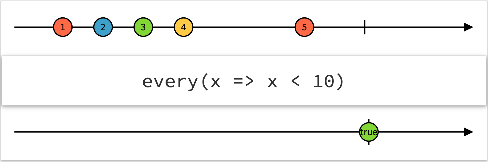

# Day 24: RxJS Error Handling and Conditional Operators

Trong ngày đầu tiên tìm hiểu RxJS chúng ta được biết rằng, mỗi Observable có thể gửi về các message cho `Next`, `Error`, `Complete`. Và nếu như có Error được phát sinh thì Observable sẽ dừng lại. Vậy làm thế nào để chúng ta có thể catch được Error đó?


Trong ngày hôm nay chúng ta sẽ cùng tìm hiểu một số operators để xử lý lỗi và một số khác để làm việc với các loại điều kiện (Error Handling and Conditional Operators).

Trong ngày 24 này, chúng ta sẽ tiếp tục sử dụng observer mặc định như sau:

```ts
const observer = {
  next: (val) => console.log(val),
  error: (err) => console.error(err),
  complete: () => console.log('complete'),
};
```

## RxJS Error Handling Operators

### catchError

Đối với trường hợp các bạn muốn bắt được lỗi và muốn xử lý lỗi đó, ví dụ: biến đổi Error thành một value thông thường, tránh bị terminate stream. Bạn có thể dùng catchError (`.catch` cho prototype chain).

> Catches errors on the observable to be handled by returning a new observable or throwing an error. [RxJS catchError](https://rxjs.dev/api/operators/catchError)

`catchError<T, O extends ObservableInput<any>>(selector: (err: any, caught: Observable<T>) => O): OperatorFunction<T, T | ObservedValueOf<O>>`

```ts
import { of } from "rxjs";
import { map, catchError } from "rxjs/operators";
const cached = [4, 5];
of(1, 2, 3, 4, 5)
  .pipe(
    map(n => {
      if (cached.includes(n)) {
        throw new Error("Duplicated: " + n);
      }
      return n;
    }),
    catchError((err, caught) => of(err))
  )
  .subscribe(observer);

/**
* Output:
* --1--2--3--(next: Error)--|
*/

```

Trong trường hợp trên nếu chúng ta không bắt error thì `observer.error` sẽ là nơi đón Error, nhưng vì chúng ta trả về là một `next: Error` nên error này đã được handle bởi `observer.next`.

Một ví dụ trong ứng dụng là khi các bạn làm việc với `forkJoin` [Day 23](Day023-rxjs-combination.md), lúc này nếu một stream nào đó emit error thì toàn bộ stream sẽ bị văng ra error. Trong trường hợp các bạn muốn nó vẫn tiếp tục chạy hết và chúng ta sẽ tách Error ra ở pipe tiếp theo thì chỉ cần `catchError` lại như trên là được.

```ts
forkJoin([
  of(1),
  of(2),
  throwError(new Error('401')),
]).subscribe(observer);
/**
* Output:
* --(x: Error 401)--
*/


// with catchError

forkJoin([
  of(1),
  of(2),
  throwError(new Error('401')).pipe(
    catchError(err => of(err))
  ),
]).subscribe(observer);

/**
* Output:
* --(next: [1, 2, Error 401])|--
*/
```


Nếu bạn return về Observable trước đó (source Observable), chúng ta có thể tiến hành retry. Nhưng hãy thật cẩn thận vì có thể sinh ra infinite loop.
Nếu bạn muốn retry kèm theo giới hạn về số lần, chúng ta có thể kết hợp với `take`:

```ts
of(1, 2, 3, 4, 5)
  .pipe(
    map(n => {
      if (cached.includes(n)) {
        throw new Error("Duplicated: " + n);
      }
      return n;
    }),
    catchError((err, caught) => caught),
    take(10)
  )
  .subscribe(observer);

/**
* Output:
* --1--2--3--1--2--3--1|
*/
```

Ngoài ra, trong catchError bạn hoàn toàn có thể throw về một error để pipe phía sau có thể handle tiếp.

### retry

> Returns an Observable that mirrors the source Observable with the exception of an error. If the source Observable calls error, this method will resubscribe to the source Observable for a maximum of count resubscriptions (given as a number parameter) rather than propagating the error call.

`retry<T>(count: number = -1): MonoTypeOperatorFunction<T>`

Operator này sẽ resubscribe vào source Observable khi có error emit từ source. Nếu chúng ta không truyền gì vào cho param `count`, lúc này nó có thể retry không giới hạn số lần. Ngược lại, nó sẽ retry max số lần được truyền vào.

Nó khá hữu ích khi bạn muốn retry HTTP request chẳng hạn. Lưu ý chỉ nên dùng cho get data, không nên dùng cho Create, Update, Delete vì có thể sinh ra race condition.

```ts
const cached = [4, 5];
of(1, 2, 3, 4, 5)
  .pipe(
    map(n => {
      if (cached.includes(n)) {
        throw new Error("Duplicated: " + n);
      }
      return n;
    }),
    retry(3)
  )
  .subscribe(observer);

/**
* Output:
* --1--2--3--1--2--3--1--2--3--1--2--3--(x: Error)
*/
```


> Lưu ý, cách hoạt động của `retry` operator khác với catch kèm theo kỹ thuật retry ở trên.

Ngoài `retry` chúng ta có thể dùng `retryWhen` để có thể control vào quá trình retry (ví dụ: khi nào sẽ retry).

Một use-case khá hay là [`retryBackoff` operator](https://github.com/alex-okrushko/backoff-rxjs/blob/7d38283bccc55237806062048eb5e6b90e9f9fff/src/operators/retryBackoff.ts), nó sẽ tăng thời gian sau mỗi lần retry:

```ts
export function retryBackoff(
  config: number | RetryBackoffConfig
): <T>(source: Observable<T>) => Observable<T> {
  const {
    initialInterval,
    maxRetries = Infinity,
    maxInterval = Infinity,
    shouldRetry = () => true,
    resetOnSuccess = false,
    backoffDelay = exponentialBackoffDelay,
  } = typeof config === 'number' ? { initialInterval: config } : config;
  return <T>(source: Observable<T>) =>
    defer(() => {
      let index = 0;
      return source.pipe(
        retryWhen<T>(errors =>
          errors.pipe(
            concatMap(error => {
              const attempt = index++;
              return iif(
                () => attempt < maxRetries && shouldRetry(error),
                timer(
                  getDelay(backoffDelay(attempt, initialInterval), maxInterval)
                ),
                throwError(error)
              );
            })
          )
        ),
        tap(() => {
          if (resetOnSuccess) {
            index = 0;
          }
        })
      );
    });
}
```

## RxJS Error Conditional Operators

### defaultIfEmpty/throwIfEmpty
`defaultIfEmpty<T, R>(defaultValue: R = null): OperatorFunction<T, T | R>`

`throwIfEmpty<T>(errorFactory: () => any = defaultErrorFactory): MonoTypeOperatorFunction<T>`

Hai operators này cho phép chúng ta trả về các giá trị tương ứng (default value hoặc Error) nếu source stream là empty (không emit value nào mà chỉ có complete).

Giả sử, chúng ta cần làm yêu cầu nếu người dùng không click vào sau 1s thì sẽ báo lỗi. Ví dụ tạo transaction sau 1s không confirm thì hủy và báo lỗi cho người dùng.

```ts
import { fromEvent, timer } from 'rxjs';
import { throwIfEmpty, takeUntil } from 'rxjs/operators';
 
const click$ = fromEvent(document, 'click');
 
click$.pipe(
  takeUntil(timer(1000)),
  throwIfEmpty(
    () => new Error('the document was not clicked within 1 second')
  ),
)
.subscribe(observer);
```


### every

> Returns an Observable that emits whether or not every item of the source satisfies the condition specified.

`every<T>(predicate: (value: T, index: number, source: Observable<T>) => boolean, thisArg?: any): OperatorFunction<T, boolean>`

Opeator này sẽ trả về true nếu tất cả các value emit của source thỏa mãn hàm `predicate`.

> Lưu ý nếu source không complete thì sẽ không có gì emit ra cả.

```ts
of(1, 2, 3, 4, 5, 6).pipe(
  every(x => x < 5),
)
.subscribe(observer);

/**
* Output:
* ------false|
*/
```


Các method của Array trong JS, có cả `every` và `some`, nếu các bạn muốn có một operator giống some ở trong RxJS thì có thể dùng `first` kèm theo predicate function. Giống như trong phần [Router của Angular](https://github.com/angular/angular/blob/10.0.x/packages/router/src/operators/check_guards.ts#L74-L76)

```ts
of(1, 2, 3, 14, 5, 6).pipe(
  first(x => x > 10, false),
  map(v => Boolean(v))
)
.subscribe(observer);

/**
* Output:
* ------true|
*/
```

### iif

> Decides at subscription time which Observable will actually be subscribed. [RxJS iff](https://rxjs.dev/api/index/function/iif)

`iif<T = never, F = never>(condition: () => boolean, trueResult: SubscribableOrPromise<T> = EMPTY, falseResult: SubscribableOrPromise<F> = EMPTY): Observable<T | F>`

Opeartor này cho phép chúng ta lựa chọn Observable tương ứng với hàm điều kiện khi thực hiện subscribe.

> `iif` accepts a condition function and two Observables. When an Observable returned by the operator is subscribed, condition function will be called. Based on what boolean it returns at that moment, consumer will subscribe either to the first Observable (if condition was true) or to the second (if condition was false). Condition function may also not return anything - in that case condition will be evaluated as false and second Observable will be subscribed.

> Note that Observables for both cases (true and false) are optional. If condition points to an Observable that was left undefined, resulting stream will simply complete immediately. That allows you to, rather than controlling which Observable will be subscribed, decide at runtime if consumer should have access to given Observable or not.

> If you have more complex logic that requires decision between more than two Observables, `defer` will probably be a better choice. Actually `iif` can be easily implemented with `defer` and exists only for convenience and readability reasons.


```ts
import { iif, of } from 'rxjs';
 
let subscribeToFirst;
const firstOrSecond = iif(
  () => subscribeToFirst,
  of('first'),
  of('second'),
);
 
subscribeToFirst = true;
firstOrSecond.subscribe(value => console.log(value));
 
// Logs:
// "first"
 
subscribeToFirst = false;
firstOrSecond.subscribe(value => console.log(value));
 
// Logs:
// "second"
```


## Summary

Như vậy ngày hôm nay chúng ta đã tăng cường thêm nội lực (💪) về RxJS qua một số operators: Error Handling và Conditional. Hẹn gặp lại các bạn vào ngày mai.

Mục tiêu ngày 25 sẽ là **RxJS Higher-order Observable & Utility**

## References

- [RxJS Overview](https://rxjs.dev/guide/overview)
- [LearnRxJS](https://www.learnrxjs.io/)
- [rxmarbles](https://rxmarbles.com/)

## Author

[Tiep Phan](https://github.com/tieppt)


`#100DaysOfCodeAngular` `#100DaysOfCode` `#AngularVietNam100DoC_Day24`
