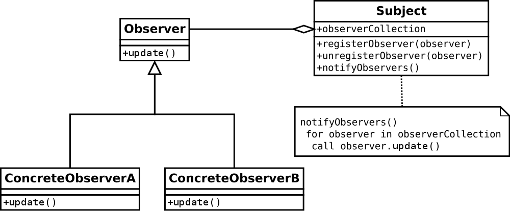

# Day 26: RxJS Subject and Multicasting

Trong ngày đầu tiên tìm hiểu về RxJS chúng ta đã được giới thiệu đến **Observable**, và cũng đã nhắc đến một số kiểu dữ liệu vệ tinh như **Subject**. Vậy **Subject** có chức năng gì trong hệ sinh thái RxJS? Hôm nay chúng ta sẽ cùng tìm hiểu.

## Observable Execution

Như chúng ta đã biết, đối với các **Observable** thông thường, mỗi khi thực hiện `subscribe` sẽ sinh ra một `execution` mới, và chúng độc lập với nhau.

Ví dụ, chúng ta có một observable như sau:

```ts
const observable = interval(500).pipe(
  take(5)
);

const observerA = {
  next: (val) => console.log(`Observer A: ${val}`),
  error: (err) => console.log(`Observer A Error: ${err}`),
  complete: () => console.log(`Observer A complete`),
};

observable.subscribe(observerA);

/**
Output:

Observer A: 0
Observer A: 1
Observer A: 2
Observer A: 3
Observer A: 4
Observer A complete
*/
```

Giả sử chúng ta subscribe thêm một observer mới sau một khoảng thời gian (ví dụ: 2s)

```ts
const observable = interval(500).pipe(
  take(5)
);

const observerA = {
  next: (val) => console.log(`Observer A: ${val}`),
  error: (err) => console.log(`Observer A Error: ${err}`),
  complete: () => console.log(`Observer A complete`),
};

observable.subscribe(observerA);

const observerB = {
  next: (val) => console.log(`Observer B: ${val}`),
  error: (err) => console.log(`Observer B Error: ${err}`),
  complete: () => console.log(`Observer B complete`),
};

setTimeout(() => {
  observable.subscribe(observerB);
}, 2000);

/**
Output:

Observer A: 0
Observer A: 1
Observer A: 2
Observer A: 3
Observer A: 4
Observer A complete
Observer B: 0
Observer B: 1
Observer B: 2
Observer B: 3
Observer B: 4
Observer B complete
*/
```

Như các bạn có thể thấy, khi hai observer subscribe vào, chúng sinh ra các execution khác nhau.

Câu hỏi đặt ra là có cách nào để bất cứ khi nào có một observer mới nào subscribe vào thì chúng sẽ share cùng một execution không?

Hãy xem xét lại một chút về RxJS, nó có apply một design pattern có tên là [Observer Pattern](https://en.wikipedia.org/wiki/Observer_pattern).



Bây giờ thay vì subscribe riêng lẻ như ở các ví dụ trên, chúng ta hãy thêm một hybrid observer như sau:

```ts
const hybridObserver = {
  observers: [],
  registerObserver(observer) {
    this.observers.push(observer);
  },
  next(value) {
    this.observers.forEach(observer => observer.next(value));
  },
  error(err) {
    this.observers.forEach(observer => observer.error(err));
  },
  complete() {
    this.observers.forEach(observer => observer.complete());
  }
}

hybridObserver.registerObserver(observerA);

observable.subscribe(hybridObserver);

setTimeout(() => {
  hybridObserver.registerObserver(observerB);
}, 2000);

/**
Output:

Observer A: 0
Observer A: 1
Observer A: 2
Observer A: 3
Observer A: 4
Observer B: 4
Observer A complete
Observer B complete
/*
```

Oh wow, chỉ với việc implement Observer Pattern, giờ đây chúng ta đã có thể share được execution, và hoàn toàn có thể share cho nhiều observer khác nữa nếu muốn.

Bây giờ chúng ta sẽ thêm một số thay đổi nhỏ nữa:

```ts
const hybridObserver = {
  observers: [],
  subscribe(observer) {
    this.observers.push(observer);
  },
  next(value) {
    this.observers.forEach(observer => observer.next(value));
  },
  error(err) {
    this.observers.forEach(observer => observer.error(err));
  },
  complete() {
    this.observers.forEach(observer => observer.complete());
  }
}

hybridObserver.subscribe(observerA);

observable.subscribe(hybridObserver);

setTimeout(() => {
  hybridObserver.subscribe(observerB);
}, 2000);
```

Lúc này bạn sẽ thấy rằng `hybridObserver` khá là giống một Observable, lại cũng có những phần của một Observer.

Đây chính là một [`Subject` ở trong RxJS](https://rxjs.dev/api/index/class/Subject).

> A Subject is a special type of Observable that allows values to be multicasted to many Observers. Subjects are like EventEmitters.

> Every Subject is an Observable and an Observer. You can subscribe to a Subject, and you can call next to feed values as well as error and complete.

```ts
const subject = new Subject();

subject.subscribe(observerA);

observable.subscribe(subject);

setTimeout(() => {
  subject.subscribe(observerB);
}, 2000);
```

Với phương pháp kể trên, chúng ta đã cơ bản chuyển đổi từ một unicast Observable execution sang multicast, bằng cách sử dụng Subject.

- unicast: giống như bạn vào Youtube, mở video nào đó đã được thu sẵn và xem, nó play từ đầu đến cuối video. Một người khác vào xem, Youtube cũng sẽ phát từ đầu đến cuối như thế, hai người không có liên quan gì về thời gian hiện tại của video mà mình đang xem.

- multicast: cũng là hai người (có thể nhiều hơn) vào xem video ở Youtube, nhưng video đó đang phát Live (theo dõi một show truyền hình, hay một trận bóng đá Live chẳng hạn). Lúc này Youtube sẽ phát video Live, và những người vào xem video đó sẽ có cùng một thời điểm của video đó (cùng thời điểm của trận đấu đang diễn ra chẳng hạn).


## Subject
Do Subject vừa là một Observable (chúng ta có thể subscribe vào nó), vừa là một Observer (có các method để chúng ta tự control khi nào gửi notification). Nên nó khá hay được sử dụng trong ứng dụng, ví dụ để làm Event Bus chẳng hạn.

Dưới đây là một ví dụ về type ahead:

```ts
@Component({
  selector: 'my-app',
  templateUrl: './app.component.html',
  styleUrls: [ './app.component.css' ]
})
export class AppComponent implements OnInit  {

  searchTerm$ = new Subject<string>();

  ngOnInit() {
    this.searchTerm$.asObservable().pipe(
      throttleTime(250, undefined, {
        leading: true,
        trailing: true,
      }),
      distinctUntilChanged(),
    ).subscribe({
      next: value => console.log(value)
    });
  }

  onInput(event: Event) {
    const target = event.target as HTMLInputElement;
    this.searchTerm$.next(target.value);
  }
}
```

Ở ví dụ trên chúng ta có thể hoàn toàn tự control khi nào cần thiết thì emit notification tương ứng.

Và chúng ta có thể apply các operator của RxJS cung cấp để control được stream theo ý muốn.

### BehaviorSubject

Một trong những vấn đề khi làm việc với Subject đó là tình huống late subscriber sẽ không nhận được các value đã emit trong quá khứ, mà nó chỉ có thể nhận được value từ sau thời điểm nó subscribe. Chúng ta cùng quan sát ví dụ sau đây.

```ts
const subject = new Subject();

subject.subscribe({
  next: v => console.log("observerA: " + v)
});

subject.next(1);
subject.next(2);

subject.subscribe({
  next: v => console.log("observerB: " + v)
});

subject.next(3);

/**
Output

observerA: 1
observerA: 2
observerA: 3
observerB: 3
*/
```
Để giải quyết vấn đề này, chúng ta có một trong các biến thể của **Subject** đó là **BehaviorSubject**, nó là biến thế có khái niệm về "the current value". **BehaviorSubject** lưu trữ lại giá trị mới emit gần nhất để khi một Observer mới subscribe vào, nó sẽ emit giá trị đó ngay lập tức cho Observer vừa rồi.

> A variant of Subject that requires an initial value and emits its current value whenever it is subscribed to. [BehaviorSubject](https://rxjs.dev/api/index/class/BehaviorSubject)

> BehaviorSubjects are useful for representing "values over time". For instance, an event stream of birthdays is a Subject, but the stream of a person’s age would be a BehaviorSubject.

> Hay như sử dụng BehaviorSubject để chia sẻ thông tin user hiện tại đang đăng nhập hệ thống cho các component khác nhau trong Angular chẳng hạn.

Lưu ý: BehaviorSubject yêu cầu phải có giá trị khởi tạo khi tạo ra subject.

```ts
const subject = new BehaviorSubject(0); // 0 is the initial value

subject.subscribe({
  next: (v) => console.log('observerA: ' + v)
});

subject.next(1);
subject.next(2);

subject.subscribe({
  next: (v) => console.log('observerB: ' + v)
});

subject.next(3);

/**
Output

observerA: 0
observerA: 1
observerA: 2
observerB: 2
observerA: 3
observerB: 3
*/
```

### ReplaySubject
Một ReplaySubject tương tự như một BehaviorSubject khi nó có thể gửi những dữ liệu trước đó cho Observer mới subscribe, nhưng nó có thể lưu giữ nhiều giá trị (có thể là toàn bộ giá trị của stream từ thời điểm ban đầu).

Tham số đầu vào của ReplaySubject có thể là:

- buffer: là số lượng phần tử tối đa có thể lưu trữ.
- windowTime: (ms) thời gian tối đa tính đến thời điểm gần nhất emit value.

> A variant of Subject that "replays" or emits old values to new subscribers. It buffers a set number of values and will emit those values immediately to any new subscribers in addition to emitting new values to existing subscribers. [ReplaySubject](https://rxjs.dev/api/index/class/ReplaySubject)

```ts
const subject = new ReplaySubject(3); // buffer 3 values for new subscribers

subject.subscribe({
  next: (v) => console.log('observerA: ' + v)
});

subject.next(1);
subject.next(2);
subject.next(3);
subject.next(4);

subject.subscribe({
  next: (v) => console.log('observerB: ' + v)
});

subject.next(5);

/**
Output:

observerA: 1
observerA: 2
observerA: 3
observerA: 4
observerB: 2
observerB: 3
observerB: 4
observerA: 5
observerB: 5
*/
```
Hoặc kết hợp buffer với `windowTime`:

```ts
const subject = new ReplaySubject(100, 500 /* windowTime */);

subject.subscribe({
  next: (v) => console.log('observerA: ' + v)
});

let i = 1;
const id = setInterval(() => subject.next(i++), 200);

setTimeout(() => {
  subject.subscribe({
    next: (v) => console.log('observerB: ' + v)
  });
}, 1000);

setTimeout(() => {
  subject.complete();
  clearInterval(id);
}, 2000);

/**
Output:

observerA: 1
observerA: 2
observerA: 3
observerA: 4
observerA: 5
observerB: 3
observerB: 4
observerB: 5
observerA: 6
observerB: 6
...
*/
```

Trong ví dụ trên sau 1s chỉ có giá trị 3, 4 và 5 là được emit trong 500ms gần nhất và nằm trong buffer nên được replay lại cho `observerB`.

### AsyncSubject

Đây là biến thể mà chỉ emit giá trị cuối cùng của Observable execution cho các observers, và chỉ khi execution complete.

> A variant of Subject that only emits a value when it completes. It will emit its latest value to all its observers on completion. [AsyncSubject](https://rxjs.dev/api/index/class/AsyncSubject)

> Lưu ý: Nếu stream không complete thì không có gì được emit cả.

AsyncSubject khá giống Promise đấy chứ.

```ts
const subject = new AsyncSubject();

subject.subscribe({
  next: (v) => console.log('observerA: ' + v)
});

subject.next(1);
subject.next(2);
subject.next(3);
subject.next(4);

subject.subscribe({
  next: (v) => console.log('observerB: ' + v)
});

subject.next(5);
subject.complete();

/**
Output:

observerA: 5
observerB: 5
*/
```

### Subject Completion
Khi BehaviorSubject complete, thì các Observers subscribe vào sau đó sẽ chỉ nhận được complete signal.

Khi ReplaySubject complete, thì các Observers subscribe vào sau đó sẽ được emit tất cả các giá trị lưu trữ trong buffer, sau đó mới thực thi complete của Observer.

Kể cả khi AsyncSubject complete rồi, Observer vẫn có thể subscribe vào được và vẫn nhận giá trị cuối cùng.

```ts
const subject = new BehaviorSubject(0); // 0 is the initial value

subject.subscribe({
  next: (v) => console.log('observerA: ' + v),
  complete: () => console.log('observerA: done')
});

subject.next(1);
subject.next(2);

subject.subscribe({
  next: (v) => console.log('observerB: ' + v),
  complete: () => console.log('observerB: done')
});

subject.next(3);

subject.complete();

subject.subscribe({
  next: (v) => console.log('observerC: ' + v),
  complete: () => console.log('observerC: done')
});

/**
Output:

observerA: 0
observerA: 1
observerA: 2
observerB: 2
observerA: 3
observerB: 3
observerA: done
observerB: done
observerC: done
*/
```
```ts
const subject = new ReplaySubject(3);

subject.subscribe({
  next: (v) => console.log('observerA: ' + v),
  complete: () => console.log('observerA: done')
});

let i = 1;
const id = setInterval(() => subject.next(i++), 200);

setTimeout(() => {
  subject.complete();
  clearInterval(id);
  subject.subscribe({
    next: (v) => console.log('observerB: ' + v),
    complete: () => console.log('observerB: done')
  });
}, 1000);

/**
Output:

observerA: 1
observerA: 2
observerA: 3
observerA: 4
observerA: 5
observerA: done
observerB: 3
observerB: 4
observerB: 5
observerB: done
*/
```
```ts
const subject = new AsyncSubject();

subject.subscribe({
  next: (v) => console.log('observerA: ' + v),
  complete: () => console.log('observerA: done')
});

subject.next(1);
subject.next(2);
subject.next(3);
subject.next(4);
subject.next(5);

subject.complete();

subject.subscribe({
  next: (v) => console.log('observerB: ' + v),
  complete: () => console.log('observerB: done')
});
/**
Output:

observerA: 5
observerA: done
observerB: 5
observerB: done
*/
```

## Multicasting
Quay trở lại vấn đề ban đầu khi chúng ta mong muốn multicast. Chúng ta mong muốn cả hai observer đều chạy cùng một execution.

```ts
const observable = interval(500).pipe(
  take(5)
);

const subject = new Subject();

const observerA = {
  next: (val) => console.log(`Observer A: ${val}`),
  error: (err) => console.log(`Observer A Error: ${err}`),
  complete: () => console.log(`Observer A complete`),
};

const observerB = {
  next: (val) => console.log(`Observer B: ${val}`),
  error: (err) => console.log(`Observer B Error: ${err}`),
  complete: () => console.log(`Observer B complete`),
};

subject.subscribe(observerA);

observable.subscribe(subject);

setTimeout(() => {
  subject.subscribe(observerB);
}, 2000);
```

Chúng ta sẽ có thể thay thế bằng cách dùng multicast operator như sau.

### multicast

`multicast<T, R>(subjectOrSubjectFactory: Subject<T> | (() => Subject<T>), selector?: (source: Observable<T>) => Observable<R>): OperatorFunction<T, R>`

> Returns an Observable that emits the results of invoking a specified selector on items emitted by a `ConnectableObservable` that shares a single subscription to the underlying stream. [multicast](https://rxjs.dev/api/operators/multicast)

Operator này sẽ trả về một Observable đặc biệt là [`ConnectableObservable`](https://rxjs.dev/api/index/class/ConnectableObservable), mà nó có thể share cùng một execution.

```ts
const subject = new Subject();

const connectableObservable = interval(500).pipe(
  take(5),
  multicast(subject)
) as ConnectableObservable<number>;

const observerA = {
  next: (val) => console.log(`Observer A: ${val}`),
  error: (err) => console.log(`Observer A Error: ${err}`),
  complete: () => console.log(`Observer A complete`),
};

const observerB = {
  next: (val) => console.log(`Observer B: ${val}`),
  error: (err) => console.log(`Observer B Error: ${err}`),
  complete: () => console.log(`Observer B complete`),
};

connectableObservable.subscribe(observerA);
connectableObservable.connect();

setTimeout(() => {
  connectableObservable.subscribe(observerB);
}, 2000);

/**
Output:

Observer A: 0
Observer A: 1
Observer A: 2
Observer A: 3
Observer A: 4
Observer B: 4
Observer A complete
Observer B complete
*/
```

Multicast nhận vào một `subjectOrSubjectFactory`, như trong ví dụ trên chúng ta truyền vào một instance của Subject. Sau đó sẽ return về một `ConnectableObservable`, nó có một số method đặc biệt.

`ConnectableObservable` là một Observable nên chúng ta có thể subscribe vào nó. Nhưng để trigger thì chúng ta cần gọi hàm `connect`.

```ts
connectableObservable.connect();
```
Nó tương đương với việc subscribe internal Subject vào Observable như ban đầu:
```ts
observable.subscribe(subject);
```

Lưu ý rằng, khi gọi hàm `connect()` chúng ta báo với stream là start đi, nhưng trong đoạn code trên không có trường hợp nào để disconnect, nên các bạn có thể bị memory leak.

```ts
const subject = new Subject();

const connectableObservable = interval(500).pipe(
  tap(x => console.log('log.info: ' + x)),
  multicast(subject)
) as ConnectableObservable<number>;

const observerA = {
  next: (val) => console.log(`Observer A: ${val}`),
  error: (err) => console.log(`Observer A Error: ${err}`),
  complete: () => console.log(`Observer A complete`),
};

const observerB = {
  next: (val) => console.log(`Observer B: ${val}`),
  error: (err) => console.log(`Observer B Error: ${err}`),
  complete: () => console.log(`Observer B complete`),
};

const sub = connectableObservable.subscribe(observerA);
connectableObservable.connect();

setTimeout(() => {
  sub.add(connectableObservable.subscribe(observerB));
}, 2000);

setTimeout(() => {
  sub.unsubscribe();
}, 3000);

/**
Output:

log.info: 0
Observer A: 0
log.info: 1
Observer A: 1
log.info: 2
Observer A: 2
log.info: 3
Observer A: 3
log.info: 4
Observer A: 4
Observer B: 4
log.info: 5
Observer A: 5
Observer B: 5
log.info: 6
log.info: 7
log.info: 8
log.info: 9
log.info: 10
...
```

Lúc này bạn cần lưu trữ lại subscription được trả về bởi lời gọi `connect()` để có thể unsubscribe.

```ts
const sub = connectableObservable.subscribe(observerA);
const connectSub = connectableObservable.connect();

setTimeout(() => {
  sub.add(connectableObservable.subscribe(observerB));
}, 2000);

setTimeout(() => {
  sub.unsubscribe();

  connectSub.unsubscribe();
}, 3000);
```
Lúc này bạn chỉ cần `connectSub.unsubscribe()` là sẽ unsubscribe internal Subject do đó không cần chạy `sub.unsubscribe()` cũng được.

#### refCount

Việc phải connect và disconnect manually khá là low level. Do đó `ConnectableObservable` có một protocol khá thuận tiện đó là: Khi có sự biến đổi về số lượng Observer từ 0 lên 1 thì sẽ tự gọi connect, và khi có sự biến đổi từ 1 về 0 thì sẽ tự động unsubscribe. Đây chính là lúc bạn có thể sử dụng đến `refCount`.

```ts
const subject = new Subject();

const connectableObservable = interval(500).pipe(
  tap(x => console.log('log.info: ' + x)),
  multicast(subject)
) as ConnectableObservable<number>;

const observerA = {
  next: (val) => console.log(`Observer A: ${val}`),
  error: (err) => console.log(`Observer A Error: ${err}`),
  complete: () => console.log(`Observer A complete`),
};

const observerB = {
  next: (val) => console.log(`Observer B: ${val}`),
  error: (err) => console.log(`Observer B Error: ${err}`),
  complete: () => console.log(`Observer B complete`),
};

const observable = connectableObservable.refCount();

const subA = observable.subscribe(observerA); // ref from 0 => 1

let subB;
setTimeout(() => {
  subB = observable.subscribe(observerB); // ref from 1 => 2
}, 2000);

setTimeout(() => {
  subA.unsubscribe(); // ref from 2 => 1
}, 3000);

setTimeout(() => {
  subB.unsubscribe(); // ref from 1 => 0
}, 5000);
```

### SubjectFactory

Trong trường hợp Subject bị complete, nó sẽ không thể next thêm một value nào nữa, đó là đặc tính của một Observable. Nên đối với trường hợp dưới đây, chúng ta sẽ không thể có execution nào được thực thi sau khi Subject đã complete.

```ts
const connectableObservable = interval(500).pipe(
  take(10),
  tap(x => console.log('log.info: ' + x)),
  multicast(new Subject())
) as ConnectableObservable<number>;

const observerA = {
  next: (val) => console.log(`Observer A: ${val}`),
  error: (err) => console.log(`Observer A Error: ${err}`),
  complete: () => console.log(`Observer A complete`),
};

const observerB = {
  next: (val) => console.log(`Observer B: ${val}`),
  error: (err) => console.log(`Observer B Error: ${err}`),
  complete: () => console.log(`Observer B complete`),
};

const sharedObservable = connectableObservable.refCount();

const subA = sharedObservable.subscribe(observerA);

let subB;
setTimeout(() => {
  subB = sharedObservable.subscribe(observerB);
}, 2000);

setTimeout(() => {
  const subA2 = sharedObservable.subscribe(observerA);
}, 6000);

```

Sau 5s `sharedObservable` đã emit complete nên khi ở thời điểm 6s chúng ta tiếp tục subscribe thì nó không thể nhận được các value được nữa. Lúc này để có thể tiếp tục trigger chúng ta cần phải tạo ra một Subject mới, đó chính là lúc bạn sẽ có thể dùng đến SubjectFactory.

```ts
const connectableObservable = interval(500).pipe(
  take(10),
  tap(x => console.log('log.info: ' + x)),
  multicast(() => new Subject())
) as ConnectableObservable<number>;
```

SubjectFactory là một function, nó sẽ trả về một Subject mới khi được gọi. Và khi có sự thay đổi refCount từ 0 => 1, nó sẽ được gọi và bắt đầu được chạy.

```ts
const sharedObservable = connectableObservable.refCount();

const subA = sharedObservable.subscribe(observerA);

let subB;
setTimeout(() => {
  subB = sharedObservable.subscribe(observerB);
}, 2000);

setTimeout(() => {
  const subA2 = sharedObservable.subscribe(observerA);
}, 6000);
```


### publish

Việc sử dụng `multicast(new Subject())` có thể được viết gọn lại bằng cách sử dụng `publish`.

`publish<T, R>(selector?: OperatorFunction<T, R>): MonoTypeOperatorFunction<T> | OperatorFunction<T, R>`

> Returns a ConnectableObservable, which is a variety of Observable that waits until its connect method is called before it begins emitting items to those Observers that have subscribed to it. [publish](https://rxjs.dev/api/operators/publish)

> Makes a cold Observable hot

```ts
const connectableObservable = interval(500).pipe(
  tap(x => console.log('log.info: ' + x)),
  publish(),
) as ConnectableObservable<number>;

const observerA = {
  next: (val) => console.log(`Observer A: ${val}`),
  error: (err) => console.log(`Observer A Error: ${err}`),
  complete: () => console.log(`Observer A complete`),
};

const observerB = {
  next: (val) => console.log(`Observer B: ${val}`),
  error: (err) => console.log(`Observer B Error: ${err}`),
  complete: () => console.log(`Observer B complete`),
};

const sharedObservable = connectableObservable.refCount();

const subA = sharedObservable.subscribe(observerA); // ref from 0 => 1

let subB;
setTimeout(() => {
  subB = sharedObservable.subscribe(observerB); // ref from 1 => 2
}, 2000);

setTimeout(() => {
  subA.unsubscribe(); // ref from 2 => 1
}, 3000);

setTimeout(() => {
  subB.unsubscribe(); // ref from 1 => 0
}, 5000);
```


Ngoài ra, giống như Subject có các biến thể thì publish cũng có các biến thể tương ứng với một số loại Subject.

- BehaviorSubject => [publishBehavior](https://rxjs.dev/api/operators/publishBehavior)
- ReplaySubject => [publishReplay](https://rxjs.dev/api/operators/publishReplay)
- AsyncSubject => [publishLast](https://rxjs.dev/api/operators/publishLast)

### share

Việc sử dụng `multicast(() => new Subject()) + refCount` khá phổ biến nên chúng ta có một shortcut khác là `share`.

`share<T>(): MonoTypeOperatorFunction<T>`

> Returns a new Observable that multicasts (shares) the original Observable. As long as there is at least one Subscriber this Observable will be subscribed and emitting data. When all subscribers have unsubscribed it will unsubscribe from the source Observable. Because the Observable is multicasting it makes the stream hot. This is an alias for `multicast(() => new Subject()), refCount()`. [RxJS share](https://rxjs.dev/api/operators/share)

```ts
const sharedObservable = interval(500).pipe(
  tap(x => console.log('log.info: ' + x)),
  share(),
);

const observerA = {
  next: (val) => console.log(`Observer A: ${val}`),
  error: (err) => console.log(`Observer A Error: ${err}`),
  complete: () => console.log(`Observer A complete`),
};

const observerB = {
  next: (val) => console.log(`Observer B: ${val}`),
  error: (err) => console.log(`Observer B Error: ${err}`),
  complete: () => console.log(`Observer B complete`),
};

const subA = sharedObservable.subscribe(observerA); // ref from 0 => 1

let subB;
setTimeout(() => {
  subB = sharedObservable.subscribe(observerB); // ref from 1 => 2
}, 2000);

setTimeout(() => {
  subA.unsubscribe(); // ref from 2 => 1
}, 3000);

setTimeout(() => {
  subB.unsubscribe(); // ref from 1 => 0
}, 5000);
```


### shareReplay

> Share source and replay specified number of emissions on subscription.

`shareReplay<T>(configOrBufferSize?: number | ShareReplayConfig, windowTime?: number, scheduler?: SchedulerLike): MonoTypeOperatorFunction<T>`

> This operator is a specialization of `replay` that connects to a source observable and multicasts through a `ReplaySubject` constructed with the specified arguments. A successfully completed source will stay cached in the `shareReplayed observable` forever, but an errored source can be retried.

#### Why use shareReplay?

You generally want to use `shareReplay` when you have side-effects or taxing computations that you do not wish to be executed amongst multiple subscribers. It may also be valuable in situations where you know you will have late subscribers to a stream that need access to previously emitted values. This ability to replay values on subscription is what differentiates `share` and `shareReplay`.

Source code & documentation: https://github.com/ReactiveX/rxjs/blob/6.x/src/internal/operators/shareReplay.ts

Một use-case khá phổ biến là sử dụng `shareReplay` để làm [caching](https://blog.thoughtram.io/angular/2018/03/05/advanced-caching-with-rxjs.html).

```ts
import { Injectable } from '@angular/core';
import { HttpClient } from '@angular/common/http';
import { Observable } from 'rxjs/Observable';
import { Subject } from 'rxjs/Subject';
import { timer } from 'rxjs/observable/timer';
import { switchMap, shareReplay, map, takeUntil } from 'rxjs/operators';

export interface Joke {
  id: number;
  joke: string;
  categories: Array<string>;
}

export interface JokeResponse {
  type: string;
  value: Array<Joke>;
}

const API_ENDPOINT = 'https://api.icndb.com/jokes/random/5?limitTo=[nerdy]';
const REFRESH_INTERVAL = 10000;
const CACHE_SIZE = 1;

@Injectable()
export class JokeService {
  private cache$: Observable<Array<Joke>>;
  private reload$ = new Subject<void>();

  constructor(private http: HttpClient) { }

  // This method is responsible for fetching the data.
  // The first one who calls this function will initiate 
  // the process of fetching data.
  get jokes() {
    if (!this.cache$) {
      // Set up timer that ticks every X milliseconds
      const timer$ = timer(0, REFRESH_INTERVAL);
          
      // For each timer tick make an http request to fetch new data
      // We use shareReplay(X) to multicast the cache so that all 
      // subscribers share one underlying source and don't re-create 
      // the source over and over again. We use takeUntil to complete
      // this stream when the user forces an update.
      this.cache$ = timer$.pipe(
        switchMap(() => this.requestJokes()),
        takeUntil(this.reload$),
        shareReplay(CACHE_SIZE)
      );
    }

    return this.cache$;
  }

  // Public facing API to force the cache to reload the data
  forceReload() {
    this.reload$.next();
    this.cache$ = null;
  }

  // Helper method to actually fetch the jokes
  private requestJokes() {
    return this.http.get<JokeResponse>(API_ENDPOINT).pipe(
      map(response => response.value)
    );
  }
}
```

## Summary

Như vậy, trong những ngày gần đây chúng ta đã tìm hiểu khá nhiều concept xung quanh Observable và RxJS. Hi vọng đây sẽ là một cẩm nang để giúp các bạn có thể áp dụng RxJS (kể cả ở các ngôn ngữ khác cũng có Reactive Extension) dễ dàng hơn trong các dự án sắp tới.

Mục tiêu của ngày 27 sẽ là **Giới thiệu Router trong Angular**

## Code sample:

https://stackblitz.com/edit/angular-ivy-wbyobn?file=src%2Fapp%2Fapp.component.ts

## References

- [RxJS Overview](https://rxjs.dev/guide/overview)
- [LearnRxJS](https://www.learnrxjs.io/)
- [rxmarbles](https://rxmarbles.com/)
- https://www.tiepphan.com/rxjs-reactive-programming/#rxjs-subject

## Author

[Tiep Phan](https://github.com/tieppt)

`#100DaysOfCodeAngular` `#100DaysOfCode` `#AngularVietNam100DoC_Day26`
