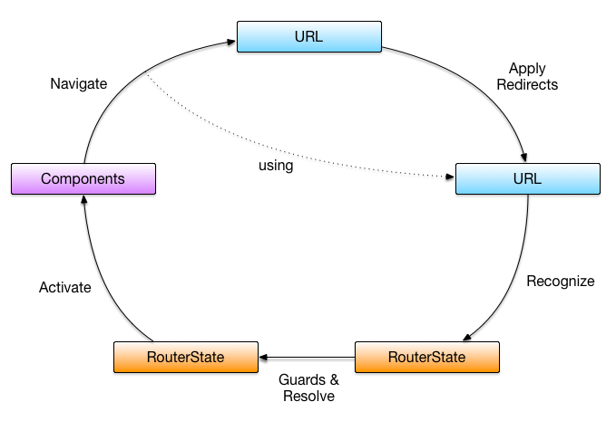
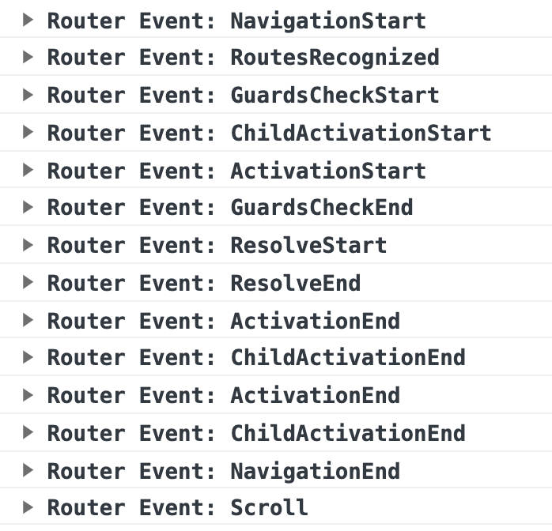
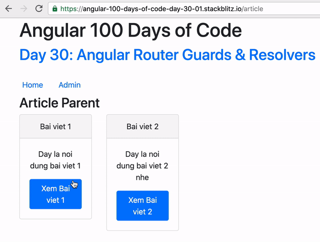
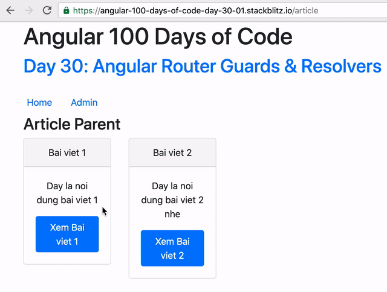

# Day 30: Angular Router - Guards and Resolvers Part 1

Thông thường, một trang web được chia thành các pages, và có thể có những pages bạn phải được cấp một quyền nào đó thì mới có thể vào được.

Đối với các ứng dụng server-side render thông thường, người dùng sẽ navigate vào các URL, sau đó server sẽ kiểm tra tính hợp lệ hay không để trả về trang yêu cầu.

Đối với các ứng dụng Single Page Apps (SPAs) được viết bằng Angular (hoặc có thể là React, Vue, etc), do chúng ta đã tải hết resouces cần thiết về và chỉ call đến DataSources để lấy về data và render Component/View tương ứng mà không cần phải reload lại pages. Do đó nhiệm vụ kiểm tra tính hợp lệ khi người dùng muốn render một/một vài component sẽ bao gồm cả phần frontend.

## Angular Router Navigation Cycle



Angular Router bao gồm 5 operations cơ bản.

Khi nhận một URL, Angular Router sẽ thực hiện các hành động sau:

1. Applies redirects
2. Recognizes router states
3. Runs guards and resolves data,
4. Activates all the needed components
5. Manages navigation


Để demo cho các nội dung tiếp theo, ứng dụng của chúng ta bao gồm các config routing như sau:

**app-routing.module.ts**
```ts
const routes: Routes = [
  {
    path: 'admin',
    loadChildren: () =>
      import('./admin/admin.module').then((m) => m.AdminModule),
  },
  {
    path: '',
    redirectTo: 'article',
    pathMatch: 'full'
  }
];
```

**article-routing.module.ts**
```ts
const routes: Routes = [
  {
    path: 'article',
    component: ArticleComponent,
    children: [
      {
        path: '',
        component: ArticleListComponent,
      },
      {
        path: ':slug',
        component: ArticleDetailComponent
      }
    ]
  },
];
```

**admin-routing.module.ts**
```ts
const routes: Routes = [
  {
    path: '',
    component: AdminComponent,
    children: [
      {
        path: '',
        component: AdminArticleListComponent,
      },
    ],
  },
];
```

### Navigation
Operation đầu tiên chính là **Navigation** hay **Applies redirects**.

Đối với thẻ `a href` thông thường, hành vi mặc định của nó sẽ gửi request đến URL được chỉ định. Do đó Angular Router cung cấp một directive là `routerLink` để thay thế hành vi đó. Directive đó là các declarative để thực hiện navigation. Ngoài ra chúng ta cũng có các cách imperative như dùng `Router.navigate()` hoặc `Router.navigateByUrl()`.

Navigation được thực hiện (thông thường) qua việc thay đổi URL bằng các cách kể trên.

Ví dụ với ứng dụng demo của chúng ta, https://stackblitz.com/edit/angular-100-days-of-code-day-30, navigation phát sinh khi navigate từ trang Article List `/article` vào trang Article Detail `/article/:slug`.


Sau bước này Angular Router sẽ emit event **NavigationStart**.

### Recognizes router states

Operation thứ hai là **Recognizes router states**. Ở bước này, Angular Router sẽ thực hiện một số thuật toán như **Backtracking**, **Depth-First** để thực hiện matching xem route nào thỏa mãn với URL đang muốn redirect đến. [The Powerful URL Matching Engine of Angular Router](https://vsavkin.com/the-powerful-url-matching-engine-of-angular-router-775dad593b03)

Ở bước này, chúng ta hoàn toàn có thể được redirect sang một URL khác, nhưng cuối cùng chúng ta sẽ đi vào một trong hai trường hợp: hoặc là lỗi do không có route nào thỏa mãn, hoặc là route recognized.

Ví dụ như app demo của chúng ta, khi người dùng navigate vào `/`, nó sẽ redirect về `/article`, và sẽ được recognized. Nhưng nếu người dùng đi vào `/something-not-present`, chúng ta sẽ nhận được lỗi `Error: Cannot match any routes. URL Segment: 'something-not-present'`.

Sau khi kết thúc, chúng ta sẽ có được `RouterState` chứa thông tin về các activated route như component được liên kết, params, data, ... [ActivatedRoute](https://angular.io/api/router/ActivatedRoute).

Sau bước này Angular Router sẽ emit event **RoutesRecognized**.

### Runs guards

Đây chính là Operation mà chúng ta sẽ tìm hiểu chủ yếu trong ngày hôm nay.

Ở thời điểm này, chúng ta sẽ có *future router state*, Router sẽ kiểm tra xem nơi mà chúng ta sắp đến này có được phép hay không.

Chúng ta có thể apply nhiều Guards khác nhau, Router sẽ check nếu tất cả các Guards đều trả về `true` hoặc `Promise<<true>>` hoặc `Observable<<true>>` thì sẽ cấp cho giấy thông hành. Ngược lại, nếu bạn trả về các giá trị `false` hoặc `Promise<<false>>` hoặc `Observable<<false>>` hoặc một [`UrlTree`](https://angular.io/api/router/UrlTree) thì sẽ không cấp phép.

Ở stage này, Router sẽ emit hai events **GuardsCheckStart**, **GuardsCheckEnd**.

Đối với ứng dụng của chúng ta sẽ có nhiều chỗ để apply được Guards, như khi vào trang `/admin`, hay vào chức năng edit của một article, hoặc là có cho phép navigate ra khỏi page edit khi người dùng đang thực hiện editing hay không, etc.

### Resolves data

Sau khi chạy xong Guards, Router sẽ tiếp tục với **Resolves data**. Ở bước này chúng ta có thể prefetch data trước khi Router render bất cứ thứ gì.

Ở stage này, Router sẽ emit hai events **ResolveStart**, **ResolveEnd**.

Sau bước này, Router sẽ update thêm những phần của resolvers vào `data` property của `ActivatedRoute`.

Sau khi đã chạy hết tất cả các resolvers đã được thiết lập từ trước, Router sẽ tiến hành activate component vào các router-outlet tương ứng trong config đã được set trước đó.

### Activating Components
Ở thời điểm này, Router sẽ activate các components đã được liên kết với các activated route. Đây sẽ là thời điểm khởi tạo mới hoặc reuse các components sau đó render chúng vào các `router-outlet` tương ứng. Default sẽ là primary outlet - tức là `<router-outlet></router-outlet>` mà không có `name`.

Các events tương ứng là **ActivationStart**, **ActivationEnd**, **ChildActivationStart**, **ChildActivationEnd**.

Sau khi navigate xong xuôi, Router sẽ emit event **NavigationEnd**, đây cũng là event các bạn có thể observe để thực hiện hành vi nào đó cần thiết sau khi navigation.

Tiếp theo đó Router sẽ update URL trên thanh địa chỉ của browser, để các bạn có thể nhìn thấy sự thay đổi, trừ trường hợp các bạn set `skipLocationChange = true`.

### Manages navigation

Từ đây, Router lại tiếp tục observe, nếu có một yêu cầu nào đó để thay đổi URL thông qua các cách đã liệt kê ở trên, nó sẽ thực hiện tiếp một chu trình nữa.




## Route Guards

Route Guards để giải quyết câu hỏi, liệu tôi có được phép redirect đến URL này hay không.

> If all guards return true, navigation will continue. If any guard returns false, navigation will be cancelled. If any guard returns a UrlTree, current navigation will be cancelled and a new navigation will be kicked off to the UrlTree returned from the guard.

Angular Router cung cấp một số guards như sau:

- Activate components:

```ts
interface CanActivate {
  canActivate(route: ActivatedRouteSnapshot, state: RouterStateSnapshot): Observable<boolean | UrlTree> | Promise<boolean | UrlTree> | boolean | UrlTree
}
```
```ts
interface CanActivateChild {
  canActivateChild(childRoute: ActivatedRouteSnapshot, state: RouterStateSnapshot): Observable<boolean | UrlTree> | Promise<boolean | UrlTree> | boolean | UrlTree
}
```

- Deactivate components:
```ts
interface CanDeactivate<T> {
  canDeactivate(component: T, currentRoute: ActivatedRouteSnapshot, currentState: RouterStateSnapshot, nextState?: RouterStateSnapshot): Observable<boolean | UrlTree> | Promise<boolean | UrlTree> | boolean | UrlTree
}
```
- Load children (lazy loading route):
```ts
interface CanLoad {
  canLoad(route: Route, segments: UrlSegment[]): Observable<boolean | UrlTree> | Promise<boolean | UrlTree> | boolean | UrlTree
}
```

### CanActivate

Giả sử chúng ta có chức năng edit bài viết, yêu cầu đưa ra là chỉ có ai là author mới có thể edit được bài của người đó. App demo sẽ có config routing như sau:

```ts
const routes: Routes = [
  {
    path: 'article',
    component: ArticleComponent,
    children: [
      {
        path: '',
        component: ArticleListComponent,
      },
      {
        path: ':slug',
        component: ArticleDetailComponent
      },
      {
        path: ':slug/edit',
        component: ArticleEditComponent
      }
    ]
  },
];
```

Giờ đây bạn có thể vào bất cứ bài nào cũng sẽ có thể navigate được vào tiếp page edit.



Giờ đây bạn có thể tạo một service, sau đó kiểm tra các quyền để có thể cho phép người dùng có được di chuyển vào hay không.

```ts
import { Injectable } from '@angular/core';
import { CanActivate, ActivatedRouteSnapshot, RouterStateSnapshot, UrlTree } from '@angular/router';
import { Observable } from 'rxjs';

@Injectable({
  providedIn: 'root' // you can change to any level if needed
})
export class CanEditArticleGuard implements CanActivate {
  canActivate(
    next: ActivatedRouteSnapshot,
    state: RouterStateSnapshot): Observable<boolean | UrlTree> | Promise<boolean | UrlTree> | boolean | UrlTree {
    return true; // replace with actual logic
  }
}
```

Để có thể register guard vừa tạo, chúng ta cần thêm vào `canActivate` array khi config routing như sau:

```ts
const routes: Routes = [
  {
    path: 'article',
    component: ArticleComponent,
    children: [
      // other configurations
      {
        path: ':slug/edit',
        component: ArticleEditComponent,
        canActivate: [CanEditArticleGuard] // <== this is an array, we can have multiple guards
      }
    ]
  },
];
```

Giả định rằng, chúng ta có một service để biết được user hiện tại là ai như sau:

```ts
import { Injectable } from '@angular/core';

@Injectable({
  providedIn: 'root'
})
export class UserService {
  currentUser = {
    username: 'TiepPhan'
  };
  constructor() { }

}
```

Guard của chúng ta sẽ có thể có logic như sau:

```ts
@Injectable({
  providedIn: 'root'
})
export class CanEditArticleGuard implements CanActivate {
  constructor(private userService: UserService, private articleService: ArticleService) {}
  canActivate(
    next: ActivatedRouteSnapshot,
    state: RouterStateSnapshot): Observable<boolean | UrlTree> | Promise<boolean | UrlTree> | boolean | UrlTree {
    return this.articleService.getArticleBySlug(next.paramMap.get('slug')).pipe(
      map(article => article.author === this.userService.currentUser.username)
    );
  }
}
```
Thành quả có được là chúng ta không thể vào page edit của `bai-viet-2`, vì author không phải là user đang đăng nhập.



Tương tự như `CanActivate`, chúng ta có cách hoạt động của `CanActivateChild`, nhưng được apply cho các children của một route.

## Summary
Day 30 này có khá nhiều concept về Angular Router Navigation Lifecycle mà các bạn nên biết, ngoài ra chúng ta đã thực hành một guard thường được sử dụng là CanActivate, hi vọng sẽ không làm khó được các bạn.

Mục tiêu của ngày 31 sẽ là **Angular Router - Guards and Resolvers Part 2**

## Code sample

- https://stackblitz.com/edit/angular-100-days-of-code-day-30?file=src%2Fapp%2Farticle%2Farticle.service.ts
- https://stackblitz.com/edit/angular-100-days-of-code-day-30-01?file=src%2Fapp%2Farticle%2Farticle-routing.module.ts

## References

Các bạn có thể đọc thêm ở các bài viết sau

- https://angular.io/guide/router
- https://vsavkin.com/angular-2-router-d9e30599f9ea
- https://www.tiepphan.com/angular-router-series/
- https://indepth.dev/angular-router-series-pillar-2-understanding-the-routers-navigation-cycle/
- https://vsavkin.com/the-powerful-url-matching-engine-of-angular-router-775dad593b03

## Author

[Tiep Phan](https://github.com/tieppt)

`#100DaysOfCodeAngular` `#100DaysOfCode` `#AngularVietNam100DoC_Day30`
