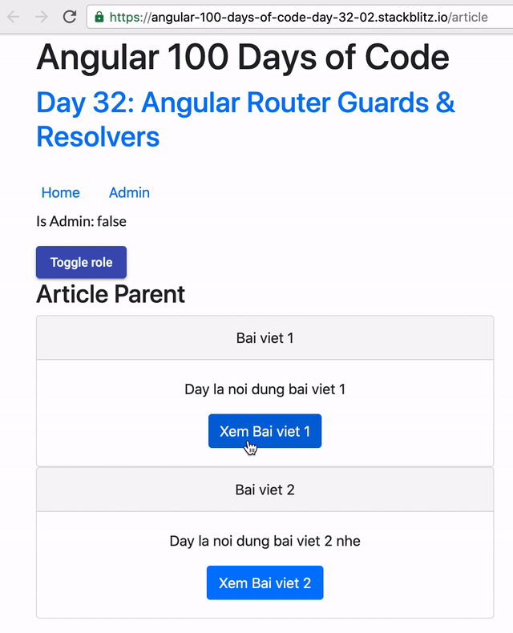
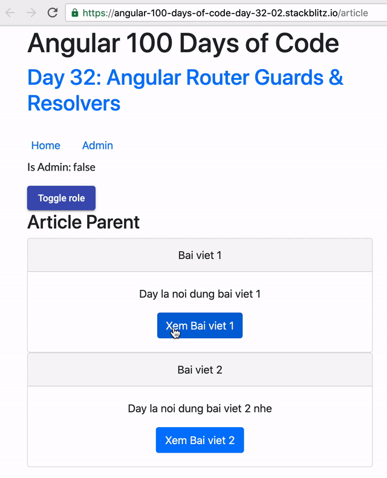

# Day 32: Angular Router - Guards and Resolvers Part 3

Trong những ngày trước chúng ta đã tìm hiểu về Route Guards, chúng ta đã đi qua khá nhiều case cụ thể để học cách sử dụng những Guards cơ bản này. Trong Day 32 này chúng ta sẽ tìm hiểu tiếp một phần nữa là Route Resolvers, chúng là gì, và cách dùng như thế nào, các câu hỏi trên sẽ lần lượt được giải quyết trong những phần sắp tới.

## Route Resolvers

Sau khi Route Guards đã chạy xong và passed các guards này thì sẽ là thời điểm Route Resolvers được thực thi. Thông thường đây là nơi chúng ta có thể chuẩn bị trước data để sử dụng cho routed component sắp được activate.

Liệu chúng ta có thật sự cần Resolvers?

Thông thường, chúng ta có thể vào component rồi từ `ngOnInit` chúng ta sẽ tiến hành các step để lấy về data cần thiết cho component đó.

Ví dụ như component `ArticleDetailComponent` ở đây:

```ts
export class ArticleDetailComponent implements OnInit {
  article$: Observable<Article>;
  constructor(private _route: ActivatedRoute, private _api: ArticleService) {}

  ngOnInit(): void {
    this.article$ = this._route.paramMap.pipe(
      map((params) => params.get('slug')),
      switchMap((slug) => this._api.getArticleBySlug(slug))
    );
  }
}
```

Đúng vậy, khi component được activated, chúng ta sẽ tiến hành connect đến DataSource để lấy về dữ liệu cần thiết. Trong khá nhiều trường hợp, quá trình đó là quá trình bất đồng bộ như trên.

Lúc này bạn sẽ nhìn thấy chúng ta có implement loading indicator để báo cho người dùng biết chúng ta đang đi lấy dữ liệu về.



Full demo: https://stackblitz.com/edit/angular-100-days-of-code-day-32-01

Với những trường hợp đơn giản như trên, chúng ta hoàn toàn có thể lấy về trước một phần data nào đó. Đây chính là một dạng như middleware ở trong Angular Router mà chúng ta được biết đến dưới tên gọi Resolvers.

> Interface that classes can implement to be a data provider. A data provider class can be used with the router to resolve data during navigation. The interface defines a `resolve()` method that will be invoked when the navigation starts. The router will then wait for the data to be resolved before the route is finally activated.

```ts
interface Resolve<T> {
  resolve(
    route: ActivatedRouteSnapshot,
    state: RouterStateSnapshot
  ): Observable<T> | Promise<T> | T;
}
```

Resolver chỉ là một service, có implement interface `Resolve` ở trên. Các Resolvers sẽ được call hàm `resolve` và Router sẽ đợi đến khi nào data được `resolved` xong xuôi thì mới activate components.

Ví dụ, chúng ta có thể tạo một resolver để lấy về thông tin một Article như sau:

```ts
@Injectable({
  providedIn: 'root',
})
export class ArticleResolver implements Resolve<Article> {
  constructor(private articleService: ArticleService) {}

  resolve(
    route: ActivatedRouteSnapshot,
    state: RouterStateSnapshot
  ): Observable<Article> | Promise<Article> | Article {
    const slug = route.paramMap.get('slug');
    return this.articleService.getArticleBySlug(slug);
  }
}
```

Sau đó, config routing của article detail sẽ có thêm một key mới:

```ts
const routes: Routes = [
  {
    path: 'article',
    component: ArticleComponent,
    children: [
      {
        path: '',
        component: ArticleListComponent,
      },
      {
        path: ':slug',
        component: ArticleDetailComponent,
        resolve: {
          article: ArticleResolver, // <== key: value (service or Dependency injection token)
        },
      },
    ],
  },
];
```

Sau cùng, chúng ta thay đổi component để lấy về data cần thiết từ `data` property:

```ts
export class ArticleDetailComponent implements OnInit {
  article$: Observable<Article>;
  constructor(private _route: ActivatedRoute, private _api: ArticleService) {}

  ngOnInit(): void {
    // this.article$ = this._route.paramMap.pipe(
    //   map(params => params.get('slug')),
    //   switchMap(slug => this._api.getArticleBySlug(slug))
    // );
    this.article$ = this._route.data.pipe(map((data) => data.article));
  }
}
```

Bây giờ chúng ta chạy thử sẽ thấy, thay vì hiển thị loading ở component, chúng ta đã lấy về data trước khi thực hiện activate component, do đó sau khi navigate, resolver phải resolved rồi chúng ta mới có thể thấy component được render ra. Vì thế nên chúng ta sẽ không thấy loading indicator đâu nữa.



Full demo: https://stackblitz.com/edit/angular-100-days-of-code-day-32-02?file=src%2Fapp%2Farticle-resolver.service.ts

## Lưu ý

Đây là điều mà bạn cần phải nhớ khi quyết định dùng Resolvers:

- Nếu Resolver không resolved, bạn sẽ không thể nhìn thấy component của mình được render. Do đó nếu bạn sử dụng Observable, và Observable có thể không bao giờ complete thì bạn sẽ không thể navigate vào page được.

- Không share giữa nhiều Resolvers với nhau.

Ví dụ, giả sử chúng ta có một service và nó emit 5 giá trị mỗi lần như sau:

```ts
getArticleBySlug(slug: string): Observable<Article> {
  let article = Articles.find(x => x.slug === slug)
  return interval(1000).pipe(
    switchMap(() => of(article)),
    take(5)
  );
}
```

Nếu bạn sử dụng trong component thông thường, chúng sẽ hiển thị rất bình thường, nhưng trong Resolvers thì chỉ khi nào Observable trả về bởi `getArticleBySlug` complete, lúc đó bạn mới navigate vào page được.

Full demo: https://stackblitz.com/edit/angular-100-days-of-code-day-32-03?file=src%2Fapp%2Farticle%2Farticle.service.ts

Do đó, đối với những stream trả về nhiều value, thì bạn không nên dùng cho Resolvers. Ví dụ như WebSocket chẳng hạn.

Quan điểm của mình, thì chúng ta chỉ nên dùng Resolver để lấy về một phần dữ liệu, sau đó component sẽ thực thi tiếp các connection khác.

## Summary

Day 32 này chúng ta đã biết thêm về Route Resolvers, chúng ta cũng đã tìm hiểu một số trade-off của việc dùng Resolvers, hi vọng các bạn sẽ có thể thấy nhiều điều hữu ích khác của nó khi dùng trong dự án.

Mục tiêu của ngày 33 sẽ là **Angular Forms: Template-driven Forms**

## Code sample

- https://stackblitz.com/edit/angular-100-days-of-code-day-32-01
- https://stackblitz.com/edit/angular-100-days-of-code-day-32-02?file=src%2Fapp%2Farticle-resolver.service.ts
- https://stackblitz.com/edit/angular-100-days-of-code-day-32-03?file=src%2Fapp%2Farticle%2Farticle.service.ts

## Youtube Video

[](https://youtu.be/YAAv4f85s7A)

## References

Các bạn có thể đọc thêm ở các bài viết sau

- https://angular.io/guide/router
- https://vsavkin.com/angular-2-router-d9e30599f9ea
- https://www.tiepphan.com/angular-router-series/
- https://www.tiepphan.com/angular-route-resolver/
- https://indepth.dev/angular-router-series-pillar-2-understanding-the-routers-navigation-cycle/
- https://vsavkin.com/the-powerful-url-matching-engine-of-angular-router-775dad593b03

## Author

[Tiep Phan](https://github.com/tieppt)

`#100DaysOfCodeAngular` `#100DaysOfCode` `#AngularVietNam100DoC_Day32`
