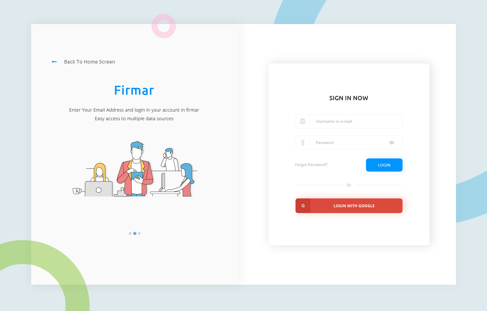
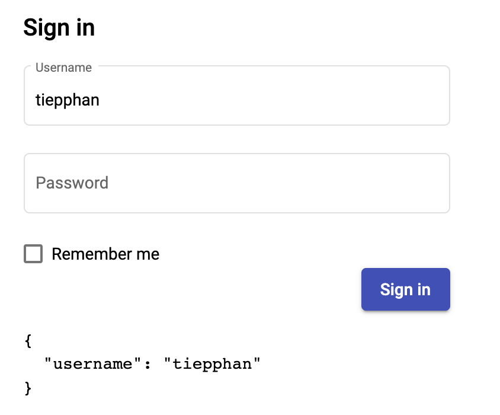
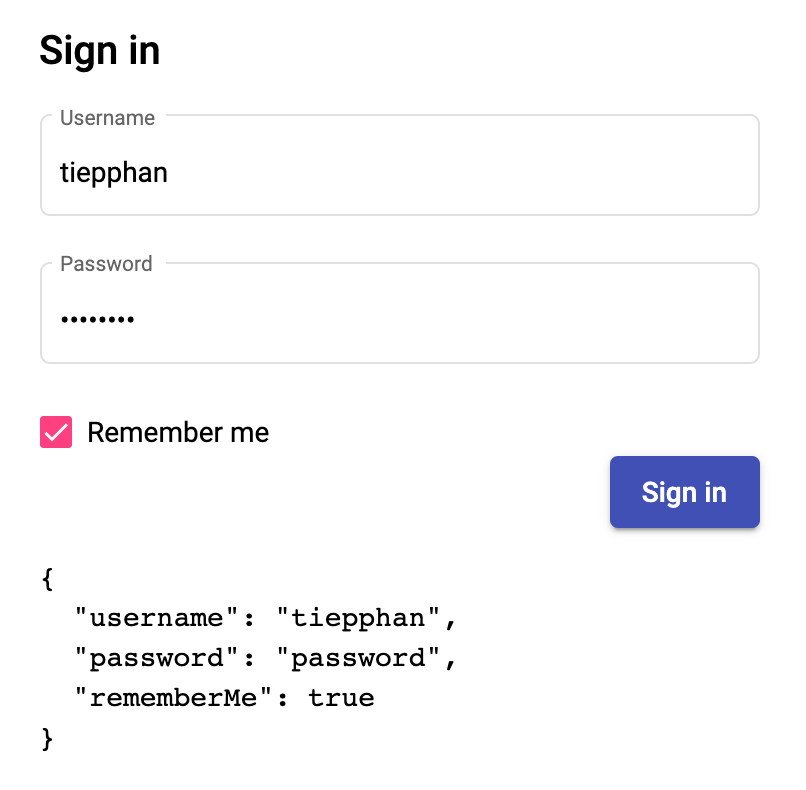
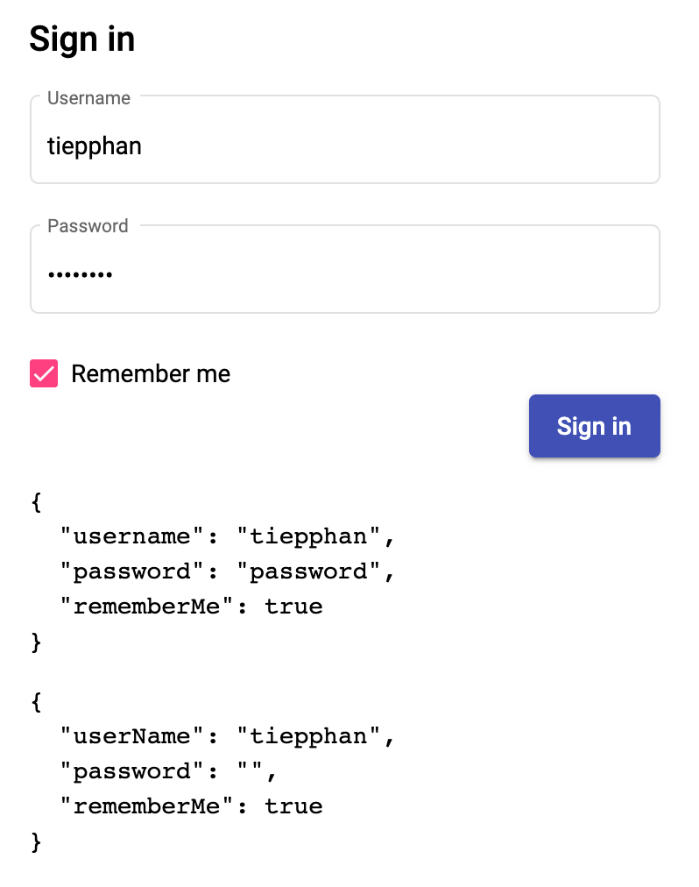
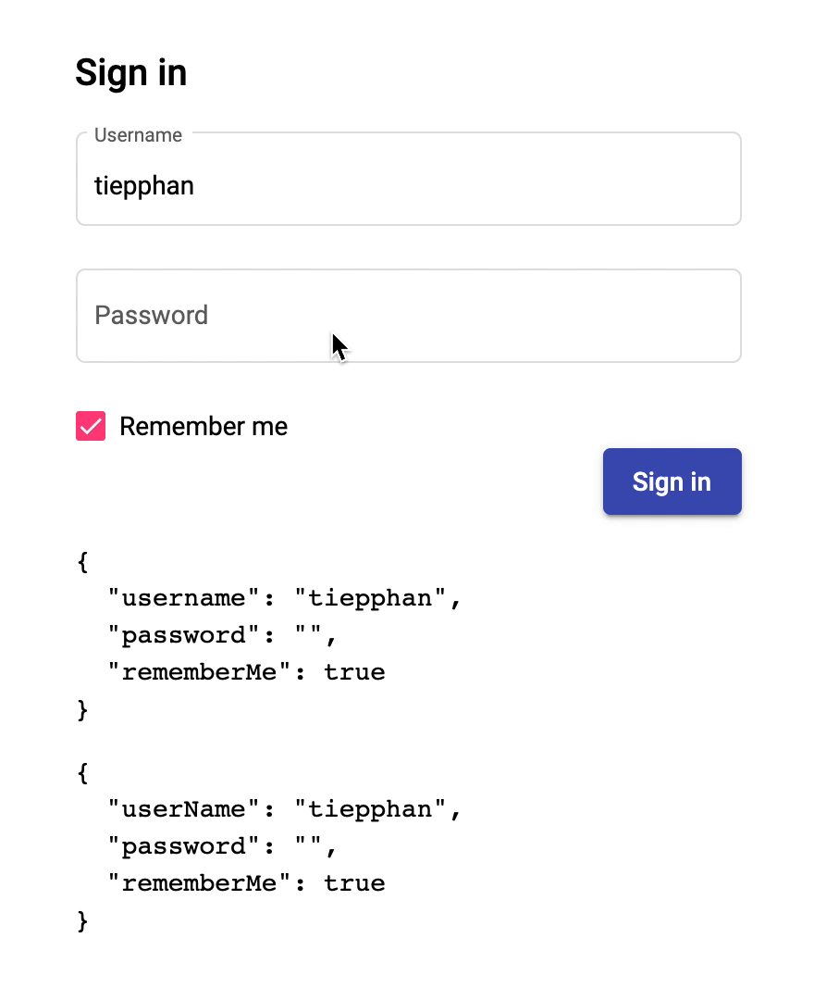

# Day 33: Template-driven Forms Trong Angular

Form hay biểu mẫu là một thành phần khá quan trọng trong các hệ thống/công ty hiện nay. Ví dụ khi bạn mở một tài khoản ngân hàng, hay form đăng ký trường Đại học, hoặc kể cả là một số form các bạn cần phải điền khi đi làm ở một công ty mới chẳng hạn.

Do đó các ứng dụng sẽ có thể có khá nhiều ứng dụng cần phải thiết lập chức năng Forms để có thể thu thập thông tin cần thiết của người dùng. Ví dụ như form **Sign in** dưới đây:


[From victorthemes](https://victorthemes.com/freebies/sign-form-template/)

## Introduction

Angular là một full-fledged framework, nó đã cung cấp sẵn hai giải pháp cho Forms là **Template-driven Forms** và **Reactive Forms** hay còn gọi làm **Model-driven Forms**.

> Angular provides two different approaches to handling user input through forms: reactive and template-driven. Both capture user input events from the view, validate the user input, create a form model and data model to update, and provide a way to track changes. [Angular Forms overview](https://angular.io/guide/forms-overview)

- **Template-driven Forms**: Cơ chế hoạt động của dạng forms này sẽ chủ yếu dựa vào các **directives** trên template như `NgForm`, `NgModel`, `required`, etc; để làm việc. Form dạng này sử dụng Two-way binding để update data model giữa template và component.

- **Reactive Forms**: Chúng ta sẽ xây dựng form từ các model, là các object có một số chức năng đặc biệt để quản lý được các form input. Nó cũng sử dụng một số (nhưng rất ít) các directives.

> Template-driven forms use two-way data binding to update the data model in the component as changes are made in the template and vice versa. [Angular.io](https://angular.io/guide/forms)

> Reactive forms provide a model-driven approach to handling form inputs whose values change over time. [Angular.io](https://angular.io/guide/reactive-forms)

## Init project

Để demo trong ngày hôm nay chúng ta có thể sử dụng Angular và Angular Material cho sinh động.

Các bạn có thể tạo mới Angular project bằng lệnh sau:

```sh
ng new acme
```

Sau đó lựa chọn các config phù hợp cho routing, style. Ví dụ:

```
? Would you like to add Angular routing? Yes
? Which stylesheet format would you like to use? SCSS
```

Sau khi tạo thành công, bạn chỉ cần chạy lệnh sau để add Angular CDK và Angular Material vào dự án:

```sh
ng add @angular/cdk
```

```sh
ng add @angular/material
```

Ở bước này bạn có thể trả lời một số câu hỏi, hoặc bạn có thể chọn các giá trị mặc định. Ví dụ:

```
? Choose a prebuilt theme name, or "custom" for a custom theme: Indigo/Pink [ Preview: https://material.angular.io?theme=indigo-pink ]
? Set up global Angular Material typography styles? Yes
? Set up browser animations for Angular Material? Yes
```

Như thế là xong phần khởi tạo project, chúng ta có thể chạy lệnh sau để khởi chạy chương trình:

```sh
ng serve
```

## Sign in form

Chúng ta sẽ cần một component (_sign-in_) mới và setup routing cho nó như sau:

```sh
ng g c sign-in
```

```ts
const routes: Routes = [
  {
    path: 'sign-in',
    component: SignInComponent,
  },
];
```

Giờ đây bạn có thể navigate vào trang http://localhost:4200/sign-in và bắt đầu code được rồi.

Giả sử page **Sign in** sẽ có một input cho việc nhập _Username_, một input cho _Password_, và một checkbox cho chức năng _Remember me_, kèm theo đó là một button để submit form chẳng hạn.

Chúng ta có thể có template như sau:

```html
<div class="container">
  <form class="sign-in-form">
    <h2>Sign in</h2>
    <div class="row-control">
      <mat-form-field appearance="outline">
        <mat-label>Username</mat-label>
        <input matInput placeholder="Username" />
      </mat-form-field>
    </div>
    <div class="row-control">
      <mat-form-field appearance="outline">
        <mat-label>Password</mat-label>
        <input type="password" matInput placeholder="Password" />
      </mat-form-field>
    </div>
    <div class="row-control">
      <mat-checkbox>Remember me</mat-checkbox>
    </div>
    <div class="row-control row-actions">
      <button mat-raised-button color="primary" type="submit">Sign in</button>
    </div>
  </form>
</div>
```

Lưu ý, để có thể sử dụng các components/directives từ Angular Material các bạn cần import `NgModule` tương ứng vào `NgModule` quản lý component hiện tại. Ví dụ trong trường hợp này `SignInComponent` được quản lý bởi `AppModule` nên chúng ta có một số imports sau:

```ts
import { MatInputModule } from '@angular/material/input';
import { MatFormFieldModule } from '@angular/material/form-field';
import { MatCheckboxModule } from '@angular/material/checkbox';
import { MatButtonModule } from '@angular/material/button';

@NgModule({
  declarations: [AppComponent, SignInComponent],
  imports: [
    BrowserModule,
    AppRoutingModule,
    BrowserAnimationsModule,
    MatButtonModule,
    MatFormFieldModule,
    MatInputModule,
    MatCheckboxModule,
    MatButtonModule,
  ],
})
export class AppModule {}
```

Khi render chúng ta sẽ có giao diện như sau:


## Integrate Angular Forms

Để có thể sử dụng các APIs mà Angular cung cấp cho việc thao tác với **Template-driven Forms**, chúng ta cần import `NgModule` là `FormsModule` từ package `@angular/forms` như sau vào `AppModule`:

```ts
import { FormsModule } from '@angular/forms';

@NgModule({
  declarations: [AppComponent, SignInComponent],
  imports: [
    // other NgModules
    FormsModule,
  ],
})
export class AppModule {}
```

### ngForm và ngModel directives

Để có thể lấy về NgForm instance, chúng ta chỉ cần tạo một template variable cho thẻ `form` kèm theo chỉ định về exportAs như sau:

```html
<form novalidate #signInForm="ngForm" ...></form>
```

Từ đây bạn có thể sử dụng variable `signInForm` này ở trong template, cũng như truyền về component class.

Ví dụ, chúng ta truyền instance này vào hàm lắng nghe event submit của form chẳng hạn:

```ts
export class SignInComponent implements OnInit {
  constructor() {}

  ngOnInit(): void {}

  onSubmit(form: NgForm): void {
    console.log(form);
  }
}
```

```html
<form
  novalidate
  #signInForm="ngForm"
  (submit)="onSubmit(signInForm)"
  ...
></form>
```

Ở thời điểm hiện tại chúng ta mặc dù đã khai báo một số input/control, nhưng form của chúng ta không thể xác nhận được những control đó, nên nếu bạn print thử value của form hiện tại sẽ là một object rỗng:

```html
<pre>
{{ signInForm.value | json }}
</pre>
```

Lúc này bạn sẽ cần phải register các control vào form thông qua `ngModel` directive.

```html
<input matInput placeholder="Username" ngModel />
```

Ngay khi chúng ta save lại, bạn sẽ nhận được một thông báo lỗi runtime như sau ở console:

```
Error: If ngModel is used within a form tag, either the name attribute must be set or the form control must be defined as 'standalone' in ngModelOptions.

  Example 1: <input [(ngModel)]="person.firstName" name="first">
  Example 2: <input [(ngModel)]="person.firstName" [ngModelOptions]="{standalone: true}">
```

Một thông báo khá rõ ràng, chúng ta cần phải gắn thêm `name` attribute cho thẻ `input` hoặc sẽ thêm một config nữa. Trong trường hợp này, chúng ta mong muốn register control nên chúng ta sẽ thêm `name` attribute.

```html
<input matInput placeholder="Username" ngModel name="username" />
```

Giờ đây control của chúng ta đã được register, và mỗi khi user typing vào ô input đó thì value của form cũng sẽ update theo.



Thực hiện tương tự cho các control khác, chúng ta sẽ có một form hoàn chỉnh như sau:

```html
<form
  class="sign-in-form"
  novalidate
  #signInForm="ngForm"
  (submit)="onSubmit(signInForm)"
>
  <h2>Sign in</h2>
  <div class="row-control">
    <mat-form-field appearance="outline">
      <mat-label>Username</mat-label>
      <input matInput placeholder="Username" ngModel name="username" />
    </mat-form-field>
  </div>
  <div class="row-control">
    <mat-form-field appearance="outline">
      <mat-label>Password</mat-label>
      <input
        type="password"
        matInput
        placeholder="Password"
        ngModel
        name="password"
      />
    </mat-form-field>
  </div>
  <div class="row-control">
    <mat-checkbox ngModel name="rememberMe">Remember me</mat-checkbox>
  </div>
  <div class="row-control row-actions">
    <button mat-raised-button color="primary" type="submit">Sign in</button>
  </div>

  <pre>{{ signInForm.value | json }}</pre>
</form>
```



### Event Submit vs NgSubmit

Ở phần trước, chúng ta đã listen event `submit` của form, nhưng ngoài ra, còn một event khác cũng được fired ra khi thực hiện submit form, đó là `ngSubmit`. Vậy có điều gì khác biệt giữa `submit` và `ngSubmit`?

Giống như `submit`, event `ngSubmit` cũng thực hiện hành động khi form thực hiện submit – người dùng nhấn vào button submit chẳng hạn. Nhưng `ngSubmit` sẽ thêm một số nhiệm vụ để đảm bảo form của bạn không thực hiện submit form theo cách thông thường – tải lại trang sau khi submit.

Giả sử, chúng ta thực hiện một tác vụ nào đó trong hàm listen form submit mà sinh ra exception, lúc này nếu bạn sử dụng `submit`, trang web của bạn sẽ reload, còn nếu bạn sử dụng `ngSubmit`, nó sẽ không reload – phiên bản lúc này tôi đang sử dụng.

```ts
onSubmit(form: NgForm) {
  // Do something awesome
  console.log(form);
  throw new Error('something went wrong');
}
```

Lời khuyên dành cho bạn là nên dùng `ngSubmit` cho việc listen form submit.

> Lưu ý rằng `ngSubmit` có thể áp dụng cho cả Reactive Forms

## ngModel, [ngModel] and [(ngModel)]

Như chúng ta đã biết, `ngModel` là directive giúp chúng ta register control với form, vậy hai hình thái còn lại có tác dụng gì?

- `[ngModel]`: là property binding, tức là chúng ta có thể binding một value hoặc một property cho nó.
- `[(ngModel)]`: là two-way data binding, lúc này nó sẽ kết hợp propety binding và event binding để đồng bộ dữ liệu giữa template và model với nhau.

Ví dụ, chúng ta có thể có một object (model) với những data có sẵn để binding ra form (form edit chẳng hạn):

```ts
export class SignInComponent implements OnInit {
  userInfo = {
    userName: 'tiepphan',
    password: '',
    rememberMe: true,
  };
  constructor() {}

  ngOnInit(): void {}

  onSubmit(form: NgForm): void {
    console.log(form);
  }
}
```

```html
<form
  class="sign-in-form"
  novalidate
  #signInForm="ngForm"
  (submit)="onSubmit(signInForm)"
>
  <h2>Sign in</h2>
  <div class="row-control">
    <mat-form-field appearance="outline">
      <mat-label>Username</mat-label>
      <input
        matInput
        placeholder="Username"
        [ngModel]="userInfo.userName"
        name="username"
      />
    </mat-form-field>
  </div>
  <div class="row-control">
    <mat-form-field appearance="outline">
      <mat-label>Password</mat-label>
      <input
        type="password"
        matInput
        placeholder="Password"
        [ngModel]="userInfo.password"
        name="password"
      />
    </mat-form-field>
  </div>
  <div class="row-control">
    <mat-checkbox [ngModel]="userInfo.rememberMe" name="rememberMe"
      >Remember me</mat-checkbox
    >
  </div>
  <div class="row-control row-actions">
    <button mat-raised-button color="primary" type="submit">Sign in</button>
  </div>

  <pre>{{ signInForm.value | json }}</pre>
  <pre>{{ userInfo | json }}</pre>
</form>
```

Khi render, những gì có trong model sẽ được binding vào control, nhưng control thay đổi giá trị thì không thay đổi ngược lại model, vì chúng ta mới chỉ binding một chiều:



Nếu chúng ta thay đổi thành two-way binding, thì những gì có ở form sẽ được update tương ứng lại model và ngược lại:

```html
<form
  class="sign-in-form"
  novalidate
  #signInForm="ngForm"
  (submit)="onSubmit(signInForm)"
>
  <h2>Sign in</h2>
  <div class="row-control">
    <mat-form-field appearance="outline">
      <mat-label>Username</mat-label>
      <input
        matInput
        placeholder="Username"
        [(ngModel)]="userInfo.userName"
        name="username"
      />
    </mat-form-field>
  </div>
  <div class="row-control">
    <mat-form-field appearance="outline">
      <mat-label>Password</mat-label>
      <input
        type="password"
        matInput
        placeholder="Password"
        [(ngModel)]="userInfo.password"
        name="password"
      />
    </mat-form-field>
  </div>
  <div class="row-control">
    <mat-checkbox [(ngModel)]="userInfo.rememberMe" name="rememberMe"
      >Remember me</mat-checkbox
    >
  </div>
  <div class="row-control row-actions">
    <button mat-raised-button color="primary" type="submit">Sign in</button>
  </div>

  <pre>{{ signInForm.value | json }}</pre>
  <pre>{{ userInfo | json }}</pre>
</form>
```




## Summary

Day 33 chúng ta đã tìm hiểu một số concept cơ bản về Angular Forms, và cũng đã thực hành cách tạo một _Sign In Form_ đơn giản bằng **Template-driven Forms**. Các bạn có thể thực hành với nhiều form hơn ở trên các trang chia sẻ template.

Mục tiêu của ngày 34 sẽ là **Angular Forms: Template-driven Forms Part 2**

## Code sample

- https://github.com/tieppt/100-doc-angular/tree/day33
- https://stackblitz.com/edit/100-days-of-angular-day-33?file=src%2Fapp%2Fsign-in%2Fsign-in.component.html

## Youtube Video

[](https://youtu.be/0kbEVtO79Xw)
## References

Các bạn có thể đọc thêm ở các bài viết sau

- https://angular.io/guide/forms-overview
- https://angular.io/guide/forms
- https://angular.io/guide/reactive-forms
- https://www.tiepphan.com/thu-nghiem-voi-angular-template-driven-forms-trong-angular/

## Author

[Tiep Phan](https://github.com/tieppt)

`#100DaysOfCodeAngular` `#100DaysOfCode` `#AngularVietNam100DoC_Day33`
