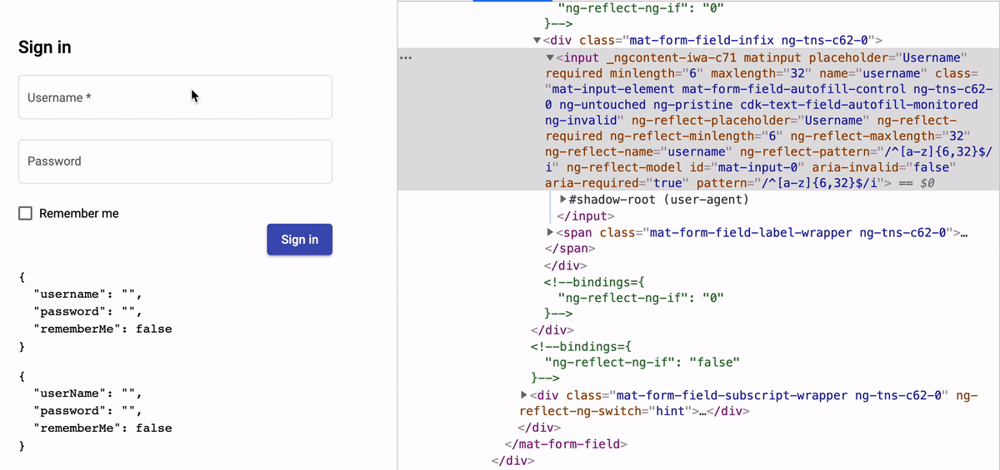
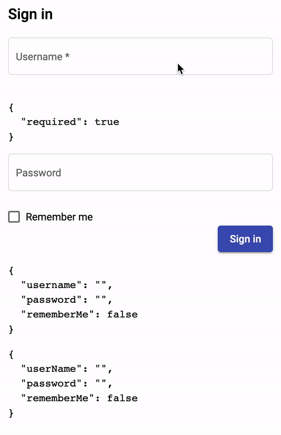
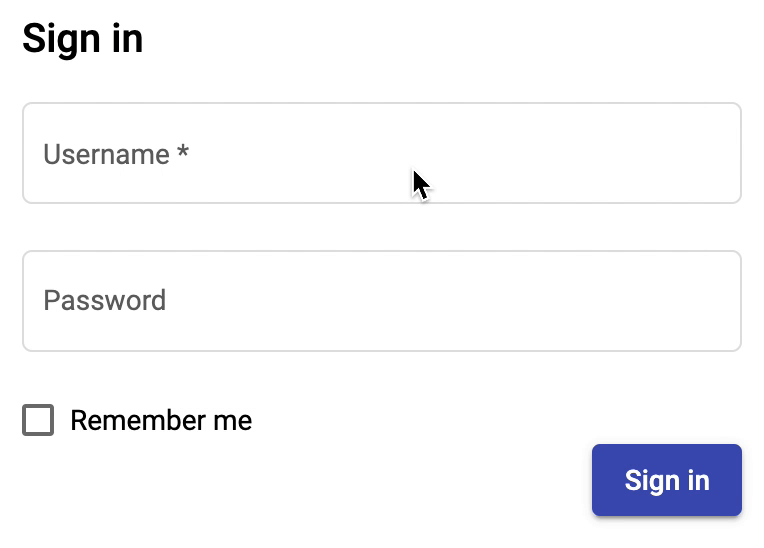

# Day 34: Template-driven Forms Trong Angular Part 2

Như chúng ta đã tìm hiểu trong [Day 33][day33] thì forms là một thành phần khá quan trọng trong mỗi hệ thống cần thu thập thông tin của người dùng. Vậy trong trường hợp người dùng nhập các thông tin đó không chính xác thì sao? Chúng ta có cần kiểm tra tính đúng đắn của dữ liệu được nhập hay không? Câu trả lời cho vấn đề trên chính là việc validate data. Ví dụ, người nhân viên ngân hàng khi nhận được form mở tài khoản của một người dùng, người tiếp viên đó sẽ phải kiểm tra những thông tin như tên, ngày tháng năm sinh có chính xác như thông tin được in trên hộ chiếu (hoặc các giấy tờ tương tự) hay không.

Vậy đối với Template-driven Forms Trong Angular thì sao, nó có giúp ích gì cho chúng ta - những lập trình viên - có thể dễ dàng validate input data hay không?

Ví dụ đối với form Sign In dưới đây sẽ có khá nhiều chi tiết chúng ta cần/nên kiểm tra theo yêu cầu của từng project cụ thể. Có thể là field `username` không được bỏ trống, có độ dài từ 6 đến 32 ký tự chẳng hạn.


[From victorthemes](https://victorthemes.com/freebies/sign-form-template/)

## Angular Forms Validation

Lưu ý rằng, do Angular application là một frontend app, nên việc validation ở frontend khá dễ dàng để bypass, do đó backend của các bạn sẽ luôn phải validate những dữ liệu gửi từ frontend lên, kể cả nó có được validate ở frontend hay chưa. **Backend phải tuyệt đối không tin tưởng vào dữ liệu từ nơi khác đến.**

Validation status cho một control sẽ bao gồm các status sau:

- touched: `true` nếu người dùng đã focus vào control (như là input, textarea, etc) rồi sau đó blur khỏi control đó. Hoặc khi gọi `markAsTouched`.
- untouched: `true` nếu người dùng chưa đụng chạm gì đến control hoặc lần đầu tiên focus và chưa bị mất focus (ngược lại với touched)
- dirty: `true` nếu người dùng đã thay đổi value của control – nhập một ký tự vào input text chẳng hạn, kể cả việc nhập vào rồi xóa đi thì cũng tính là đã thay đổi.
- pristine: `true` nếu người dùng chưa thay đổi value của control, mặc dù có thể đã touched, nhưng chưa sửa đổi gì.

Với mỗi validation status như trên chúng ta sẽ có các CSS class tương ứng cho control/form. Bạn hoàn toàn có thể style cho component dựa vào các class này.

- `.ng-valid`
- `.ng-invalid`
- `.ng-pending`
- `.ng-pristine`
- `.ng-dirty`
- `.ng-untouched`
- `.ng-touched`

## Template-driven Forms Validation

Angular Template-driven Forms có cung cấp sẵn một số directives cơ bản để thực hiện việc validation.

- required: Yêu cầu form control không được phép bỏ trống.
- minlength: Yêu cầu form control phải có value có length ít nhất bằng một giá trị nào đó.
- maxlength: Yêu cầu form control phải có value có length không vượt quá một giá trị nào đó.
- pattern: Yêu cầu form control phải có value thỏa mãn một pattern nào đó (RegEx).
- email: Yêu cầu form control phải có value thỏa mãn pattern của một email

Source code: [validators.ts](https://github.com/angular/angular/blob/10.0.x/packages/forms/src/directives/validators.ts)


## Validate Forms

Đối với form Sign In như đã đề cập từ [Day 33][day33], giả sử theo dự án yêu cầu:

- Username không được bỏ trống, có độ dài từ 6 đến 32 ký tự, chỉ chứa ký tự alphabet.
- Password không được bỏ trống, có độ dài từ 6 đến 32 ký tự, chỉ chưa các ký tự alphabet, digit, và phải chứa ít nhất một ký tự đặc biệt trong list: `!@#$%^&*`.

Với yêu cầu trên chúng ta sẽ làm thế nào để hiển thị cho người dùng biết khi họ nhập chưa chính xác.

```html
<div class="container">
  <form class="sign-in-form" novalidate #signInForm="ngForm" (submit)="onSubmit(signInForm)">
    <h2>Sign in</h2>
    <div class="row-control">
      <mat-form-field appearance="outline">
        <mat-label>Username</mat-label>
        <input matInput placeholder="Username" [(ngModel)]="userInfo.userName" name="username">
      </mat-form-field>
    </div>
    <div class="row-control">
      <mat-form-field appearance="outline">
        <mat-label>Password</mat-label>
        <input type="password" matInput placeholder="Password" [(ngModel)]="userInfo.password" name="password">
      </mat-form-field>
    </div>
    <div class="row-control">
      <mat-checkbox [(ngModel)]="userInfo.rememberMe" name="rememberMe">Remember me</mat-checkbox>
    </div>
    <div class="row-control row-actions">
      <button mat-raised-button color="primary" type="submit">Sign in</button>
    </div>

    <pre>{{ signInForm.value | json }}</pre>
    <pre>{{ userInfo | json }}</pre>
  </form>
</div>
```


### Username input

Chúng ta sẽ lần lượt thêm các directives vào để validate như sau:
```html
<input
  matInput
  placeholder="Username"
  required
  minlength="6"
  maxlength="32"
  [pattern]="usernamePattern"
  [(ngModel)]="userInfo.userName"
  name="username">
```
```ts
export class SignInComponent {
  usernamePattern = /^[a-z]{6,32}$/i;
}
```

Chỉ với việc thêm vào một số directives có sẵn, chúng ta đã có kết quả rất khả quan. Các bạn hãy để ý phần html bị thay đổi khi typing như sau:



Nếu chúng ta muốn hiển thị message báo lỗi tùy thuộc vào từng loại lỗi thì sao? Điều này hoàn toàn có thể giải quyết bằng cách lấy ra instance của `ngModel`, sau đó bạn có thể truy cập vào property `errors` như sau:

```html
<input
  matInput
  placeholder="Username"
  required
  minlength="6"
  maxlength="32"
  [pattern]="usernamePattern"
  #username="ngModel"
  [(ngModel)]="userInfo.userName"
  name="username">

<pre>{{ username.errors | json }}</pre>
```


Giờ đây chúng ta có thể sử dụng `NgIf` để hiển thị được lỗi tương ứng:

```html
<mat-form-field appearance="outline">
  <mat-label>Username</mat-label>
  <input
    matInput
    placeholder="Username"
    required
    minlength="6"
    maxlength="32"
    [pattern]="usernamePattern"
    #username="ngModel"
    [(ngModel)]="userInfo.userName"
    name="username">
  <mat-error *ngIf="username.errors.required">Username is required!</mat-error>
</mat-form-field>
```

Nhưng khi chạy bạn sẽ thấy có một lỗi runtime như sau:

> `TypeError: Cannot read property 'required' of null at SignInComponent_Template (sign-in.component.html:17)`

Điều này xảy ra vì ở thời điểm ban đầu khi control mới được khởi tạo, hoặc trong trường hợp control ở trạng thái `valid` thì nó sẽ có `errors` là `null`, do đó chúng ta cần check null hoặc dùng safe navigation operator (trong template của Angular component có operator đặc biệt này).

```html
<mat-form-field appearance="outline">
  <mat-label>Username</mat-label>
  <input
    matInput
    placeholder="Username"
    required
    minlength="6"
    maxlength="32"
    [pattern]="usernamePattern"
    #username="ngModel"
    [(ngModel)]="userInfo.userName"
    name="username">
  <mat-error *ngIf="username.errors?.required">Username is required!</mat-error>
</mat-form-field>
```

Nếu bạn sử dụng Angular Material như ở trên, nó sẽ check một cách khá thông minh là khi người dùng touched rồi thì nó mới hiển thị error message. Nên nếu bạn không sử dụng Angular Material thì bạn hoàn toàn có thể áp dụng tương tự bằng cách check thêm điều kiện có touched/dirty hay chưa chẳng hạn.

```html
<mat-error *ngIf="username.touched && !username.valid">
  <span *ngIf="username.errors.required">Username is required</span>
  <span *ngIf="username.errors.minlength || username.errors.maxlength">Length from 6 to 32 characters</span>
  <span *ngIf="!(username.errors.minlength || username.errors.maxlength) && username.errors.pattern">Only alphabet</span>
</mat-error>
```
Giờ đây bạn sẽ có thể có những validation giúp UX được nâng cao hơn trước đây.



### Password input

Tương tự như Username input, bạn cũng có thể làm cho Password input với cách thức như đã được đề cập.
```html
<mat-form-field appearance="outline">
  <mat-label>Password</mat-label>
  <input
    type="password"
    matInput
    placeholder="Password"
    required
    minlength="6"
    maxlength="32"
    [pattern]="passwordPattern"
    #password="ngModel"
    [(ngModel)]="userInfo.password"
    name="password">
  <mat-error *ngIf="password.touched && !password.valid">
    <span *ngIf="password.errors.required">Password is required</span>
    <span *ngIf="password.errors.minlength || password.errors.maxlength">Length from 6 to 32 characters</span>
    <span *ngIf="!(password.errors.minlength || password.errors.maxlength) && password.errors.pattern">
      Only alphabet, digit and at least one of !@#$%^&*
    </span>
  </mat-error>
</mat-form-field>
```
```ts
passwordPattern = /^(?=.*[!@#$%^&*]+)[a-z0-9!@#$%^&*]{6,32}$/;
```


## Summary
Day 34 chúng ta hiểu hơn về Angular Forms, cụ thể ở đây là Template-driven Forms Validation.

Mục tiêu của ngày 35 sẽ là **Angular Forms: Reactive Forms**

## Code sample

- https://github.com/tieppt/100-doc-angular/tree/day34
- https://stackblitz.com/edit/100-days-of-angular-day-34?file=src%2Fapp%2Fsign-in%2Fsign-in.component.html

## References

Các bạn có thể đọc thêm ở các bài viết sau:

- https://angular.io/guide/form-validation
- https://angular.io/guide/forms-overview
- https://angular.io/guide/forms
- https://angular.io/guide/reactive-forms
- https://www.tiepphan.com/thu-nghiem-voi-angular-template-driven-forms-trong-angular/

## Author

[Tiep Phan](https://github.com/tieppt)

`#100DaysOfCodeAngular` `#100DaysOfCode` `#AngularVietNam100DoC_Day34`

[day33]: Day033-template-driven-forms.md