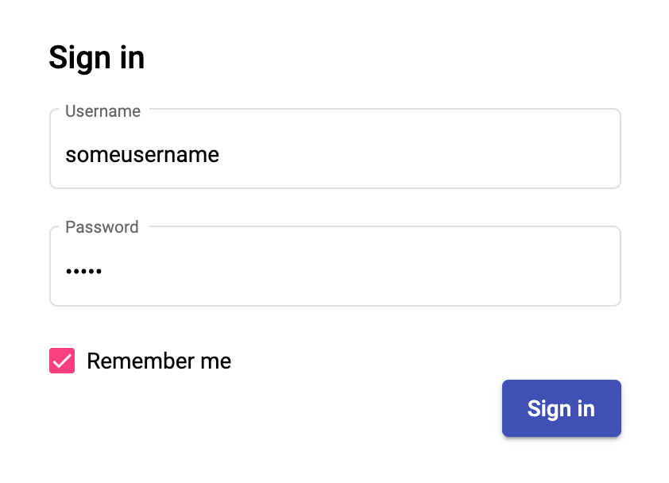
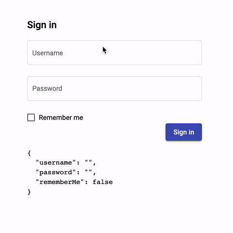

# Day 35: Reactive Forms Trong Angular

Trong [Day 33][day33] và [Day 34][day34] chúng ta đã tìm hiểu về Template-driven Forms trong Angular. Ngoài cách tạo form như đã học, Angular còn cung cấp cho chúng ta một dạng form khác khá mạnh mẽ đó là Reactive Forms hay Model-driven Forms.

Vậy dạng form này có gì khác biệt so với Template-driven Forms đã học, nó có thể tạo các form phức tạp được hay không? Trong những ngày tới đây chúng ta sẽ cùng tìm hiểu để trả lời câu hỏi đó.

## Reactive Forms
Thuật ngữ Reactive Forms hay còn được gọi là Model-driven Forms, là một phương pháp để tạo form trong Angular, phương pháp này tránh việc sử dụng các directive ví dụ như `ngModel`, `required`, etc, thay vào đó tạo các Object Model ở trong các Component, rồi tạo ra form từ chúng. Một điều lưu ý đó là Template-driven Forms là async còn Reactive Forms là sync.

Trong Reactive Forms, chúng ta tạo toàn bộ form control tree ở trong code (khởi tạo ngay, khởi tạo trong `constructor`, hoặc khởi tạo trong `ngOnInit`), nên có thể dễ dàng truy cập các phần tử của form ngay tức thì.

Form state ở trong Reactive Forms là immutable, mỗi sự thay đổi của form state sẽ đều tạo ra một state mới.

Reactive Forms sử dụng khá nhiều Observable streams, ví dụ như `valueChanges`, `statusChanges` chẳng hạn. Bạn hoàn toàn có thể combine, manipulate stream đó như những Observable thông thường.

Validation ở trên Reactive Forms cũng rất dễ dàng, nó chỉ là một function, và bạn hoàn toàn có thể thay đổi trong khi application đang chạy.

Overview từ https://angular.io/guide/reactive-forms#overview-of-reactive-forms
> Reactive forms use an explicit and immutable approach to managing the state of a form at a given point in time. Each change to the form state returns a new state, which maintains the integrity of the model between changes. Reactive forms are built around observable streams, where form inputs and values are provided as streams of input values, which can be accessed synchronously.

> Reactive forms also provide a straightforward path to testing because you are assured that your data is consistent and predictable when requested. Any consumers of the streams have access to manipulate that data safely.

> Reactive forms differ from template-driven forms in distinct ways. Reactive forms provide more predictability with synchronous access to the data model, immutability with observable operators, and change tracking through observable streams.

> Template-driven forms allow direct access to modify data in your template, but are less explicit than reactive forms because they rely on directives embedded in the template, along with mutable data to track changes asynchronously. See the [Forms Overview](https://angular.io/guide/forms-overview) for detailed comparisons between the two paradigms.

## Sign In Reactive Forms Component
Ví dụ như form **Sign in** chúng ta đã quen thuộc trong những ngày qua, làm thế nào để chúng ta tạo ra được một form như thế?


[From victorthemes](https://victorthemes.com/freebies/sign-form-template/)

Chúng ta sẽ tạo mới một component để tiến hành bài học:

```sh
ng g c sign-in-rf
```

```ts
const routes: Routes = [{
  path: 'sign-in',
  component: SignInComponent
}, {
  path: 'sign-in-rf',
  component: SignInRfComponent
}];
```

Component của chúng ta sẽ có template như form từ những ngày đã qua.

```html
<div class="container">
  <form class="sign-in-form">
    <h2>Sign in</h2>
    <div class="row-control">
      <mat-form-field appearance="outline">
        <mat-label>Username</mat-label>
        <input matInput placeholder="Username">
      </mat-form-field>
    </div>
    <div class="row-control">
      <mat-form-field appearance="outline">
        <mat-label>Password</mat-label>
        <input type="password" matInput placeholder="Password">
      </mat-form-field>
    </div>
    <div class="row-control">
      <mat-checkbox>Remember me</mat-checkbox>
    </div>
    <div class="row-control row-actions">
      <button mat-raised-button color="primary" type="submit">Sign in</button>
    </div>
  </form>
</div>
```

Sau khi khởi chạy ứng dụng với lệnh `ng serve` bạn có thể visit trang web tại địa chỉ http://localhost:4200/sign-in-rf.



## Integrate Angular Forms

Để sử dụng được **Reactive Forms** ở trong ứng dụng, chúng ta cần imports một `NgModule` là `ReactiveFormsModule` vào NgModule quản lý component của chúng ta - trong trường hợp của component hiện tại là `AppModule`.

```ts
import { ReactiveFormsModule } from '@angular/forms';

@NgModule({
  declarations: [
    // components, pipes, directives
  ],
  imports: [
    // other imports
    ReactiveFormsModule,
  ],
  // ...
})
export class AppModule { }
```

## FormGroup, FormControl, FormArray

- `AbstractControl` đây là base class của 3 thành phần kể trên - chúng là các thành phần cơ bản của form.
- `FormControl` là đơn vị nhỏ nhất của một form, dùng để track thông tin về value, validation của một form control như là thông tin của một input, một checkbox, etc.
- `FormGroup` là một tập hợp của các control/group/array (`AbstractControl`) khác. Dạng như một Object, nó có thể chứa các value đơn lẻ, hoặc các Object khác.
- `FormArray` cấu trúc dạng mảng, để quản lý các `AbstractControl` theo dạng mảng, dùng cho trường hợp cấu trúc có thể thêm bớt phần tử một cách linh hoạt.

Thông thường, mỗi một form sẽ bắt đầu bởi một **FormGroup**, nó sẽ đăng ký các **AbstractControl** khác bên trong nó.

Đối với **Sign In** form của chúng ta ở trên, chúng ta có thể khởi tạo nó như sau.

```ts
export class SignInRfComponent implements OnInit {
  signInForm = new FormGroup({
    username: new FormControl(''), // <== default value
    password: new FormControl(''), // <== default value
    rememberMe: new FormControl(false), // <== default value
  });
  constructor() { }

  ngOnInit(): void {
  }

}
```

## Binding Form
Để binding giữa form model và template lại với nhau, chúng ta sẽ dùng directive `[formGroup]` như sau:
```html
<form class="sign-in-form" [formGroup]="signInForm">
</form>
```

Để binding các `FormControl` vào các form control như textbox, checkbox chúng ta sẽ dùng một directive đó là `formControlName`. Đầu vào của nó sẽ là key mà chúng ta dùng để khai báo control trong FormGroup gần nhất:

```html
<form class="sign-in-form" [formGroup]="signInForm">
  <h2>Sign in</h2>
  <div class="row-control">
    <mat-form-field appearance="outline">
      <mat-label>Username</mat-label>
      <input matInput placeholder="Username" formControlName="username">
    </mat-form-field>
  </div>
  <div class="row-control">
    <mat-form-field appearance="outline">
      <mat-label>Password</mat-label>
      <input type="password" matInput placeholder="Password" formControlName="password">
    </mat-form-field>
  </div>
  <div class="row-control">
    <mat-checkbox formControlName="rememberMe">Remember me</mat-checkbox>
  </div>
  <div class="row-control row-actions">
    <button mat-raised-button color="primary" type="submit">Sign in</button>
  </div>
  <pre>{{ signInForm.value | json }}</pre>
</form>
```


Như vậy, chỉ với một vài bước đơn giản, các bạn đã có thể có được form ưng ý.

## FormBuilder Service
Như các bạn có thể thấy là nếu form có số lượng control lớn mà cứ phải `new` như ở trên thì khá là vất vả.
Vì thế Angular Reactive Forms cung cấp luôn cho chúng ta một service là `FormBuilder` để các bạn có thể khởi tạo form nhanh hơn.

Để sử dụng service này, bạn chỉ cần inject vào constructor là được.

```ts
export class SignInRfComponent implements OnInit {
  signInForm: FormGroup;
  constructor(private fb: FormBuilder) { }

  ngOnInit(): void {
    this.signInForm = this.fb.group({
      username: '',
      password: '',
      rememberMe: false,
    });
  }
}
```

## Cập nhật giá trị cho Reactive Forms qua pathValue hoặc setValue
Có 2 phương thức để cập nhật giá trị cho form control được mô tả bởi class `AbstractControl` là `setValue` và `patchValue`. Chúng là các abstract method, vậy nên các class dẫn xuất sẽ phải implement riêng cho chúng.

- Đối với class `FormControl`, không có gì khác biệt giữa 2 phương thức – thực chất `patchValue` gọi lại `setValue`.
- Đối với các class `FormGroup` và `FormArray`, `patchValue` sẽ cập nhật các giá trị được khai báo tương ứng trong object value truyền vào. Nhưng `setValue` sẽ báo lỗi nếu một control nào bị thiếu hoặc thừa, tức là bạn phải truyền chính xác object có cấu trúc giống như cấu trúc của form hay nói cách khác là không chấp nhận *subset* hoặc *superset* của cấu trúc form hiện tại.

Vậy nên nếu bạn muốn cập nhật một phần của form thì hãy dùng `patchValue`, nếu bạn muốn set lại tất cả và đảm bảo không cái nào bị thiếu thì dùng `setValue` để tận dụng việc báo lỗi của nó.

Ngoài ra, còn có phương thức `reset` để bạn có thể reset lại trạng thái lúc khởi tạo của form hoặc control.

```ts
ngOnInit(): void {
  this.signInForm = this.fb.group({
    username: '',
    password: '',
    rememberMe: false,
  });
  setTimeout(() => {
    // fake api call then update form value
    this.signInForm.patchValue({
      username: 'TiepPhan'
    });
  }, 1000);
}
```

## Event Submit vs NgSubmit
Angular Reactive Forms cũng cung cấp event `ngSubmit` giống như Template-driven Forms, các bạn chỉ cần listen vào event đó là được.

```html
<form class="sign-in-form" [formGroup]="signInForm" autocomplete="off" (ngSubmit)="onSubmit()">
</form>
```
```ts
onSubmit(): void {
  console.log(this.signInForm);
}
```

## Summary
Day 35 chúng ta đã tìm hiểu một số concept cơ bản về Angular Reactive Forms, và cũng đã thực hành cách tạo một *Sign In Form* đơn giản. Các bạn có thể thực hành với nhiều form hơn ở trên các trang chia sẻ template.

Mục tiêu của ngày 36 sẽ là **Angular Forms: Reactive Forms Part 2**

## Code sample

- https://github.com/tieppt/100-doc-angular/tree/day35
- https://stackblitz.com/edit/100-days-of-angular-day-35

## References

Các bạn có thể đọc thêm ở các bài viết sau

- https://angular.io/guide/forms-overview
- https://angular.io/guide/forms
- https://angular.io/guide/reactive-forms
- https://www.tiepphan.com/thu-nghiem-voi-angular-reactive-forms-trong-angular/
- https://www.tiepphan.com/thu-nghiem-voi-angular-template-driven-forms-trong-angular/

## Author

[Tiep Phan](https://github.com/tieppt)

`#100DaysOfCodeAngular` `#100DaysOfCode` `#AngularVietNam100DoC_Day35`

[day33]: Day033-template-driven-forms.md
[day34]: Day034-template-driven-forms-2.md