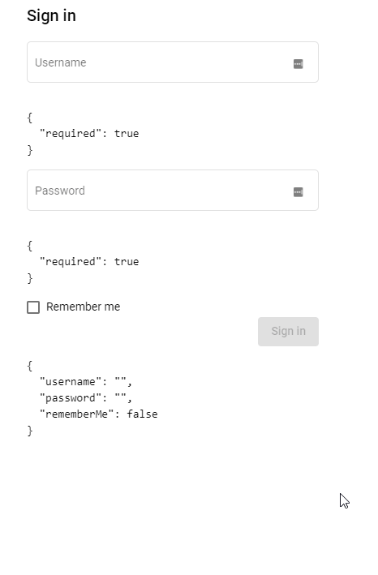
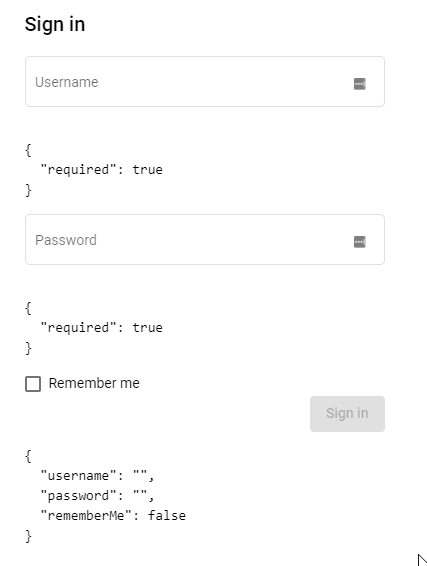
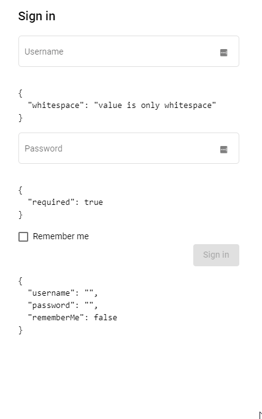

# Day 36: Reactive Forms Part 2

Trong [day 35][day35], chúng ta đã tìm hiểu về Reactive Forms trong Angular. Day 36 chúng ta sẽ nói thêm về validate input của Reactive Forms.

Mình sẽ dùng lại ví dụ về SignIn form như trong [Day 35][day35] của anh Tiệp.

## Prerequisites

SignIn form mình sẽ tạo bằng `FormBuilder` cho ngắn gọn như ví dụ trước. Sẽ có hai textbox là username/password và một checkbox.

```ts
export class SignInRfComponent implements OnInit {
  signInForm: FormGroup;
  constructor(private fb: FormBuilder) {}

  ngOnInit(): void {
    this.signInForm = this.fb.group({
      username: "",
      password: "",
      rememberMe: false,
    });
  }
}
```

Phần HTML của form sẽ có dạng như sau.

```html
<form class="sign-in-form" [formGroup]="signInForm">
  <h2>Sign in</h2>
  <div class="row-control">
    <mat-form-field appearance="outline">
      <mat-label>Username</mat-label>
      <input matInput placeholder="Username" formControlName="username" />
    </mat-form-field>
  </div>
  <div class="row-control">
    <mat-form-field appearance="outline">
      <mat-label>Password</mat-label>
      <input
        type="password"
        matInput
        placeholder="Password"
        formControlName="password"
      />
    </mat-form-field>
  </div>
  <div class="row-control">
    <mat-checkbox formControlName="rememberMe">Remember me</mat-checkbox>
  </div>
  <div class="row-control row-actions">
    <button mat-raised-button color="primary" type="submit">Sign in</button>
  </div>
  <pre>{{ signInForm.value | json }}</pre>
</form>
```

- Đầu tiên, set `formGroup` input của thẻ `form` tới `signInForm` mình đã tạo bằng `FormBuilder`
- Với mỗi control của form, thêm directive `formControlName` tới phần key của `signInForm`. Bởi vì input là string và ko có auto suggestion nên các bạn chú ý điền đúng giá trị và có phân biệt chữ hoa chữ thường. Ví dụ nếu trong form setup là `username` mà set `formControlName="userName"` thì sẽ ko chạy nhé.

## Yêu cầu validate data

Như trong ví dụ của [day 34][day34], giả sử chúng ta có yêu cầu như sau:

- Username không được bỏ trống, có độ dài từ 6 đến 32 ký tự, chỉ chứa ký tự alphabet.
- Password không được bỏ trống, có độ dài từ 6 đến 32 ký tự, chỉ chưa các ký tự alphabet, digit, và phải chứa ít nhất một ký tự đặc biệt trong list: `!@#\$%^&\*`.

## Validate Forms with Reactive Forms

Bởi vì với Reactive Forms, chúng ta set up form ở trong component và từ đó link đến phần template HTML. Nên phần validators thay vì dùng các attribute trên template như template form có nói trong [day 34][day34], phần code này sẽ được định nghĩa khi bạn setup form thông qua `FormBuilder`. Phần validate này sẽ đều là các function.

### Validator functions

Có 2 loại validator function:

#### 1. Sync validators (đồng bộ)

Đây là các function để validate thường gặp, sẽ nhận đầu vào là một form control và trả về:

- Một danh sách các validation errors.
- Hoặc null tức là control này ko có lỗi gì.

Ví dụ như input cần có độ dài tối thiểu là 6, thì function validate khi nhận control đầu vào sẽ check ngay giá trị của control đó xem có đủ độ dài hay ko, đơn giản như `control.value.length < 6 ? { "notValid": "input too short!"} : null`

Khi khởi tạo `FormControl` thì Sync validators sẽ được truyền vào ở argument số 2. Argument số 1 sẽ là giá trị mặc định khi khởi tạo form nhé.

```ts
let control = new FormControl("", Validators.required);
//Or
this.fb.control("", Validators.required);
```

#### 2. Async validators (bất đồng bộ)

Đây là các validate function sẽ trả về Promise hoặc Observable. Ví dụ như bạn muốn validate xem username nhập vào đã có trong hệ thống hay chưa. Thì bắt buộc bạn phải gửi một yêu cầu lên server để làm việc này, HTTP request thường sẽ trả về Promise/Observable.

Khi khởi tạo `FormControl` thì async validators sẽ được truyển vào ở argument số 3.

```ts
isUserNameDuplicated(control: AbstractControl): Observable<ValidationErrors> {
    return of(null);
}

let control = new FormControl("", Validators.required, this.isUserNameDuplicated);
this.fb.control("", Validators.required, this.isUserNameDuplicated);
```

### Implement validate function

Angular có cung cấp một set các validate function trong class [Validators][validators], cụ thể:

```ts
class Validators {
  static min(min: number): ValidatorFn;
  static max(max: number): ValidatorFn;
  static required(control: AbstractControl): ValidationErrors | null;
  static requiredTrue(control: AbstractControl): ValidationErrors | null;
  static email(control: AbstractControl): ValidationErrors | null;
  static minLength(minLength: number): ValidatorFn;
  static maxLength(maxLength: number): ValidatorFn;
  static pattern(pattern: string | RegExp): ValidatorFn;
  static nullValidator(control: AbstractControl): ValidationErrors | null;
  static compose(validators: ValidatorFn[]): ValidatorFn | null;
  static composeAsync(validators: AsyncValidatorFn[]): AsyncValidatorFn | null;
}
```

Mình sẽ cần dùng `Validators.required`, `Validators.minLength` và `Validators.pattern` cho yêu cầu như đã nói kể trên. Phần code khởi tạo form với validators sẽ trông như sau.

```ts
this.signInForm = this.fb.group({
  username: [
    "",
    Validators.compose([
      Validators.required,
      Validators.minLength(6),
      Validators.pattern(/^[a-z]{6,32}$/i),
    ]),
  ],
  password: [
    "",
    Validators.compose([
      Validators.required,
      Validators.minLength(6),
      Validators.pattern(/^(?=.*[!@#$%^&*]+)[a-z0-9!@#$%^&*]{6,32}$/),
    ]),
  ],
  rememberMe: false,
});
```

Mình dùng `Validators.compose` và truyển vào một mảng các validators để có thể kết hợp được nhiều loại validators với nhau. Pattern cho username và password mình copy từ code của anh Tiệp trong [Day 34][day34] nhé, có gì cứ blame anh ấy 😂.

Cú pháp khi khởi tạo `FormControl` trong form group bằng `FormBuilder` sẽ hơi khác, thay vì 3 argument riêng biệt thì bạn sẽ truyền vào một mảng có 3 phần tử, đầu tiên là giá trị mặc định, thứ 2 là sync validator và cuối cùng là async validator.

Kết quả thì như ở dưới, mình show trên UI phần error để các bạn dễ hình dung. Dưới đây là requirement như trong screenshot.

- Username: Nếu điền dưới 6 sẽ báo lỗi, hoặc bỏ trống, hoặc có số, hoặc điền kí tự đặc biệt.
- Password: Nếu ko có kí tự đặc biệt hoặc dưới 6 kí tự sẽ báo lỗi.
- Nút Sign in chỉ đc enable nếu form valid.



### Your first custom validator

Các bạn để ý là `Validators.require` chỉ check là input có value thì validator này sẽ trả về null, tức là control đã valid. Nếu bạn thử điền chỉ toàn dấu cách thì control này cũng sẽ được pass `Validators.require`.

Như ví dụ ở trên thì sau khi mình điền đủ 6 kí tự khoảng trắng, thì `Validators.required` và `Validators.minLength` đã pass. Nhưng vì có `Validators.pattern` nên control vẫn invalid. Ví dụ bây giờ username sẽ cho phép điền toàn bộ kí tự. Để minh họa thì mình sẽ tạm bỏ `Validators.pattern(/^[a-z]{6,32}$/i)` đi nhé.

```ts
this.signInForm = this.fb.group({
  username: [
    "",
    Validators.compose([
      Validators.required,
      Validators.minLength(6),
      //Validators.pattern(/^[a-z]{6,32}$/i)
    ]),
  ],
});
```

Bây giờ khi điền dủ 6 dấu cách thì input đã pass validators!



Để xử lý trường hợp trên mà ko dùng thêm tới `Validators.pattern(/^[a-z]{6,32}$/i)`, mình sẽ viết một custom validator có tên là `NoWhitespaceValidator`.

```ts
import { AbstractControl, ValidatorFn } from "@angular/forms";

export function NoWhitespaceValidator(): ValidatorFn {
  return (control: AbstractControl): { [key: string]: any } => {
    let controlVal = control.value;
    if (typeof controlVal === "number") {
      controlVal = `${controlVal}`;
    }
    let isWhitespace = (controlVal || "").trim().length === 0;
    let isValid = !isWhitespace;
    return isValid ? null : { whitespace: "value is only whitespace" };
  };
}
```

Phần code khá đơn giản

1. Lấy giá trị của control
2. Check xem nếu giá trị là số (vì bạn có thể dùng ở `<input type="number"`) thì convert giá trị đó sang string.
3. Check độ dài của string sau khi đã trim, nếu độ dài vẫn băng 0 thì chắc chắn input chỉ toàn dấu cách.
4. Dựa vào đó và return lại errors hay null.

Giờ thì mình sẽ bỏ `Validators.required` và thay bằng `NoWhitespaceValidator`.

```ts
this.signInForm = this.fb.group({
  username: [
    "",
    Validators.compose([
      //Validators.required,
      NoWhitespaceValidator(),
      Validators.minLength(6),
      //Validators.pattern(/^[a-z]{6,32}$/i)
    ]),
  ],
});
```

Test thử thì thấy hoạt động khá mượt mà như ý muốn. Vậy là đã xong custom validator đầu tiên rồi đấy 😂



Mình có dùng `NoWhitespaceValidator` trong dự án [Angular Jira Clone][no-white-space]

## Summary

Day 36 chúng ta đã tìm hiểu cách để validate data với Reactive Forms cho form Sign In đơn giản

Mục tiêu của ngày 37 sẽ là **Angular Form Async Validator**

## Code sample

- https://stackblitz.com/edit/100-days-of-angular-day-36

## References

Các bạn có thể đọc thêm ở các bài viết sau

- https://angular.io/guide/forms-overview
- https://angular.io/guide/forms
- https://angular.io/guide/reactive-forms
- https://www.tiepphan.com/thu-nghiem-voi-angular-reactive-forms-trong-angular/
- https://www.tiepphan.com/thu-nghiem-voi-angular-template-driven-forms-trong-angular/

## Author

[Trung Vo](https://github.com/trungk18)

`#100DaysOfCodeAngular` `#100DaysOfCode` `#AngularVietNam100DoC_Day36`

[day33]: Day033-template-driven-forms.md
[day34]: Day034-template-driven-forms-2.md
[day35]: Day035-reactive-forms.md
[validators]: https://angular.io/api/forms/Validators
[no-white-space]: https://github.com/trungk18/jira-clone-angular/blob/master/frontend/src/app/core/validators/no-whitespace.validator.ts