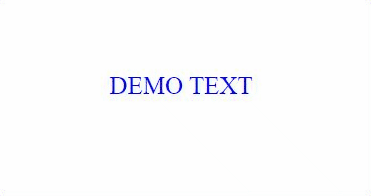

# Day 39: Custom Attribute Directive trong Angular

## Introduction

Qua các bài trước, các bạn cũng biết những directives trong Angular như ngFor, ngIf, ngStyle.
Trước khi bước vào bài mới hôm nay, mình xin tổng quát lại về các directives như sau:

Có 3 loại directives trong Angular:

**Components**: Đây là directive phổ biến nhất, cũng thường gặp nhất trong Angular. Directive này giúp chúng ta đóng gói (encapsulated), và tái sử dụng (reusable). Đây là directive với template, view.

**Structural directives**: Đây là directive dùng để thay đổi cấu trúc của views bằng cách thêm hoặc ẩn, xóa bớt phần tử trong DOM. Ví dụ: ngFor, ngIf.

**Attribute directives**: Đây là directive dùng để thay đổi diện mạo (style, appearance) hoặc hành vi (behavior) của các phần tử DOM hay components. Ví dụ: ngStyle, ngClass

Và bài hôm nay của chúng ta sẽ là tạo 1 **Custom Attribute Directive** để chúng ta có thể tái sử dụng nhiều nơi trong ứng dụng.

Dưới đây là kết quả của project code hôm nay


## Coding Practice

### Step 1: Khởi tạo project

```sh
ng new custom-attribute-directive-demo
```

### Step 2: Tạo các components và directives

```sh
ng g c example-component
```

```sh
ng generate directive custom-directive-demo
```

Một lưu ý nhỏ ở đây như sau, để sử dụng được directive này chúng ta cần khai báo nó vào module giống như cách chúng ta khai báo component. Câu lệnh generate trên đã auto khai báo directive trên declarations của AppModule cho chúng ta.

Sau đó chúng ta add example-component vào template của app.component.html như sau:

```html
<app-example-container></app-example-container>
```

### Step 3: Code directive logic

Chúng ta sẽ inject **ElementRef** vào constructor của directive như sau:

```typescript
constructor(private el: ElementRef) {
    this.el.nativeElement.innerText = "DEMO TEXT";
    this.el.nativeElement.style.color = "blue";
}
```

Ở đây chúng ta dùng **ElementRef** để tương tác và thay đổi các properties của DOM element. Cụ thể là **innerText** hay **style.color**.

### Step 4: Apply directive

Chúng ta apply attribute directive bằng cách add nó vào như mọi attribute bình thường khác. Tên của attribute này sẽ nằm ở decorator @Directive. (Chúng ta hoàn toàn có thể sửa lại tên chúng ta muốn. Ở đây mình đã sửa từ appCustomDirectiveDemo -> appCustomDirective)

```typescript
@Directive({
  selector: "[appCustomDirective]",
})
```

Chúng ta vào file **example-component.component.html** sửa lại như sau để apply custom directive chúng ta vừa tạo vào component này.

```html
<p appCustomDirective></p>
```

Vậy là chúng ta đã hoàn thành cách tạo và sử dụng 1 custom attribute directive đơn giản.

### Step 5: Using Render2

Ở step 3, chúng ta đã dùng **ElementRef** để tương tác và thay đổi các properties của DOM element. Điều này đã được warning trong official doc của Angular là không nên vì nó sẽ tạo nguy cơ về cho XSS attacks.
Và ở chính warning đó, Angular cũng giới thiệu đến **Render2** layer. **Render2** cung cấp những apis để dùng tương tác với DOM element 1 cách an toàn. Vậy nên chúng ta sẽ update code sử dụng **Render2** như sau:

```typescript
export class CustomDirectiveDemoDirective {
  constructor(private el: ElementRef, private renderer: Renderer2) {
    this.customContent("DEMO TEXT", "blue");
  }
  private customContent(text: string, color: string) {
    this.renderer.setProperty(this.el.nativeElement, "innerText", text);
    this.renderer.setStyle(this.el.nativeElement, "color", color);
  }
}
```

### Step 6: Interact with event of Host Element

Khi chúng ta sử dụng 1 **Custom Directive** cho 1 HTML element, thì element đó sẽ được gọi là **Host Element**.( Ở trường hợp của chúng ta Host Element chính thẻ p ở template của example component )

Vậy hiện tại chúng ta muốn xử lý event của Host Element ở directive thì chúng ta sẽ làm thế nào? Ví dụ, khi hover chuột thì đổi màu text. Ở trường hợp nào chúng ta sẽ tương tác thông qua **HostListener**.

Code chúng ta sẽ update như sau để lắng nghe và xử lý 2 event **mouseenter** and **mouseleave** trên Host Element:

```typescript
export class CustomDirectiveDemoDirective {
  constructor(private el: ElementRef, private renderer: Renderer2) {
    this.customContent("DEMO TEXT", "blue");
  }

  @HostListener("mouseenter") onMouseEnter() {
    this.customContent("ON MOUSE ENTER", "orange");
  }

  @HostListener("mouseleave") onMouseLeave() {
    this.customContent("DEMO TEXT", "blue");
  }

  private customContent(text: string, color: string) {
    this.renderer.setProperty(this.el.nativeElement, "innerText", text);
    this.renderer.setStyle(this.el.nativeElement, "color", color);
  }
}
```

### Step 7: Pass values into the directive

Tiếp theo, chúng ta sẽ truyền xử lý data truyền từ Host Element vào directive. Cụ thể ở case này chúng ta sẽ truyền màu sẽ thay đổi khi hover từ thẻ p vào.

Ở thẻ p, chúng ta sẽ truyền vào như 1 attribute bình thường.

```html
<p appCustomDirective hoverColor="green"></p>
```

Ở directive, chúng ta sẽ dùng **@Input** để nhận và xử lý.

```typescript
import {
  Directive,
  ElementRef,
  Renderer2,
  HostListener,
  Input,
} from "@angular/core";

@Directive({
  selector: "[appCustomDirective]",
})
export class CustomDirectiveDemoDirective {
  @Input() hoverColor: string;

  constructor(private el: ElementRef, private renderer: Renderer2) {
    this.customContent("DEMO TEXT", "blue");
  }

  @HostListener("mouseenter") onMouseEnter() {
    this.customContent("ON MOUSE ENTER", this.hoverColor);
  }

  @HostListener("mouseleave") onMouseLeave() {
    this.customContent("DEMO TEXT", "blue");
  }

  private customContent(text: string, color: string) {
    this.renderer.setProperty(this.el.nativeElement, "innerText", text);
    this.renderer.setStyle(this.el.nativeElement, "color", color);
  }
}
```

Vậy là đã xong, các bạn đã thực hiện thành công việc tạo và sử dụng 1 **Custom Attribute Directive** trong Angular.

## Concepts

### ElementRef

Đây là 1 class trong **@angular/core** dùng để tương tác với các DOM element trong template. Tuy nhiên chúng ta không nên sử dụng trực tiếp vì vấn đề security.

### Renderer2

Đây là 1 class cung cấp những apis để tương tác với DOM Element 1 cách an toàn. Chúng ta sẽ dùng nó gọi đến ElementRef.

### HostListener

Đây là 1 decorator được định nghĩa cho việc lắng nghe 1 event của DOM. Chúng ta sẽ dùng để viết hàm xử lý khi event đó diễn ra.

Example:

```typescript
constructor(private el: ElementRef, private renderer: Renderer2) {
  this.renderer.setProperty(this.el.nativeElement, "innerText", "DEMO");
}
```

## Exercise

### 1. @Input and @Input alias

Hiện tại code đang truyền vào thẻ p 2 attribute là **appCustomDirective** và **hoverColor** cho 2 mục đích khác nhau. Hãy sử dụng **property binding** để chỉ cần truyền 1 cái và làm gọn code đi.
Tham khảo: [**Pass value into directive**](https://angular.io/guide/attribute-directives#pass-values-into-the-directive-with-an-input-data-binding)

### 2. Interact more with Render2

Hãy sử dụng các apis của Render2 để biến đổi nhiều properties và styles hơn.

## Summary

Day 39 chúng ta đã học được những concepts và cách làm liên quan đến cách **Custom attribute directive**.

Mục tiêu của ngày 40 sẽ là **Custom structural directive**.

## Code sample

- https://github.com/januaryofmine/angular-custom-attribute-directive-example

## References

Các bạn có thể đọc thêm ở các bài viết sau

- https://angular.io/guide/attribute-directives#build-a-simple-attribute-directive
- https://medium.com/@nishu0505/custom-directives-in-angular-5a843f76bb96
- https://angular.io/api/core/ElementRef

## Author

[Khanh Tiet](https://github.com/januaryofmine)

`#100DaysOfCodeAngular` `#100DaysOfCode` `#AngularVietNam100DoC_Day39`

[day34]: Day034-template-driven-forms-2.md
[day38]: Day038-dynamic-component.md
