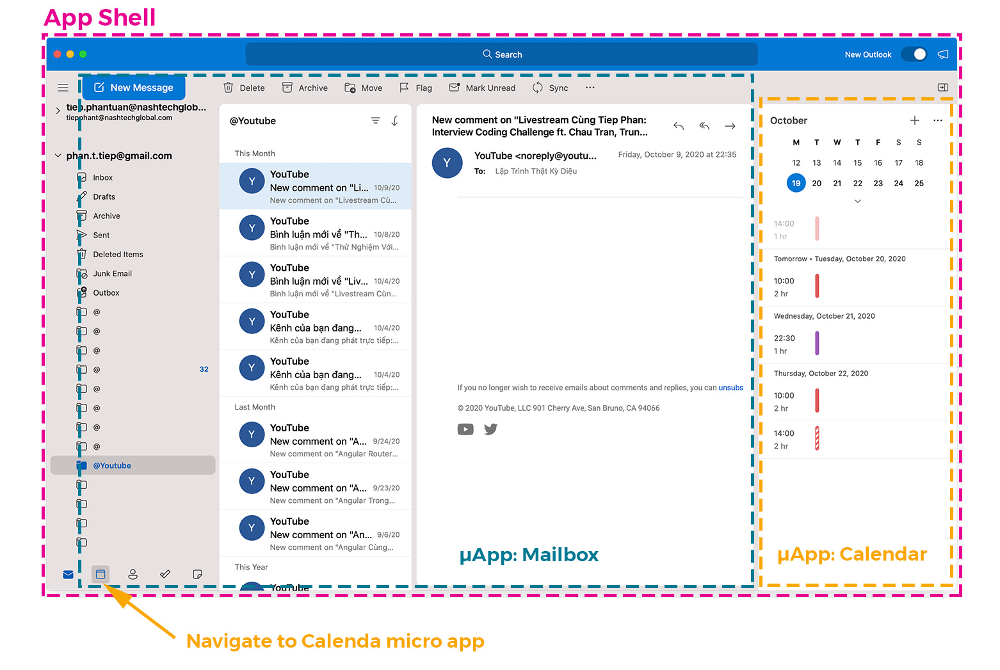

# Day 39: Thực Hành Micro Frontends

> Good frontend development is hard. Scaling frontend development so that many teams can work simultaneously on a large and complex product is even harder.

> source: [https://martinfowler.com/articles/micro-frontends.html](https://martinfowler.com/articles/micro-frontends.html)

## Micro Frontends là gì?
Hiện nay, các ứng dụng Single Page Apps (SPAs) cực kỳ phổ biến, chúng có nhiều tính năng và cũng rất phức tạp và thường được kết hợp với kiến trúc Microservices ở tầng backend. Sau một thời gian phát triển, các ứng dụng SPAs này trở nên cồng kềnh, và khó hơn cho việc maintain và chúng được gọi là Frontend Monolith.

Trong những năm trở lại đây, việc áp dụng những concepts từ Microservices vào các ứng dụng Frontend được nhắc đến khá thường xuyên. Ý tưởng của Micro Frontends đó là sẽ phân tách các ứng dụng này thành các phần kết hợp của các tính năng, mỗi tính năng có thể được phát triển bới một team độc lập.

> "An architectural style where independently deliverable frontend applications are composed into a greater whole"

> source: [https://martinfowler.com/articles/micro-frontends.html](https://martinfowler.com/articles/micro-frontends.html)

### Monolithic Frontends


> source: [https://micro-frontends.org](https://micro-frontends.org)

### Micro Frontends


> source: [https://micro-frontends.org](https://micro-frontends.org)

## Phương pháp để áp dụng Micro Frontends

- Iframe

Phương pháp này dễ để áp dụng nhưng có chứa nhiều giới hạn như việc navigation, thực thi các đoạn JavaScript từ Host App, ...
- Proxy like nginx

Phương pháp này yêu cầu việc phát triển các ứng dụng phải độc lập, ví dụ `<host>/mailbox`, `<host>/calendar` là các app Frontend khác nhau. Phương pháp này có một vấn đề là khi navigate từ app này sang app khác thì bạn sẽ bị reload giống như ứng dụng client-server thông thường.
- Web Components

Đây là một công nghệ không quá mới trong thời gian trở lại đây. Các framework áp dụng hoặc tạo ra Custom Elements khá nhiều. Ví dụ [Angular Elements](https://angular.io/guide/elements), [Stencil](https://stenciljs.com).
Chúng có ưu điểm là bạn có thể tạo ra được các element và có thể sử dụng như là một thẻ html thông thường ở bất cứ framework nào (Framework Agnostic)
- Orchestrator Frameworks

Webpack 5 and Module Federation, [piral](https://piral.io), [luigi](https://luigi-project.io/), [single-spa](https://single-spa.js.org/)

## Develop Email Client Micro Frontends

Code demo có tại repo sau: [https://github.com/tieppt/micro-frontends-demo](https://github.com/tieppt/micro-frontends-demo)




Từ hình mô tả trên chúng ta có thể thấy rằng, ứng dụng email client của chúng ta sẽ có thể được phát triển bởi 2 team cho 2 chức năng là **mailbox** và **calendar**. Trong đó, team **calendar** có thể phát triển thêm một widget để có thể nhúng vào page của **mailbox**. Việc tạo ra các widget có thể được thực hiện thông qua Custom Elements.

### Shell or Host app
Để các micro app có thể chạy trên cùng một app, chúng ta cần có một shell (có thể được gọi là host). Shell sẽ setup một số thứ như routing, shared state, ... Việc tạo ra shell app có thể ảnh hưởng đến công nghệ cần áp dụng cho các micro app.

Ví dụ: nếu chúng ta lựa chọn Angular hay React làm shell app, thì các micro app sẽ phải có tầng wrapper để có thể chạy được các app đó. Vì routing của các framework trên là specific cho từng framework. Nên để route được, và render đúng component thì phải tuân thủ theo ràng buộc của framework đó.

### Chuẩn bị
Trong demo này, chúng ta sẽ sử dụng Webpack 5, trong bản release mới nhất nó đã giới thiệu một advanced API là Module Federation. Điều này giúp chúng ta dễ dàng phát triển được Micro Frontend.
Ngoài ra, chúng ta sẽ dùng Angular v11 (thời điểm này đang là RC) để tạo các app.

Đầu tiên, chúng ta cần tạo một shell app bằng lệnh sau. (lưu ý, nếu Angular CLI đã support Webpack 5 thì không cần dùng `next` version, bạn chỉ cần dùng `latest` là được).
```sh
npx @angular/cli@next new acme-email-client
```

Sau khi tạo xong project, chúng ta sẽ tạo thêm 2 application nữa: 1 cho mailbox, 1 cho calendar.

```sh
npx ng generate application mailbox

npx ng generate application calendar
```

Do thời điểm hiện tại Angular CLI (v11 RC.1) mới chỉ opt-in support cho Webpack 5, nên chúng ta cần dùng Yarn và `resolutions` để có thể dùng được Webpack 5.

Ngoài ra, chúng ta cần dùng đến custom webpack config nên chúng ta cần install thêm một package là `@angular-builders/custom-webpack`.

File `package.json` của chúng ta sẽ có dạng như sau:


```json
{
  "name": "acme-email-client",
  "scripts": {
    "start:shell": "ng serve --project=acme-email-client --port 5200",
    "start:mailbox": "ng serve --project=mailbox --port 5300",
    "start:calendar": "ng serve --project=calendar --port 5400"
  },
  "dependencies": {
      "./": "other deps"
  },
  "devDependencies": {
    "@angular-devkit/build-angular": "~0.1100.0-rc.1",
    "@angular/cli": "~11.0.0-rc.1",
    "@angular/compiler-cli": "~11.0.0-rc.1",
    "@angular-builders/custom-webpack": "~10.0.1"
  },
  "resolutions": {
    "webpack": "~5.3.0",
    "@angular-devkit/build-angular": "~0.1100.0-rc.1"
  }
}
```
Sau đó chúng ta cần xóa bỏ `node_modules` và chạy lại `yarn install` để cài đặt các packages.

Ngoài ra để đảm bảo rằng project sẽ sử dụng yarn khi cài đặt các package thông qua lệnh `ng add` thì chúng ta có thể chạy lệnh sau:

```sh
npx ng config cli.packageManager yarn
```

### Bật tính năng Module Federation
Để bật được tính năng này chúng ta cần sử dụng custom webpack như sau:
Bạn tạo ra các file webpack config, sau đó thay thế builder mặc định ở trong `angular.json`.

Ví dụ chúng ta tạo ra 2 files `webpack.config.js` và `webpack.prod.config.js` để sử dụng cho 2 môi trường là development và production.
Sau đó chúng ta sẽ thay thế trong `angular.json`:
- Thay `@angular-devkit/build-angular` bằng `@angular-builders/custom-webpack`.
- Thêm config của webpack mà chúng ta vừa tạo

Dưới đây là một phần của file `angular.json`.

```json
{
  "projects": {
    "acme-email-client": {
      "architect": {
        "build": {
          "builder": "@angular-builders/custom-webpack:browser",
          "options": {
            "customWebpackConfig": {
              "path": "./webpack.config.js"
            }
          },
          "configurations": {
            "production": {
              "customWebpackConfig": {
                "path": "./webpack.prod.config.js"
              }
            }
          }
        },
        "serve": {
          "builder": "@angular-builders/custom-webpack:dev-server",
          "options": {
            "browserTarget": "acme-email-client:build",
            "customWebpackConfig": {
              "path": "./webpack.config.js"
            }
          },
          "configurations": {
            "production": {
              "browserTarget": "acme-email-client:build:production",
              "customWebpackConfig": {
                "path": "./webpack.prod.config.js"
              }
            }
          }
        },
      }
    },
  }
}
```

Sau đó chúng ta sẽ tạo tương tự cho các project `mailbox` và `calendar`.

#### Config Shell

Chúng ta cần config shell như sau để bật Module Federation:

```js
const ModuleFederationPlugin = require("webpack/lib/container/ModuleFederationPlugin");

module.exports = {
  output: {
    publicPath: "http://localhost:5200/",
    uniqueName: "acme-email-client"
  },
  optimization: {
    // Only needed to bypass a temporary bug
    runtimeChunk: false
  },
  plugins: [
    new ModuleFederationPlugin({
      remotes: {
        'mailbox': "mailbox@http://localhost:5300/remoteEntry.js",
        'calendar': "calendar@http://localhost:5400/remoteEntry.js",
      },
      shared: ["@angular/core", "@angular/common", "@angular/router"]
    })
  ],
};
```

Shell sẽ chạy ở port 5200, và chúng ta cần một unique name cho mỗi app. Ngoài ra, do shell sẽ trỏ đến 2 app remote, nên bạn sẽ thấy chúng ta config tương ứng cho 2 app remote luôn ở đây.

Do đang dùng các micro app bằng Angular, nên chúng ta có thể share các phần code, như config phía trên, chúng ta đã share 3 packages.

Giờ đây chúng ta có thể thêm config cho routing của shell để trỏ đến 2 micro app kia:

```ts
const routes: Routes = [
  {
    path: 'mailbox',
    loadChildren: () => import('mailbox/MailboxModule').then(m => m.MailboxModule)
  },
  {
    path: 'calendar',
    loadChildren: () => import('calendar/CalendarModule').then(m => m.CalendarModule)
  }
];
```

Có một vấn đề phát sinh lúc này đó là 2 đướng dẫn trên không thật sự tồn tại trong app shell, nó là đường dẫn ảo, do đó chúng ta cần bảo cho TypeScript biết rằng chúng có thật sự tồn tại.

Chúng ta chỉ cần tạo một file `types.d.ts` trong thư mục `src` là sẽ được.

```ts
declare module 'mailbox/MailboxModule';
declare module 'calendar/CalendarModule';
```

Giờ đây bạn có thể chạy shell để xem kết quả.

```sh
yarn start:shell
```

Nhưng app của chúng ta khi chạy sẽ báo lỗi như sau: `Uncaught Error: Shared module is not available for eager consumption`.
Điều này xảy ra do chúng ta đang shared các packages. Do đó chúng ta cần config thêm 1 số thứ để bootstrap được ứng dụng. Dựa theo bài viết này [https://medium.com/dev-genius/module-federation-advanced-api-inwebpack-5-0-0-beta-17-71cd4d42e534](https://medium.com/dev-genius/module-federation-advanced-api-inwebpack-5-0-0-beta-17-71cd4d42e534) chúng ta thấy có gợi ý như sau:

> **The recommended solution to eager imports**

>Methods mentioned above work, but can have some limits or drawbacks.

>At Webpack, we strongly recommend a dynamic import of a bootstrap file. Doing so will not create any additional Round Trips, it’s also more performant in general as initialization code is split out of a larger chunk.

Webpack khuyến cáo chúng ta tạo ra 1 file chứa phần import đó, và sẽ gọi dynamic import.

**bootstrap.ts**
```ts
import { enableProdMode } from '@angular/core';
import { platformBrowserDynamic } from '@angular/platform-browser-dynamic';

import { AppModule } from './app/app.module';
import { environment } from './environments/environment';

if (environment.production) {
  enableProdMode();
}

platformBrowserDynamic().bootstrapModule(AppModule)
  .catch(err => console.error(err));
```
**main.ts**
```ts
import('./bootstrap');
```

Vậy là ứng dụng đã chạy được thành công.

#### Config Remotes app
Nếu chúng ta muốn navigate vào 2 micro app kia thì cũng cần config tương tự, nhưng cần một số thay đổi, vì những app đó là remotes app.

Config dưới đây là dành cho mailbox app.
```js
const ModuleFederationPlugin = require("webpack/lib/container/ModuleFederationPlugin");

module.exports = {
  output: {
    publicPath: "http://localhost:5300/",
    uniqueName: "mailbox"
  },
  optimization: {
    // Only needed to bypass a temporary bug
    runtimeChunk: false
  },
  plugins: [
    new ModuleFederationPlugin({
      name: "mailbox",
      library: { type: "var", name: "mailbox" },
      filename: "remoteEntry.js",
      exposes: {
        './MailboxModule': './projects/mailbox/src/app/mailbox.module.ts',
      },
      shared: ["@angular/core", "@angular/common", "@angular/router"]
    })
  ],
};
```

Như các bạn cũng thấy, chúng ta config phần `output` giống như app shell vừa rồi. Phần khác biệt nhất là ở config cho `ModuleFederationPlugin`.

Chúng ta cần config một số fields như `name`, `library`, và đặc biệt là `fileName` cần giống với phần shell chúng ta đã config (ở đây là `remoteEntry.js`) và phần `exposes`.

Phần `exposes` cho phép chúng ta config những gì sẽ được public ra bên ngoài. Mỗi key của nó nên tuân theo [ESM syntax inside Node 14](https://medium.com/dev-genius/module-federation-advanced-api-inwebpack-5-0-0-beta-17-71cd4d42e534).


**Standalone-Mode cho Remotes app**: Ở đây chúng ta cũng có đề cập đến các package được shared. Do đó để chạy được mode này, tức là các micro app sẽ có thể chạy như app độc lập, chúng ta cũng sẽ áp dụng kỹ thuật tương tự đó là dùng dynamic import phần bootstrap như shell ở trên.

Các micro apps lúc này hoàn toàn có thể có phần config routing riêng tùy ý.

```ts
export const MAILBOX_ROUTES: Routes = [
  {
    path: '',
    children: [
      {
        path: '',
        component: MailboxHomeComponent,
        pathMatch: 'full'
      },
    ]
  }
];

@NgModule({
  declarations: [
    MailboxHomeComponent,
  ],
  imports: [
    CommonModule,
    RouterModule.forChild(MAILBOX_ROUTES),
  ],
  providers: [],
})
export class MailboxModule { }
```

Tương tự chúng ta có thể config cho calendar app như sau:

```js
const ModuleFederationPlugin = require("webpack/lib/container/ModuleFederationPlugin");

module.exports = {
  output: {
    publicPath: "http://localhost:5400/",
    uniqueName: "calendar"
  },
  optimization: {
    // Only needed to bypass a temporary bug
    runtimeChunk: false
  },
  plugins: [
    new ModuleFederationPlugin({
      name: "calendar",
      library: { type: "var", name: "calendar" },
      filename: "remoteEntry.js",
      exposes: {
        './CalendarModule': './projects/calendar/src/app/calendar/calendar.module.ts',
      },

      shared: ["@angular/core", "@angular/common", "@angular/router"]
    })
  ],
};
```

### Khỏi chạy ứng dụng

Giờ đây bạn có thể chạy cả 3 ứng dụng:
```sh
yarn start:shell
yarn start:mailbox
yarn start:calendar
```

Sau đó truy cập vào các địa chỉ sau:
[http://localhost:5200/](http://localhost:5200/), [http://localhost:5300/](http://localhost:5300/), [http://localhost:5400/](http://localhost:5400/)

Dưới đây là kết quả có được. Chúng ta có thể chạy standalone cho từng micro apps hoặc chạy chính từ shell app.


## Lời kết
Như vậy với việc dùng Webpack 5 Module Federation chúng ta đã có thể tự tạo một ứng dụng Micro Frontend.

Trong bài tiếp theo chúng ta sẽ tìm hiểu cách sử dụng Custom Elements để tạo ra các widget giúp dễ dàng nhúng vào các micro app khác.

## Code sample

- https://github.com/tieppt/micro-frontends-demo

## References

Các bạn có thể đọc thêm ở các bài viết sau:

- https://medium.com/dev-genius/module-federation-advanced-api-inwebpack-5-0-0-beta-17-71cd4d42e534
- https://www.angulararchitects.io/aktuelles/the-microfrontend-revolution-part-2-module-federation-with-angular/
- https://martinfowler.com/articles/micro-frontends.html

## Author

[Tiep Phan](https://github.com/tieppt)

`#100DaysOfCodeAngular` `#100DaysOfCode` `#AngularVietNam100DoC_Day39`