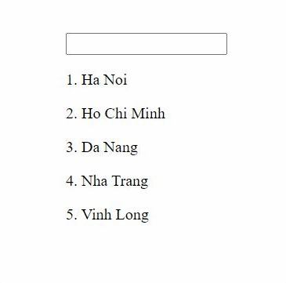

# Day 40: Custom Structural Directive trong Angular

## Introduction

Ở bài trước, chúng ta đã biết cách tạo và sử dụng 1 **Custom Attribute Directive**. Ở bài này, chúng ta sẽ tiếp tục tiếp hiểu cách tạo và sử dụng 1 **Custom Structural Directive**.

Đây là project của bài hôm nay



## Coding Practice

### Step 1: Khởi tạo project

```sh
ng new custom-structural-directive-demo
```

### Step 2: Tạo các components và directives

```sh
ng g c example-container
```

```sh
ng g d custom-loop
```

Sau đó chúng ta add example-container vào template của app.component.html như sau:

```html
<app-example-container></app-example-container>
```

### Step 3: Code directive logic and apply to component

Chúng ta sẽ tạo 1 **ngFor** cơ bản như sau. Đầu tiên các bạn hãy add những đoạn code sau vào và chạy project thử để có cái nhìn tổng quan.

Add `FormsModule` vào app.module. (Vì chúng ta sẽ sử dụng `ngModel` cho project này).

File `custom-loop.directive.ts`

```typescript
import { Directive, Input, ViewContainerRef, TemplateRef } from "@angular/core";

@Directive({
  selector: "[ngCustomLoop]",
})
export class CustomLoopDirective {
  @Input("ngCustomLoopOf") itemList: Array<any>;

  constructor(
    private containerRef: ViewContainerRef,
    private template: TemplateRef<any>
  ) {}

  ngOnChanges() {
    this.containerRef.clear();

    for (const item of itemList) {
      this.containerRef.createEmbeddedView(this.template, {
        $implicit: item,
        index: this.itemList.indexOf(item),
      });
    }
  }
}
```

File `example-container.component.html`

```html
<input type="text" [(ngModel)]="text" />
<p *ngCustomLoop="let city of cityList; let i = index">
  {{ i + 1 }}. {{ city }}
</p>
```

File `example-container.component.ts`

```typescript
export class ExampleContainerComponent implements OnInit {
  text = "";
  cityList = ["Ha Noi", "Ho Chi Minh", "Da Nang", "Nha Trang", "Vinh Long"];

  constructor() {}

  ngOnInit() {}
}
```

Khi chạy đoạn code trên, các bạn đã thấy được 1 cái input và 1 danh sách ngắn các thành phố.
Mình đã dùng `Custom Loop Directive` của mình để generate ra.

Bây giờ chúng ta đi vào quá trình đọc hiểu code.

#### 3.1, Mình đã làm thế nào để sử dụng directive `CustomLoop` cho component `ExampleContainer`?

Đầu tiên các bạn nhìn vào file html của component. Các bạn thấy thay vì là *ngFor như bình thường, mình đã thay thế bằng
*ngCustomLoop.

Các bạn vào file directive. Như bài 39 trước, tên directive nằm ở trong decorator **@Directive**, và các bạn sẽ dùng tên này mỗi khi muốn sẽ sử dụng directive có các HTML elements. (Ở đây mình sẽ sửa tên này ngCustomLoop)

```typescript
@Directive({
  selector: "[ngCustomLoop]",
})
```

#### 3.2, Mình đã truyền list các thành phố cho directive bằng cách nào?

Các bạn thấy `Custom Loop directive` này mình nhận vào 1 Array như sau:

```typescript
@Input("ngCustomLoopOf") itemList: Array<any>;
```

Mình đã dùng **@Input** alias để đổi tên lại thành _itemList_, dễ dùng hơn thay vì dùng tên _ngCustomLoopOf_ bên ngoài truyền vào. Nhưng mình đã truyền cái này vào ở đâu?

Các bạn qua file html của `ExampleContainer` component.

```html
<p *ngCustomLoop="let city of cityList; let i = index">
  {{ i + 1 }}. {{ city }}
</p>
```

Nhìn vào đây các bạn có thể đoán được biến mình truyền vào là `cityList`. Tuy nhiên, tại sao nó lại có tên `ngCustomLoopOf`.

Đó là 1 micro syntax trong Angular. Angular đã kết hợp tên của directive (ở đây là **ngCustomLoop**) với tên identity cho biến truyền vào (ở đây là chữ **of**).

> **ngCustomLoop + of = ngCustomLoopOf**

(Nếu đoạn này các bạn vẫn cảm thấy chưa hiểu lắm thì đọc xuống xíu nữa, mình có giải thích tiếp)

Các bạn sẽ còn gặp lại cách truyền value thế này vào directive ở tính năng tiếp theo của project này.

#### 3.3, Mình đã dùng cái gì để generate ở `HTML` code từ file `Custom Loop directive`?

Ở lifecycle _ngOnChange_ của directive này, mình dùng **ViewContainerRef** và gọi hàm **createEmbeddedView()** của nó như sau:

```typescript
constructor(
    private containerRef: ViewContainerRef,
    private template: TemplateRef<any>
) {}

ngOnChanges() {
    this.containerRef.clear();

    for (const item of itemList) {
      this.containerRef.createEmbeddedView(this.template, {
        $implicit: item,
        index: this.itemList.indexOf(item),
      });
    }
  }
```

Đọc code này các bạn có thể hình dung cơ bản:

1, Mình inject `TemplateRef` và `ViewContainerRef` vào directive này.
Nói về `TemplateRef`, khi gặp directive có dấu \* (asterisk), Angular sẽ thực hiện cơ chế wrapper Host Element (ở đây là thẻ `p`) vào `<ng-template></ng-template>`. Và điều này chúng ta khi inject template này vào directive để sử dụng cũng như thực hiện các thao tác trên nó.

2, Mình dùng `ViewContainerRef` và gọi hàm `createEmbeddedView()` dùng để tạo views. Ở bài 38, mình cũng có nói `ViewContainerRef` sẽ được dùng để tạo những `EmbeddedView`.
Đây là cơ chế chính trong việc tạo 1 **Custom Structural Directive**.

#### 3.4, Hàm `createEmbeddedView()` và những điều cần biết.

1, Hàm `createEmbeddedView()` nhận vào param thứ 1 là 1 `TemplateRef` dùng để khởi tạo `EmbeddedView`.

2, Hàm `createEmbeddedView()` nhận vào param thứ 2, là Object định nghĩa cho những gì nó trả ra. Chúng ta còn gọi Object này là `Context Object`.

> Nói về **\$implicit**, khái niệm này ở bài 5 đã giới thiệu qua. Nay mình nói lại cho cụ thể hơn. **\$implicit** là 1 property đặc biệt, như tên gọi của nó, mình tạm dịch nghĩa tiếng Việt của Implicit là `"Ngầm hiểu"`. Đây là property được mặc định sẽ trả ra trong hàm này.

Để hiểu rõ hơn thì các bạn tạm thời các bạn sửa code như sau.

File `example-container.component.html`

```html
<p *ngCustomLoop="let city findingText: text of: cityList; let i = index">
  {{ i + 1 }}. {{ city }}
</p>
```

File `custom-loop.directive.ts`

```typescript
  export class CustomLoopDirective {
     @Input("ngCustomLoopOf") itemList: Array<any>;
     @Input("ngCustomLoopFindingText") findingText: string;
     ...
 }
```

Nhìn lại project, vẫn hoạt động bình thường.
Đến đây thì các bạn cũng hình dung ra rồi. Cái cấu trúc huyền thoại đã học **\*ngFor="let item of itemList"**, thật ra `item` với `itemList` nó chẳng liên quan gì với nhau cả.

Ở đây mình đã sửa thành **of: cityList** cho các bạn dễ hiểu, đây là truyền vào directive biến **of** có value là **cityList**.

Tương tự như mình vừa truyền vào thêm 1 biến khác **findingText** có value là **text** (biến text này mình đã tạo sẵn trong file typescript của component).

Tiếp đó cái **let city** bản chất là let city = **\$implicit**. Đây là biến bắt buộc cần định nghĩa để Angular gán giá trị của **\$implicit** vào. Nếu không khai báo let city thì sẽ bị lỗi.

Kết luận bản chất **let city** là cái hứng đầu ra. **of: cityList** là biến truyền đầu vào. 2 cái này không liên quan gì nhau hết. Việc mình biến đổi cityList thế nào để trả ra là quyền của mình, thậm chí mình trả cái **\$implicit** ra chẳng liên quan gì cái **cityList** cũng chẳng sao cả. Quyền của mình mà.

Đến đây chắc các bạn cũng hiểu rồi. Ngoài ra nhìn lại đoạn

```typescript
ngOnChanges() {
    for (const item of itemList) {
      this.containerRef.createEmbeddedView(this.template, {
        $implicit: item,
        index: this.itemList.indexOf(item),
      });
    }
  }
```

```html
<p *ngCustomLoop="let city findingText: text of: cityList; let i = index">
  {{ i + 1 }}. {{ city }}
</p>
```

Các bạn sẽ thấy ngoài trừ `$implicit`, mình còn thêm vào object trả ra 1 cái nữa tên là `index`. Ở đây mình đã xử lý để trả ra `index` là vị trí phần tử trong mảng

```typescript
 index: this.itemList.indexOf(item).
```

Vì biến này không phải `$implicit` nên muốn nhận biến này phải khai báo nhận đàng hoàng như sau trong file html `let i = index`. Ngoài ra các bạn cũng có thể dùng cách `index as i`.

Vậy là đã xong, các bạn đã thực hiện thành công việc tạo và sử dụng 1 **Custom Structural Directive** trong Angular. Các bạn có thể dựa vào đây tiếp tục truyền thêm **@Input** vào, xử lý trả về `Object Context` nhiều và đa dạng hơn. Hoặc lắng nghe `event` ở directive này.

Mấu chốt để tạo **Custom Structural Directive** xoay quanh ở hàm `createEmbeddedView()` của `ViewContainerRef`. Hiểu được input `TemplateRef` của hàm này từ đầu mà có, cũng như các kết quả trả ra của `Context Object`.

## Concepts

Bài này chủ yếu là các concepts cũ. Những concepts cần đọc như là **ViewContainerRef**, **TemplateRef**.

## Exercise

### 1. Implement Filter Feature like demo project

Mình làm đến đây rồi, các bạn hãy thử code tiếp để hoàn thành tính năng filter theo chữ cái đầu như demo nhen. Không thì các bạn có thể tham khảo source code hoàn chỉnh ở dưới đây.

## Summary

Day 40 chúng ta đã học được những concepts và cách làm liên quan đến cách **Custom structural directive**.

Mục tiêu của ngày 41 sẽ là những lệnh quen thuộc và các flag thường gặp trong **Angular CLI**.

## Code sample

- https://github.com/januaryofmine/angular-custom-structural-directive

## References

Các bạn có thể đọc thêm ở các bài viết sau

- https://angular.io/guide/structural-directives#writing-your-own-structural-directives
- https://medium.com/@kay.odenthal_25114/creating-a-custom-structural-directive-with-angular-7-3e85bcf88bdf
- https://netbasal.com/understanding-angular-structural-directives-659acd0f67e
- https://blog.cloudboost.io/creating-structural-directives-in-angular-ff17211c7b28

## Author

[Khanh Tiet](https://github.com/januaryofmine)

`#100DaysOfCodeAngular` `#100DaysOfCode` `#AngularVietNam100DoC_Day40`

[day38]: Day038-dynamic-component.md
[day39]: Day039-custom-attribute-directive.md
