# Day 40: Jira Clone Tutorial 01 - Các bước chuẩn bị, tạo Github repository và tạo mới ứng dụng Angular với CLI

Đây là post đầu tiên trong chuỗi bài viết về ứng dụng [Jira clone][jira] đã được sự ủng hộ rất lớn từ thành viên của Angular Việt Nam. Bọn mình sẽ cố nói chi tiết nhất có thể về quá trình hoàn thiện jira clone, nhưng sẽ tập trung và các component thú vị cũng như phức tạp là chủ yếu, ví dụ như phần kéo thả, hay rich text/markdown editor. Vì nguyên thời gian code đã là hơn hai tuần liên tục, nên để giải thích từng dòng code một gần như là điều không thể 😂

## Jira clone là gì?

Đây là ứng dụng mô phỏng lại ứng dụng Jira của Atlassian được mình viết bằng Angular trong thời gian rảnh. Mục tiêu là để kiểm chứng lại khả năng của bản thân, và cũng là nguồn tư liệu để viết bài cho series 100 days Angular của group :)

- Live demo: [jira.trungk18.com][jira]
- Source code: [trungk18/jira-clone-angular](https://github.com/trungk18/jira-clone-angular)

![Jira clone built with Angular 9 and Akita][demo]

### Tech stack

![Tech logos][stack]

- [Angular CLI][cli]
- [Akita][akita] state management
- [NestJS][nestjs]
- UI modules:
  - [TailwindCSS][tailwind]
  - Angular CDK [drag and drop][cdkdrag]
  - [ng-zorro][ng-zorro] UI component: `tooltip`, `modal`, `select`, `icon` and more.
  - [ngx-quill][quill]
- [Netlify][netlify]
- [Heroku][heroku]

[demo]: https://github.com/trungk18/jira-clone-angular/raw/master/frontend/src/assets/img/jira-clone-angular-demo-trungk18.gif
[stack]: https://github.com/trungk18/jira-clone-angular/raw/master/frontend/src/assets/img/jira-clone-tech-stack.png
[cli]: https://cli.angular.io/
[akita]: https://datorama.github.io/akita/
[nestjs]: https://nestjs.com/
[tailwind]: https://tailwindcss.com/
[cdkdrag]: https://material.angular.io/cdk/drag-drop/overview
[ng-zorro]: https://ng.ant.design/docs/introduce/en
[quill]: https://github.com/KillerCodeMonkey/ngx-quill
[netlify]: https://www.netlify.com/
[heroku]: https://www.heroku.com/

## Kiến thức cơ bản nên biết trước khi theo dõi series jira clone

- Angular

  - Concept cơ bản như [interpolation][interpolation], component, [directive][directive].
  - [Reactive Forms][reactive-forms]
  - [Router][router], lazy loading module
  - Cách [để giao tiếp giữa component trong Angular][interaction], @Input and @Output

- Typescript cơ bản: [interface][interface], [class][class]
- Package Manager: `npm` or `yarn`
- RxJS operators: `map`, [`combineLatest`][combinelatest] and so on
- [Git][git]
  - Tạo commit
  - Push the changes to remote
  - Git merge and pull request
- Cách sử dụng command line trong Windows/MacOS

### Chú ý: Vì sao lại cần kĩ năng dùng command line khi mình chỉ là một front end dev?

Lý do là các công cụ hỗ trợ frontend về sau này sử dụng command line rất nhiều.

Ví dụ như ngày trước muốn có jQuery trong project thì lên trang chủ của jQuery, download về, giải nén, copy vào thư mục, rồi từ trong file HTML thêm một thẻ script để load. Còn giờ thì chỉ cần `npm i jquery` là có ngay jQuery rồi.

Nếu bạn chưa dùng hoặc ko rành command line thì có thể đọc qua [bài viết này][cmdtut] trước khi bắt đầu nhé. Kiến thức về commend line hiện tại là một phần quan trọng khi làm việc với các ứng dụng JavaScript hiện đại, và cũng mở ra những cơ hội trong các lĩnh vực khác nữa (backend, hay dev ops).

## Trước khi bắt tay vào code

Khi bạn nhìn vào [jira clone][jira], hẳn đây cũng không phải là một ứng dụng lớn tốn cả năm trời để code frontend, nhưng cũng ko phải là một form nhỏ code vài tiếng là xong. Việc đầu tiên nên làm là mình tạo ra [một list những công việc cần làm][notion] trên notion, từ những đầu mục lớn cho đến các task nhỏ dần đều.

Danh sách sẽ bao gồm ba mục chính, chi tiết như ở dưới:

- Ground work:

  - Create a repository on Github
  - Set up project structure with CLI
  - Configure TailwindCSS

- Backend

  - Create interface and sample JSON data
  - Add the simple API with NestJS

- Frontend

  - Layout: includes left nav, sidebar, resizer and the like
  - Breadcrumb
  - Drag and drop kanban board
  - Filtering
  - Issue detail view, modal
  - Inline edit issue
  - Add new issue modal
  - Search issue

Danh sách ở trên đã được rút gọn, các bạn có thể xem chi tiết [ở đây][notion] nhé. Mình chỉ muốn cho các bạn thấy là những phần nào có thể phải sờ đến khi bắt tay là một ứng dụng thực tế. Danh sách này chưa bao gồm phần deployment hay chi tiết về database vì hiện tại mình cũng chỉ tập trung vào phần frontend.

## 1. Tạo mới một repository trên Github

Đây là cách mình hay làm. Mình ko tạo project với CLI trước rồi mới push lên remote trên github, mà làm ngược lại 🤣

- Tạo một repo
- Clone về máy
- Mở folder vừa clone, tạo ứng dụng Angular
- Rồi commit và push

Tuỳ vào lựa chọn của bạn, ko nhất thiết phải làm theo các steps kể trên nhé!

### Tại sao cần sử dụng source control?

Có thể không phải là Github, có thể dùng Gitlab hoặc Bitbucket. Từ kinh nghiệm của bản thân mình, dùng source control là việc **BẮT BUỘC**. Chúng ta không thể cứ viết code, rồi `Ctrl + Z` để undo. Rất nhiều lần mình để viết được chức năng hoàn chỉnh, và vì ko có source control nên ko commit được code. Về sau sửa sửa mấy cái, code ko chạy, cũng ko có cách nào để sửa được 😂 Không có source control ko thể giúp bạn quay ngược lại thời gian...

### Mở https://github.com/new và tạo một repository mới

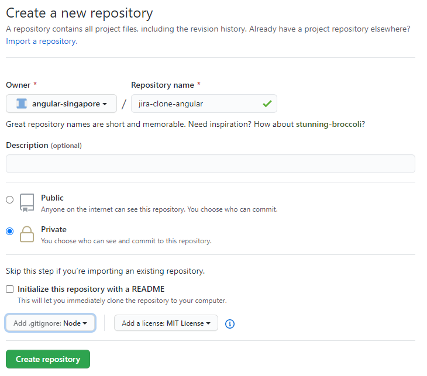

Có một số thông tin mà bạn sẽ cần phải nhập vào:

- Repository name: `jira-angular-clone` hoặc là tên mà bạn muốn, ví dụ `vansutuyduyen-jira` 🤪
- Description: Phần mô tả, mình đặt là "A simplified Jira clone built with Angular 9 and Akita", nhưng đây cũng là thông tin ko bắt buộc cần phải điền.
- Mình chọn private repository vì mình muốn làm gần xong rồi mới public, như thế vẫn hơn
- Bạn có thể chọn để Github tự tạo ra file README. Đây chỉ là một file markdown bình thường nhưng nếu bạn ko quen thuộc với github và markdown thì nên tích cái box đó.
- Phần `.gitignore`, chọn `Node`. Đại ý là có một số thứ bạn không muốn giữ trong source control, ví dụ như folder `node_modules` chẳng hạn. Vì mỗi lần cần nó bạn chỉ cần chạy `npm i` là xong.
- Phần cuối cùng, là license - giấy phép. Mình thường chọn MIT vì code của mình ai cũng có thể sử dụng lại được chứ ko có hạn chế gì cả.

Xong rồi đấy, bấm nút thôi.

### Clone repository về máy

Mở command line lên, đánh `git clone your_repo_url` và thay thế `your_repo_url` với đường link tới repo của bạn. Xem hình dưới để có thêm thông tin.

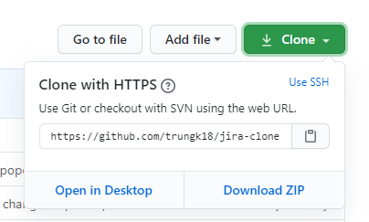

## 2. Tạo ứng dụng Angular với CLI

### Cài đặt Angular CLI nếu bạn chưa cài bao giờ

Nếu bạn chưa làm Angular bao giờ và không biết Angular CLI là gì, đọc thêm ở [đây][cli]. Đây là một command line interface cho Angular, tức là bạn mở command line lên và đánh vài câu lệnh. CLI sẽ làm **một số việc** cho bạn.

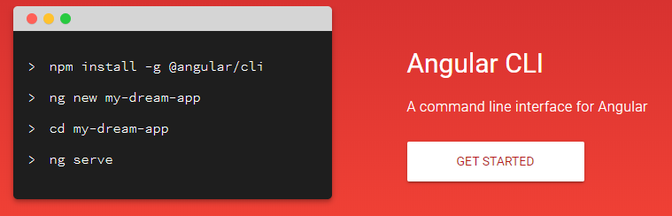

Nếu bạn chưa cài CLI trên máy, mở command line lên và type `npm install -g @angular/cli` để cài CLI. Sau khi cài xong thì kiểm tra phiên bản của CLI bằng cách chạy câu lệnh `ng --version`, nó sẽ trông như hình dưới.

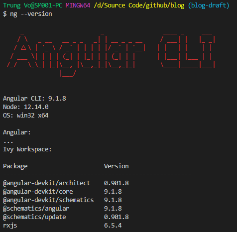

### Chạy npm init để tạo ra file package.json

Mở command line, thay đổi đường dẫn tới folder bạn vừa clone về (`cd path_to_your_folder`), và chạy.

```bash
npm init
```

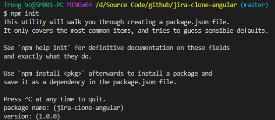

Idea lúc đầu của mình là tạo ra hai folder `frontend` và `api` trong cùng một root folder, nên file `package.json` chỉ để chứa các câu lệnh về sau cần build `frontend` và `api` thôi. Ko có gì đặc sắc cả. Ngoài ra, `package.json` sẽ chứa một số thông tin về dự án như name, description này nọ. Tạm thời cứ làm theo hướng này đi nhé, còn phần về [Nx workspace](https://nx.dev/angular) bọn mình sẽ cover sau.

### Tạo ứng dụng Angular

Sau bước tạo `package.json` ở trên, bạn chạy câu lệnh `ng new frontend --skipTests=true` để tạo ra ứng dụng Angular với tên là frontend. `--skipTests=true` tức là CLI sẽ không tạo unit test file - `.spec.ts`. Với dự án này tạm thời mình sẽ không viết test nhé.

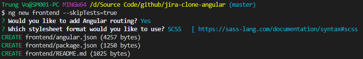

Mình chọn là có dùng routing, và SCSS để styling. Sau khi chạy xong thì sẽ trông như ở hình dưới.

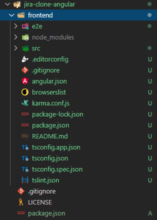

Bây giờ các bạn commit những thay đổi ở trên lên git nhé. Nếu chưa biết thì search `git commit` 🙂

## 3. Cấu hình TailwindCSS

Mình có viết chi tiết về TailwindCSS ở một bài viết khác, đọc thêm ở [đây nhé][tailwind].

Nhưng trước khi tiếp tục, mình cần tạo một branch mới để cấu hình TailwindCSS. Lý do là chỉ khi nào configure Tailwind xong thì mới nên merge vào branch chính. Chứ nếu commit thẳng lên master thì trong lúc làm có khi mình đang dở, chưa xong. Mà team member check out về sẽ không chạy được :)

```bash
git checkout -b tailwind-configuration
```

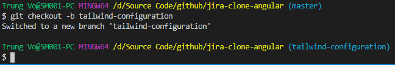

> Sau đó làm theo các bước trong [bài viết chi tiết về TailwindCSS][tailwind] nhé. Mình tóm tắt lại như ở dưới

### Cài đặt TailwindCSS package và một số dependencies cần thiết

```bash
npm i tailwindcss postcss-scss postcss-import postcss-loader @angular-builders/custom-webpack -D
```

### Import Tailwind CSS trong file style.scss

```scss
@import 'tailwindcss/base';
@import 'tailwindcss/components';
@import 'tailwindcss/utilities';
```

### Tạo file webpack.config.js trong frontend folder với content như ở dưới

#### Nếu bạn cài `postcss-loader@^3.0`, thì copy phần code này

```js
module.exports = {
  module: {
    rules: [
      {
        test: /\.scss$/,
        loader: 'postcss-loader',
        options: {
          ident: 'postcss',
          syntax: 'postcss-scss',
          plugins: () => [
            require('postcss-import'),
            require('tailwindcss'),
            require('autoprefixer'),
          ],
        },
      },
    ],
  },
};
```

#### Nếu bạn cài `postcss-loader@^4.0`, dùng phần config này nhé

Sự khác biệt là trong `options`, có thêm một key tên là `postcssOptions` rồi mới đến phần plugin. Xem chi tiết ở [postcss documentation](https://webpack.js.org/loaders/postcss-loader/)

```js
module.exports = {
  module: {
    rules: [
      {
        test: /\.scss$/,
        loader: 'postcss-loader',
        options: {
          postcssOptions: {
            ident: 'postcss',
            syntax: 'postcss-scss',
            plugins: ['postcss-import', 'tailwindcss', 'autoprefixer'],
          },
        },
      },
    ],
  },
};
```

### Sừa file angular.json để dùng custom builder với file webpack.config.js vừa tạo

```json
{
  "architect": {
    "build": {
      "builder": "@angular-builders/custom-webpack:browser",
      "options": {
        "customWebpackConfig": {
          "path": "./webpack.config.js"
        }
      }
    },
    "serve": {
      "builder": "@angular-builders/custom-webpack:dev-server",
      "options": {
        "customWebpackConfig": {
          "path": "./webpack.config.js"
        }
      }
    }
  }
}
```

Sau khi hoàn thành các bước ở trên, theo lý thuyết là giờ đã có thể dùng TailwindCSS trong project.

### Test thử thôi

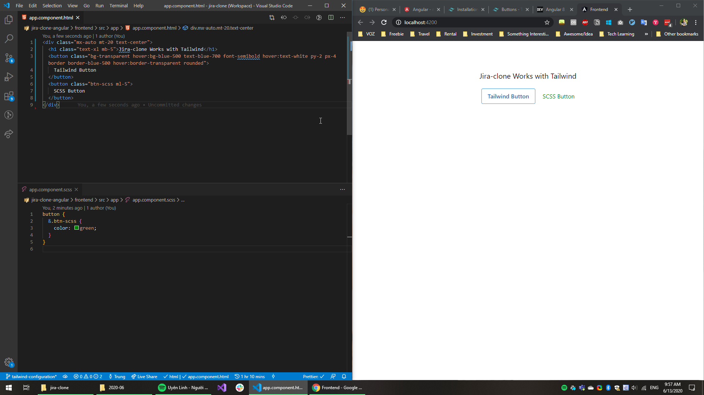

Cú pháp `@apply` cũng chạy khá mượt.

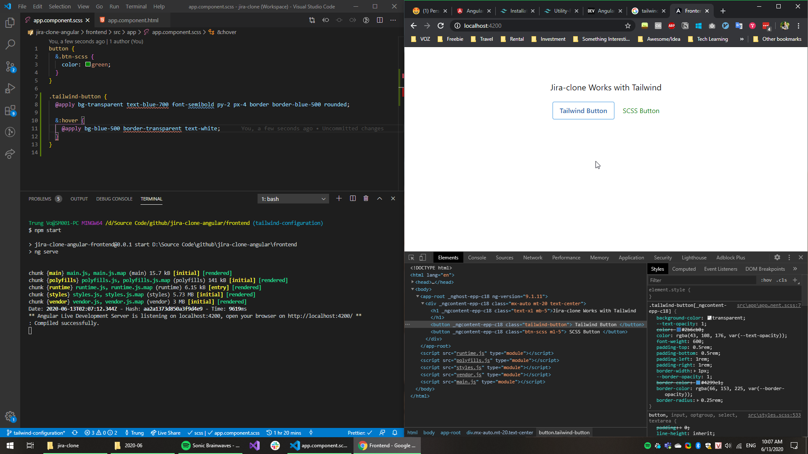

Trông ngon đấy chứ, giờ commit rồi push thôi.

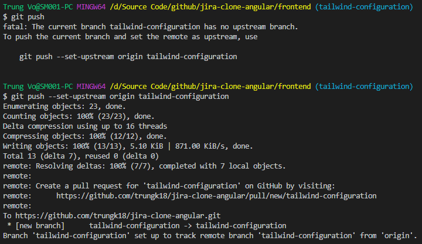

## 4. Cấu hình Prettier

Để code được thống nhất trên nhiều môi trường, mình cài thêm [Prettier for VSCode][prettiervs] và tạo file `.prettierrc` config.

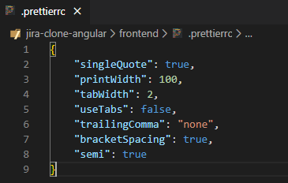

## 5. Cấu hình một số câu lệnh build project

Mở file `package.json` ở folder root (không phải `frontend` folder nhé!) và thêm một số cấu hình như hình dưới. Bước này chỉ cần làm khi bạn cần deploy ứng dụng này lên đâu đấy thôi, chứ hiện tại cũng chưa cần thiết lắm.

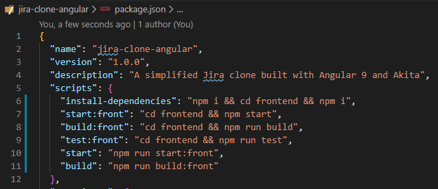

## Lời kết

Xong phần đầu rồi đấy, dài thật 🤣 Code đã dài mà viết ra chắc tốn nhiều thời gian gấp mấy lần. Phần configuration cơ bản coi như đã xong, về sau là có thể nhảy vào code được rồi.

Mình đã cố viết chi tiết nhất có thể, nhưng bài viết này viết bằng tiếng Anh cũng bốn tháng rồi. Chắc có nhiều phần đã không còn valid, anh em đọc có comment thì nhắn mình hoặc tạo PR để fix nhé. Cảm ơn đóng góp của mọi người.

## Source code

- https://github.com/trungk18/jira-clone-angular/tree/tailwind-configuration

## Author

[Trung Vo](https://github.com/trungk18)

`#100DaysOfCodeAngular` `#100DaysOfCode` `AngularVietNamJiraCloneTutorial` `#AngularVietNam100DoC_Day40`

[jira]: https://jira.trungk18.com/
[cmdtut]: https://www.learnenough.com/command-line-tutorial/basics
[interface]: https://www.typescriptlang.org/docs/handbook/interfaces.html
[class]: https://www.typescriptlang.org/docs/handbook/classes.html
[git]: https://www.atlassian.com/git/tutorials/comparing-workflows
[combinelatest]: https://www.learnrxjs.io/learn-rxjs/operators/combination/combinelatest
[router]: https://angular.io/guide/router
[directive]: https://angular.io/guide/attribute-directives
[reactive-forms]: https://angular.io/guide/reactive-forms
[interaction]: https://angular.io/guide/component-interaction
[interpolation]: https://angular.io/guide/template-syntax
[prettier]: https://prettier.io/docs/en/configuration.html
[prettiervs]: https://marketplace.visualstudio.com/items?itemName=esbenp.prettier-vscode
[tailwind]: https://trungk18.com/experience/configure-tailwind-css-with-angular/
[notion]: https://www.notion.so/trungk18/Angular-Jira-clone-Phase-1-79d3205e26024357a75ebfc00aba558e
[jira]: https://jira.trungk18.com/
[cli]: https://cli.angular.io/
