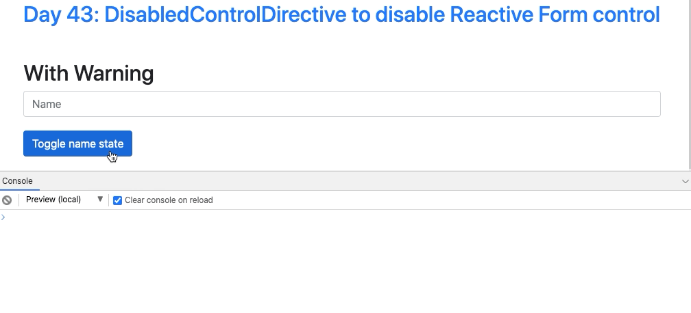
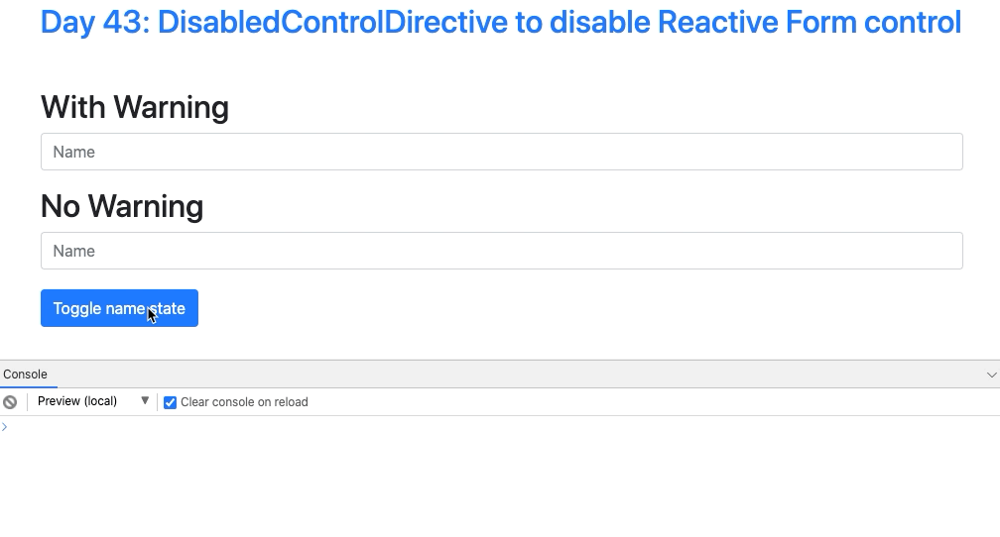

# Day 43: Có thể bạn đã biết - DisabledControlDirective to disable Reactive Form control

## Reactive Forms warning

Khi làm việc với Reactive Forms thì các bạn có thể đã gặp qua warning sau:

```
It looks like you're using the disabled attribute with a reactive form directive. If you set disabled to true
when you set up this control in your component class, the disabled attribute will actually be set in the DOM for
you. We recommend using this approach to avoid 'changed after checked' errors.

Example:
form = new FormGroup({
first: new FormControl({value: 'Nancy', disabled: true}, Validators.required),
last: new FormControl('Drew', Validators.required)
});
```

Code mà trigger warning trên có dạng như sau:

```ts
export class ReactiveFormWarningComponent implements OnInit {
  disabledName = false;
  form: FormGroup;

  constructor(private fb: FormBuilder) {}

  ngOnInit() {
    this.form = this.fb.group({
      name: [''],
    });
  }
}
```

```html
<button (click)="disabledName = !disabledName">Toggle name state</button>
<form [formGroup]="form">
  <input
    class="form-control"
    type="text"
    formControlName="name"
    [disabled]="disabledName"
  />
</form>
```



Và dĩ nhiên, Reactive Forms sẽ ngăn cái disabled attribute kia hoạt động đúng, bạn sẽ ko disable được input này.

## Approach

Có một số cách giải quyết như sau:

### 1. Khai báo FormGroup như warning chỉ dẫn

```ts
this.form = this.fb.group({
  name: [{ value: '', disabled: false }],
});
```

### 2. Dùng FormControl.enable() hoặc FormControl.disable()

```ts
this.form.get('name').enable();
this.form.get('name').disable();
```

Hai cách trên đều hoạt động tốt nhưng lại khá bất cập nếu như bạn muốn điều khiển **disable state của FormControl trên template** như đoạn code bị warn lúc đầu tiên.

```html
<input
  class="form-control"
  type="text"
  formControlName="name"
  [disabled]="disabledName"
/>
```

## Directive approach

Vậy hướng giải quyết là gì? Câu trả lời là dùng một **Directive**.

Mình sẽ gọi là **DisabledControlDirective** nhé. Directive này chỉ được áp dụng khi dùng chung với `formControlName` directive hoặc `formControl` directive. Khi các bạn muốn disable một `FormControl` trên template, dùng `[disableControl]` thay thế cho `[disabled]` bình thường.

```ts
import { Directive, Input } from '@angular/core';
import { NgControl } from '@angular/forms';

@Directive({
  selector: '([formControlName], [formControl])[disabledControl]',
})
export class DisabledControlDirective {
  @Input() set disabledControl(state: boolean) {
    const action = state ? 'disable' : 'enable';
    this.ngControl.control[action]();
  }

  constructor(private readonly ngControl: NgControl) {}
}
```

Apply trên template sẽ có dạng

```html
<form [formGroup]="form">
  <input type="text" formControlName="name" [disabledControl]="disabledName" />
</form>
```

Kết quả đây nha.



## Chú ý

Các bạn lưu ý là nếu một control bị disabled thì value của control này sẽ bị lược bỏ khi truy xuất đến `FormGroup.value`. Muốn lấy value của tất cả controls mà không phụ thuộc vào disable state thì dùng `FormGroup.getRawValue()` nhé.

## Source code

https://stackblitz.com/edit/angular-disable-reactive-form-control-directive?file=src/app/disabled-control.directive.ts

## Author

- [Chau Tran](https://github.com/nartc)

`#100DaysOfCodeAngular` `#100DaysOfCode` `#AngularVietNam100DoC_Day43`
