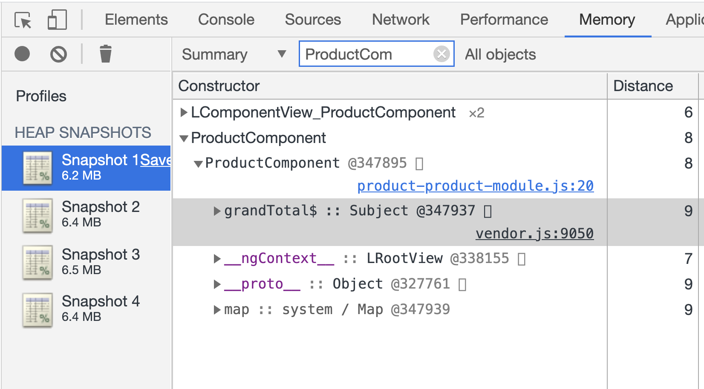
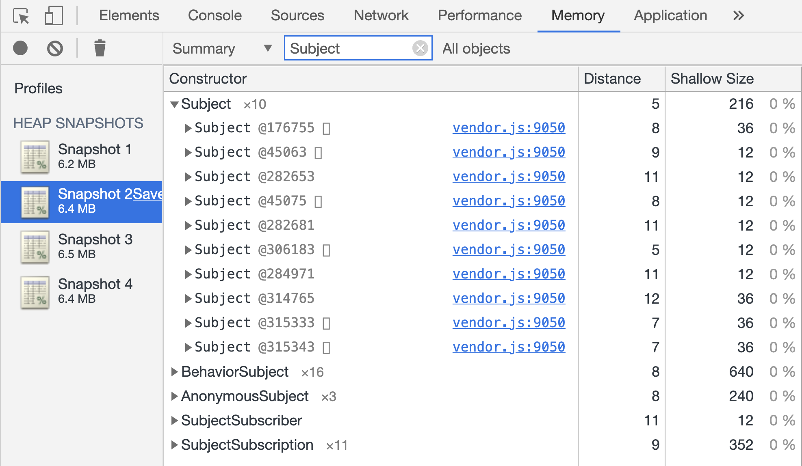
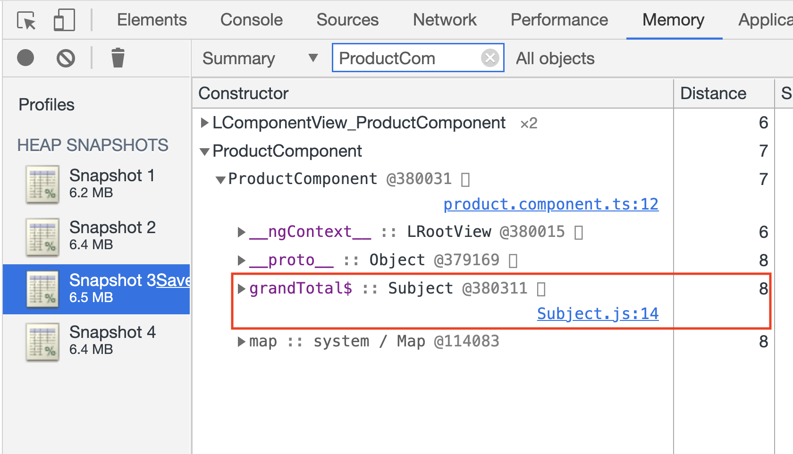
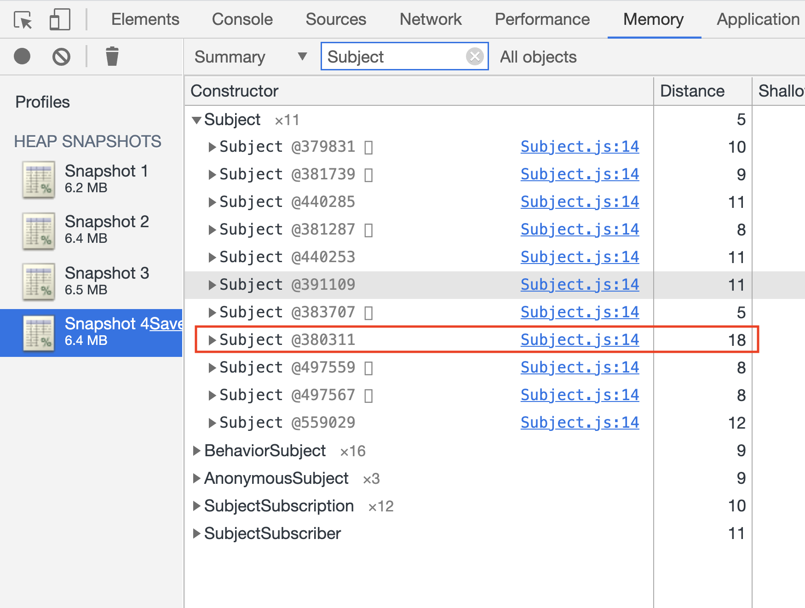
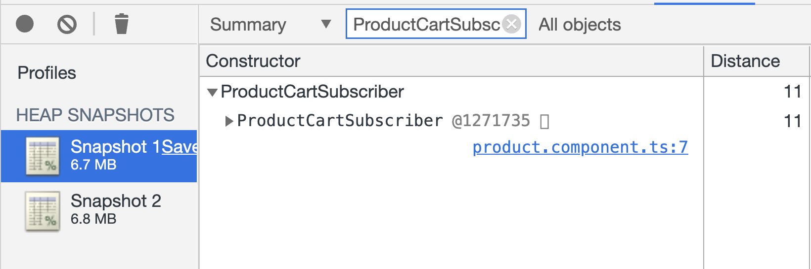
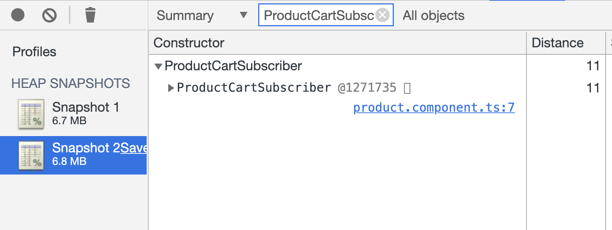
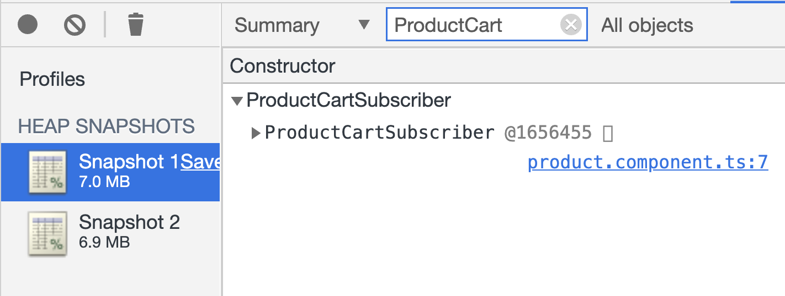
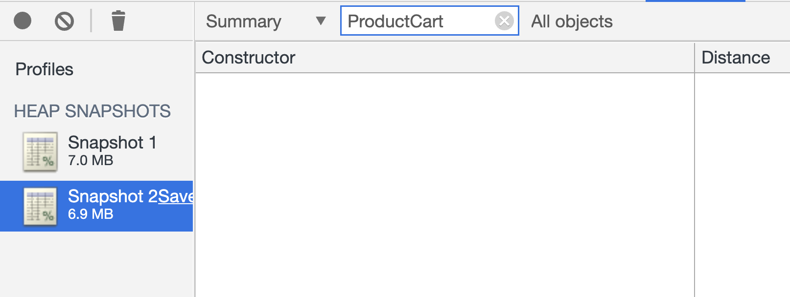

# Day 45: RxJS Trong Angular - Unsubscribe Một Subscription

Khi bạn làm việc với Angular, có những khi bạn thắc mắc "Khi nào chúng ta cần `unsubscribe` một `Subscription`". Tại sao chỗ này thì không unsubcribe cũng không sao. Hoặc có cách nào để đỡ phải unsubcribe hay không?

Hôm nay chúng ta sẽ cùng tìm hiểu một số khí cạnh về việc unsubscribe đó.

## Angular EventEmitter
Như các bạn cũng biết, `Angular EventEmitter` (mình sẽ gọi ngắn gọn là `EventEmitter`) *hiện tại* đang được extends từ một `Subject`. Do đó bạn hoàn toàn có thể query các component instances và subscribe vào các `Output` này, hoặc khi bạn dùng event binding.

Trong các trường hợp trên, nếu bạn dùng event binding thì không cần unsubscribe, vì Angular đã tự làm việc đó cho bạn. Trường hợp bạn từ subscribe thì bạn phải tìm một cách nào đó để unsubscribe, tránh trường hợp có thể bị memory leak.

## Subject Trong Một Component

Giả sử bạn có một component, và bên trong đó bạn khởi tạo một instance của một Subject như ví dụ sau:

```ts
import { Component, OnInit } from '@angular/core';
import { Subject } from 'rxjs';

@Component({
  selector: 'app-product',
  templateUrl: './product.component.html',
  styleUrls: ['./product.component.scss']
})
export class ProductComponent implements OnInit {
  grandTotal$ = new Subject<number>();
  constructor() { }

  ngOnInit(): void {
    this.grandTotal$.subscribe({
      next: grandTotal => {
        console.log(grandTotal);
      }
    });
  }

  calculate(): void {
    this.grandTotal$.next(Math.random() * 1000);
  }
}

```
Đối với trường hợp cụ thể như trên, bạn chỉ subscribe trực tiếp vào Subject mà không thực hiện thêm bất cứ `pipe operators` nào khác thì bạn hoàn toàn không cần thiết phải unsubscribe khi component `OnDestroy`.

Bạn có thể so sánh memory của 2 trường hợp: có và không có ProductComponent. Sau khi component bị destroyed thì không còn tồn tại instance của Subject `grandTotal$` ở trên.




Về cơ bản thì một Subject như trên sẽ chỉ như một function thông thường, khi component bị destroyed thì nó cũng bị trình dọn dẹp rác (GC) loại bỏ đi.

Bây giờ thử với trường hợp khác hơn một chút:

```ts
import { Component, OnInit } from '@angular/core';
import { interval, Subject } from 'rxjs';
import { mergeMap, scan } from 'rxjs/operators';

@Component({
  selector: 'app-product',
  templateUrl: './product.component.html',
  styleUrls: ['./product.component.scss']
})
export class ProductComponent implements OnInit {
  grandTotal$ = new Subject<number>();
  constructor() { }

  ngOnInit(): void {
    this.grandTotal$.pipe(
      mergeMap(total => interval(1000).pipe(
        scan((acc, value) => acc + value, total),
      )),
    ).subscribe({
      next: grandTotal => {
        console.log(grandTotal);
      }
    });
  }
  // những phần còn lại giống như bản ở trên
}
```
Trong phiên bản này, bạn sẽ để ý chúng ta đã fake việc từ Subject ban đầu sẽ tạo ra một stream mới. Stream này có thể không bao giờ dừng lại.

Bây giờ cùng compare memory giống như trên chúng ta đã làm xem sao:



Lúc này, dù component đã bị destroyed nhưng stream inner kia vẫn chạy không dừng. Đây chính là một điểm memory leak. **Do đó bạn phải unsubscribe những stream có thể vẫn chạy sau khi componnent bị destroyed**. Như thế sẽ tránh được memory leak.

```ts
export class ProductComponent implements OnInit, OnDestroy {
  grandTotal$ = new Subject<number>();
  subscription = Subscription.EMPTY; // lưu lại subscription
  constructor() { }

  ngOnInit(): void {
    this.subscription = this.grandTotal$.pipe(
      mergeMap(total => interval(1000).pipe(
        scan((acc, value) => acc + value, total),
      )),
    ).subscribe({
      next: grandTotal => {
        console.log(grandTotal);
      }
    });
  }

  ngOnDestroy(): void {
    this.subscription.unsubscribe(); // call unsubscribe khi component OnDestroy
  }

}
```

## ActivatedRoute

Một trong các biến thể của dạng Observable chúng ta vừa gặp ở phần trước chính là `ActivatedRoute`. Khi chúng ta inject service này vào component. Mỗi khi component được khởi tạo, thì có một instance của `ActivatedRoute` cũng được khởi tạo. Nó có chứa một số Observable như `paramMap`, `queryParamMap`.

Lúc này nếu bạn chỉ subscribe vào như ví dụ đầu tiên với Subject thì nó cũng hoạt động tương tự. Bạn có thể không cần unsubscribe. GC sẽ dọn dẹp nó đi cùng với component instance khi nó bị destroyed.

Nhưng thông thường chúng ta sẽ có thể lấy thông tin nào đó dựa theo *param* hoặc *query* như call AJAX, lắng nghe vào chanel nào đó bằng WebSocket. Do đó bạn sẽ rơi vào ví dụ thứ hai của phần Subject ở trên. Lúc này bạn nên làm tương tự để tránh bị memory leak.
```ts
export class ProductComponent implements OnInit, OnDestroy {
  subscription = Subscription.EMPTY;

  constructor(private activatedRouter: ActivatedRoute) {
  }

  ngOnInit(): void {
    this.subscription = this.activatedRouter.queryParamMap.pipe(
      mergeMap(query => {
        // do something with query
        console.log(query);
        return interval(1000);
      })
    ).subscribe({
      next: data => {
        console.log(data);
      }
    });
  }

  ngOnDestroy(): void {
    this.subscription.unsubscribe();
  }
}
```

## Subscribe Vào Một Observable Từ Một Service
Trong các ví dụ trên bạn sẽ thấy rằng các Observable có vòng đời (life-cycle) tương đương với vòng đời của component chứa nó. Vậy trong trường hợp khác nhau thì sao.

Ví dụ bạn có một service có dạng singleton (nó sẽ tồn tại một instance trong suốt vòng đời của application), và bạn thực hiện subscribe vào một Observable từ service đó mà quên unsubscribe thì điều gì có thể xảy ra.

```ts
export interface CartItem {
  product: Product;
  quantity: number;
}

@Injectable({
  providedIn: 'root'
})
export class CartService {
  private _cart$ = new BehaviorSubject<CartItem[]>([]);
  cart$ = this._cart$.asObservable();
  constructor() { }

  addToCart(product: Product): void {
    const current = this._cart$.getValue();
    const item = current.find(cart => cart.product.id === product.id);
    if (item) {
      item.quantity++;
    } else {
      current.push({
        product,
        quantity: 1
      });
    }
    this._cart$.next([...current]);
  }
}
```

Và ProductComponent sẽ sử dụng:

```ts
// sử dụng class để hỗ trợ profiler dễ dàng hơn
class ProductCartSubscriber extends Subscriber<CartItem[]>{
  next(cartItems: CartItem[]): void {
    console.log(cartItems);
  }
}

export class ProductComponent implements OnInit, OnDestroy {
  constructor(
    private cartService: CartService,
  ) { }

  ngOnInit(): void {
    this.cartService.cart$.subscribe(new ProductCartSubscriber());
  }
}
```

Trong trường hợp trên, kể cả component bị destroyed thì khi `cart$` emit một value mới, phần `next callback` kia vẫn được gọi.

Khi so sánh memory bạn sẽ thấy instance của `ProductCartSubscriber` vẫn còn trong memory:




Do đó, đối với các service có life cycle không tương tự như component hiện tại thì bạn nên unsubscribe khi component OnDestroy.

```ts
export class ProductComponent implements OnInit, OnDestroy {
  subscription = Subscription.EMPTY;

  constructor(
    private cartService: CartService,
  ) { }

  ngOnInit(): void {
    this.subscription = this.cartService.cart$.subscribe(new ProductCartSubscriber());
  }

  ngOnDestroy(): void {
    this.subscription.unsubscribe();
  }
}
```




## HttpClient Có Cần Unsubscribe
HttpClient là một Observable khá đặc biệt. Nó chỉ emit (next) một giá trị, sau đó sẽ `complete`.
Khi một Observable complete, nó sẽ không next tiếp các giá trị khác.

Do đó nếu bạn chỉ subscribe vào chính Observable đó mà không thực hiện các `pipe operators` có thể không bao giờ dừng thì bạn không cần unsubscribe cũng được. Trường hợp ngược lại hoặc bạn không chắc chắn nó có dừng lại không thì bạn nên unsubscribe.

## Avoid Unsubscribe
Như các bạn thấy thì những phần code ở trên chúng ta phải luôn nhớ khi nào cần unsubscribe, nếu không sẽ có thể sinh ra memory leak. Nếu có cách nào đó tiện lợi hơn mà không cần unsubscribe nhưng vẫn đảm bảo không bị memory leak thì tốt hơn cả.

Khi làm việc với Angular, bạn hoàn toàn có thể sử dụng `async pipe` cho một Observable hoặc Promise. Async pipe sẽ chịu trách nhiệm subscribe và unsubscribe Observable đó cho bạn.

Lưu ý: bạn chỉ sử dụng async pipe ở ngoài template, ngoài ra bạn có thể dùng nhiều lần cho một Observable sẽ sinh ra nhiều subscription.

```html
<div *ngIf="stream$ | async as stream">
  Làm gì đó với stream ở đây, ví dụ truy cập vào stream.body: {{stream.body}}
</div>
```

Do việc sử dụng async pipe có những giới hạn ở trên, nên bạn có thể dùng một kỹ thuật khác như kết hợp với `takeUntil` operator ở cuối stream.

```ts
export class ProductComponent implements OnInit, OnDestroy {
  destroyed$ = new Subject<void>();
  constructor(
    private cartService: CartService,
  ) { }

  ngOnInit(): void {
    this.cartService.cart$.pipe(
      takeUntil(this.destroyed$),
    ).subscribe(new ProductCartSubscriber());
  }

  ngOnDestroy(): void {
    this.destroyed$.next();
    this.destroyed$.complete(); // có thể bỏ qua dòng này
  }
}
```

Khi OnDestroy được call, chúng ta sẽ emit một tín hiệu (signal), lúc này stream có sử dụng `takeUntil` sẽ nhận được tín hiệu và ngắt stream phía trên đó.

Lưu ý: luôn đặt `takeUntil` ở cuối, vì nếu bạn đặt lưng chừng thì có thể vẫn có stream phía sau nó sinh ra leak.

Cách làm trên vẫn lặp đi lặp lại phần tạo Subject destroyed. Lúc này chúng ta có thể có một giải pháp khác, đó là tạo một service để làm việc này. Service này sẽ có ràng buộc là có life cycle giống như component.

```ts
import { Injectable, OnDestroy } from '@angular/core';
import { Subject } from 'rxjs';

@Injectable() // not root scope
export class DestroyService implements OnDestroy {
  public destroyed$ = new Subject<void>();
  ngOnDestroy(): void {
    this.destroyed$.next();
    this.destroyed$.complete();
  }
}

@Component({
  selector: 'app-product',
  templateUrl: './product.component.html',
  styleUrls: ['./product.component.scss'],
  providers: [DestroyService], // provide at component level
})
export class ProductComponent implements OnInit, OnDestroy {
  constructor(
    private cartService: CartService,
    private destroy: DestroyService,
  ) { }

  ngOnInit(): void {
    this.cartService.cart$.pipe(
      takeUntil(this.destroy.destroyed$),
    ).subscribe(new ProductCartSubscriber());
  }
}
```

## Tổng Kết
Bài học này chúng ta đã đi qua một số khía cạnh khi bạn quyết định xem có unsubscribe một Subscription hay không. Ngoài ra, một số cái nhìn mới về memory leak trong ứng dụng Angular cũng được giới thiệu.

Xin chào và hẹn gặp lại các bạn trong các ngày tiếp theo.

## Author

- [Tiep Phan](https://github.com/tieppt)

`#100DaysOfCodeAngular` `#100DaysOfCode` `#AngularVietNam100DoC_Day45`

