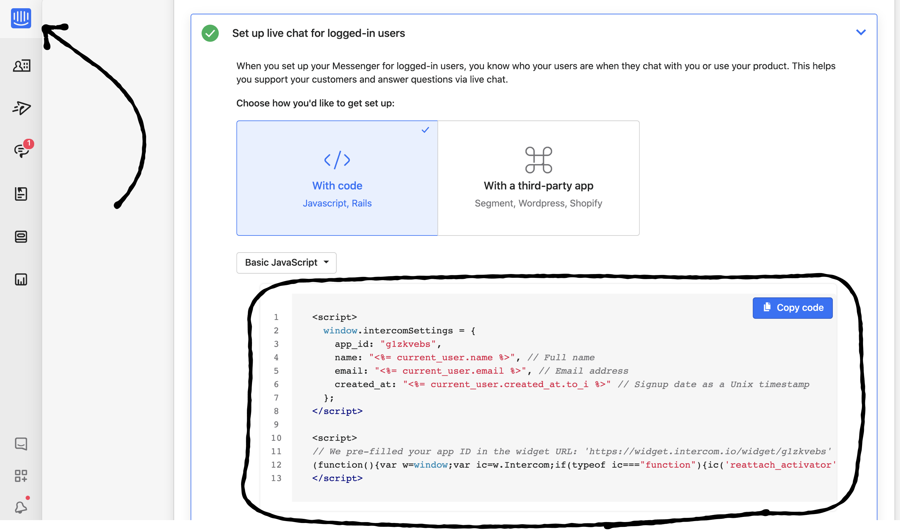
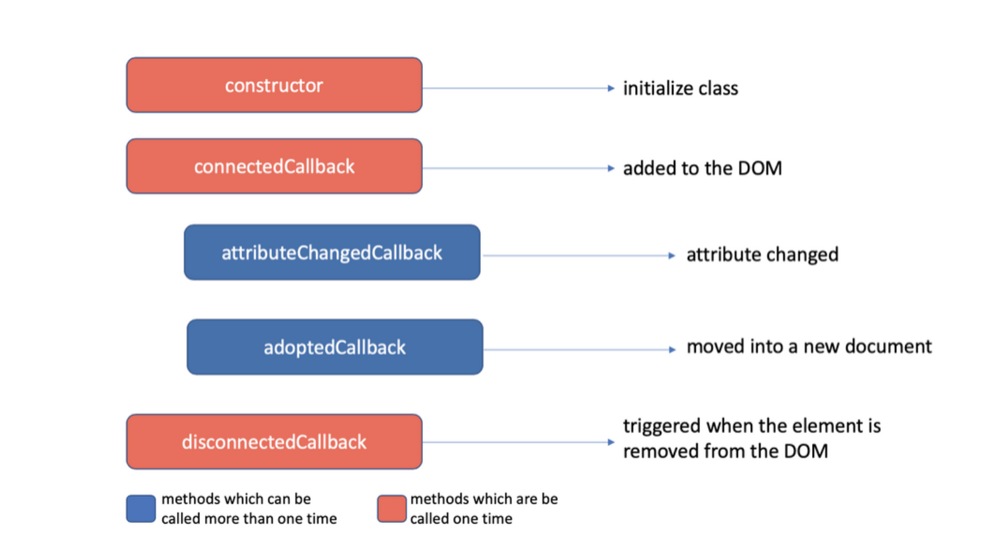

# Day 46: JavaScript Widget và Embedded Script

Tìm hiểu về khái niệm, cách xây dựng và triển khai một JavaScript Widget và Embedded Script

## Mục đích ra đời và trường hợp sử dụng

Ngày nay, việc xây dựng và phát triển ứng dụng web bằng JavaScript đã trở nên cực kỳ phổ biến, gần như có thể nói làm web ngày nay là sử dụng JavaScript.

Một ứng dụng web ngày nay có rất nhiều tính năng và nghiệp vụ đi kèm. Có thể kể đến, khi một website đã được triển khai và cần thêm các tính năng nhẹ nhàng, độc lập với website chính như 1 form thu thập phản hồi khách hàng, 1 form dành cho chăm sóc khách hàng hoặc là 1 dịch vụ chat support. Dựa vào nhu cầu đó, việc xây dựng JavaScript Widget ra đời.

## Khái niệm

JavaScript Widget là một giải pháp để đưa thêm các dịch vụ và tính năng vào 1 trang web có sẵn chỉ bằng việc import 1 đoạn mã nhúng (embedded script) và 1 số config đơn giản.

Script được nhúng vào trang web sẽ thực hiện tất cả những bước cần có để từ đó provide cho trang web làm “host” có được thêm 1 tính năng hoàn chỉnh và chạy độc lập. 

Có thể lấy ví dụ về dịch vụ chat support của intercom cung cấp, chỉ cần chèn thêm 1 số đoạn code vào website hiện có, website sẽ có thêm tính năng chat support hoàn chỉnh được cung cấp bởi intercom trong ứng dụng.




Nguồn: Intercom

## Phương pháp thực hiện và những lưu ý

Việc thực hiện xây dựng một Widget chỉ đơn giản là cung cấp các đoạn mã để chèn thêm DOM element nhằm thực hiện các tính năng mong muốn vào "host" website.

Tuy nhiên, việc chèn thêm các element mới vào website có một số điểm phải lưu ý:

- Xung đột style, script với trang web gốc
- Bundle size của script
- Các feature mà widget sử dụng không được hỗ trợ trên trình duyệt đang chạy website.

Với các lưu ý này, chúng ta có thể có nhiều cách để có thể giải quyết. Với các công nghệ xây dựng web ngày nay thì chúng ta hiện tại đều đã có sẵn các webpack plugin, polyfill tương ứng để giúp chúng ta dễ dàng giải quyết các lưu ý khi thực hiện một JavaScript widget.

## Thực hành xây dựng embedded script với các giải pháp web application quen thuộc

Trong bài viết lần này, chúng ta sẽ tìm hiểu việc xây dựng 1 embedded script với 2 giải pháp trending hiện nay là React và Angular. Với React chúng ta sẽ sử dụng webpack và webpack-cli, còn với Angular chúng ta sẽ sử dụng giải pháp Angular Element để thực hiện.

### React
Với cách triển khai này, ta sẽ thực hiện như 1 React app bình thường, tuy nhiên sẽ cần 1 số cấu hình webpack custom để có thể có đc "thành quả" như ý muốn.

Khác với React app thông thường sẽ sử dụng file `app.tsx` để có thể mount lên DOM thuộc `index.html`, thì ở đây chúng ta sẽ thực hiện entry khác với thông thường.

`embeddable-widget.tsx`
```ts
export default class WidgetBooking {
  static htmlelment: any;

  static mount(
    id: string,
    locale: "en" | "vi" = "en",
    fullscreened: boolean = false,
    divId: string = ""
  ) {
    const component = (
      <Widget id={id} locale={locale} fullscreened={fullscreened} divId={divId} />
    );

    function doRender() {
      if (WidgetBooking.htmlelment) {
        throw new Error("EmbeddableWidget is already mounted, unmount first");
      }
      let htmlelment = null;
      if (divId) {
        htmlelment = document.querySelector(`#${divId}`);
      } else {
        htmlelment = document.createElement("div");
        htmlelment.style.position = "fixed";
        htmlelment.style.bottom = "20px";
        htmlelment.style.right = "20px";
        document.body.appendChild(htmlelment);
      }

      ReactDOM.render(component, htmlelment);
      WidgetBooking.htmlelment = htmlelment;
    }
    if (document.readyState === "complete") {
      doRender();
    } else {
      window.addEventListener("load", () => {
        doRender();
      });
    }
  }

  static unmount() {
    if (!WidgetBooking.el) {
      throw new Error("EmbeddableWidget is not mounted, mount first");
    }
    ReactDOM.unmountComponentAtNode(WidgetBooking.htmlelment);
    WidgetBooking.htmlelment.parentNode.removeChild(WidgetBooking.htmlelment);
    WidgetBooking.htmlelment = null;
  }
}
```

Với webpack ta sẽ có 3 files:

`webpack.config.base.js`

```js
const CleanWebpackPlugin = require("clean-webpack-plugin");
const path = require("path");

module.exports = {
  entry: {
    widget: "./src/outputs/embeddable-widget.tsx",
  },
  output: {
    path: path.resolve(__dirname, "dist"),
    publicPath: "/",
    filename: "[name].js",
    library: "WidgetBooking",
    libraryExport: "default",
    libraryTarget: "window"
  },
  plugins: [new CleanWebpackPlugin()],
  module: {
    rules: [
      {
        test: /\.(js|jsx|ts|tsx)$/,
        exclude: /node_modules/,
        use: [
          {
            loader: "babel-loader",
            options: {
              plugins: []
            }
          },
          "ts-loader"
        ]
      },
      {
        test: /\.(scss|css)$/,
        use: [
          "style-loader",
          "css-loader",
          "sass-loader",
          "cssimportant-loader"
        ]
      }
    ]
  },
  resolve: {
    extensions: ["*", ".js", ".jsx", ".ts", ".tsx"]
  },
  performance: {
    maxEntrypointSize: 2048000,
    maxAssetSize: 2048000
  }
}
```

`webpack.config.dev.js`

```js
const base = require("./webpack.config.base");
const merge = require("webpack-merge");

module.exports = merge(base, {
  mode: "development"
})
```

`webpack.config.prod.js`

```js
const base = require("./webpack.config.base");
const merge = require("webpack-merge");
const webpack = require("webpack");
const MiniCssExtractPlugin = require("mini-css-extract-plugin");
const JavaScriptObfuscator = require("webpack-obfuscator");
const BundleAnalyzerPlugin = require("webpack-bundle-analyzer").BundleAnalyzerPlugin;

module.exports = merge(base, {
  mode: "production",
  plugins: [
    new BundleAnalyzerPlugin({
      analyzerMode: "static"
    }),
    new MiniCssExtractPlugin({
      // Options similar to the same options in webpackOptions.output
      // both options are optional
      filename: "[name].[hash].css",
      chunkFilename: "[id].[hash].css"
    }),
    new JavaScriptObfuscator()
  ]
});

```

Khi đã đầy đủ các cấu hình như vậy, chúng ta sẽ provide các script cần thiết ở trong `package.json` để có thể bắt đầu development cũng như build embedded script

```json
"scripts": {
    "build": "webpack-cli --config ./webpack.config.prod.js",
    "start": "webpack-serve --config ./webpack.config.dev.js --open",
    "test": "jest",
    "test-update-snapshots": "jest --updateSnapshot"
  },
```

Sau khi thành phẩm được phát triển và sẵn sàng được sử dụng, việc sử dụng script tại các website trở nên rất dễ dàng

```html
<script src="./widget.js"></script>
<script>
    WidgetBooking.mount(
        'idXXX',
    "en",
    true // fullscreen
    );
</script>
```

### Angular

Với giải pháp này, bản thân widget vẫn sẽ là 1 angular app bình thường, những điểm cần lưu ý chỉ bắt đầu ở giai đoạn build script để có thể sẵn sàng sử dụng tại website.

Việc khai báo AppModule sẽ có 1 số thay đổi như sau

```ts
import { createCustomElement } from '@angular/elements';

export class AppModule {
  constructor(injector: Injector) {
    const el = createCustomElement(AppComponent, { injector });
    customElements.define('online-booking', el);
  }

  ngDoBootstrap() {}
}
```

Khi ứng dụng angular được build, mọi việc sẽ vẫn như mọi ứng dụng bình thường, tuy nhiên, để phục vụ cho khâu đóng gói script, ta sẽ phải thêm 1 số cấu hình tùy chọn khi build cũng như bổ sung 1 nodejs script nhỏ cho việc đóng gói.

```bash
ng build booking-widget --output-hashing none
```

```js
const fs = require('fs-extra');
const concat = require('concat');

(async function build() {
  const files = [
    './dist/apps/booking-widget/runtime-es2015.js',
    './dist/apps/booking-widget/polyfills-es2015.js',
    './dist/apps/booking-widget/main-es2015.js'
  ];

  const es5Files = [
    './dist/apps/booking-widget/runtime-es5.js',
    './dist/apps/booking-widget/polyfills-es5.js',
    './dist/apps/booking-widget/main-es5.js'
  ];

  await concat(files, './dist/booking-widget.js');
  await concat(es5Files, './dist/booking-widget-es5.js');

  await fs.ensureDir('./dist/assets/booking-widget');

  await fs.copyFile('./dist/apps/booking-widget/styles.css', './dist/assets/booking-widget/styles.css');
})();
```

Mọi việc đã hoàn thành, để sử dụng trong ứng dụng website, ta sẽ thực hiện chèn script như sau:

```html
<script src="./booking-widget.js"></script>
<script src="./booking-widget-es5.js" nomodule defer"></script>
<script>
const widgetElement = document.createElement('div');
widgetElement.innerHTML = `
          <online-booking id="${id}" lang="${lang}" fullscreen="${true}" ></online-booking>`;
document.body.appendChild(widgetElement);
</script>
```

Về mặt testing, cả 2 giải pháp này đề hỗ trợ việc testing như những ứng dụng React và Angular thông thường.

### Web Component

Với giải pháp này đầu tiên ta cần hiểu về việc tạo ra 1 web component, define 1 custom element trên website. Toàn bộ sẽ được thực hiện trong embedded script đc chèn vào trong website cần sử dụng.

Khi chèn embedded script việc khởi tạo và chạy web component sẽ dựa trên 1 lifecycle được cung cấp 1 cách "native" từ trình duyệt như sau:



Nguồn: https://www.thinktecture.com

Do đó mọi việc khởi tạo web component ta sẽ thực hiện trong hàm connectedCallback.

Với giải pháp này, ta có thể kết hợp với giải pháp sử dụng React JS, về bản chất chúng ta vẫn có 1 React app, tuy nhiên sẽ được deliver theo 1 cách khác tới website cần sử dụng.

```jsx
class Widget extends HTMLElement {
  connectedCallback() {
    const mountPoint = document.createElement(div);
    this.attachShadow({ mode: 'open' }).appendChild(mountPoint);

    const id = this.getAttribute('id');
    ReactDOM.render(<WidgetApp id={id} />, mountPoint);
  }
}
customElements.define('embedded-widget', Widget);

// when using
<embedded-widget id="Idxxx"></embedded-widget>
```

Lưu ý: Khi đặt tên define cho custom web component, chúng ta nên đặt tên mang theo logic và ngăn cách bằng dấu “-” do native component các HTML tag chỉ có 1 word.

## Tổng kết
Với các cách triển khai embedded script như trên, dễ thấy, đây là 1 hướng implement rất phù hợp với giải pháp Micro-frontend hiện nay (tham khảo: Day 039). Tuy nhiên, để thêm hoàn thiện, các embedded script cần có 1 giải pháp để trao đổi dữ liệu với nhau. Chúng ta sẽ cùng nhau tìm hiểu giải pháp ở các bài viết tiếp theo.
Như vậy qua chia sẻ ngày hôm nay, chúng ta đã đã được tìm hiểu về JavaScript Widget, các thức thực hiện để có được 1 embedded script nhằm tạo ra các widget như ý muốn.

Chúc các bạn thành công.

## Author

- [Tuan Le](https://github.com/ngoctuanle)

`#100DaysOfCodeAngular` `#100DaysOfCode` `#AngularVietNam100DoC_Day46`

