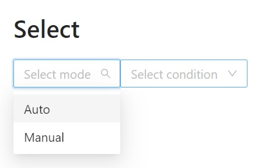
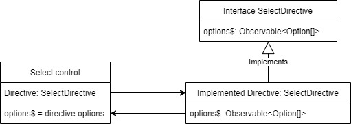

# Day 47: Composition form datasource with Directive

## Introduction
Trong quá trình phát triển một ứng dụng web, chúng ta chắc hẳn đã phải trải qua làm việc với Form không ít thì nhiều. Khi làm việc với form, ta sẽ gặp phải trường hợp một form control với logic rất đơn giản nhưng chỉ khác duy nhất dữ liệu nguồn (data source). Ví dụ, khi làm việc với các select control, chúng ta sẽ phải lặp đi lặp lại việc gọi data source select đó, khi control đó được sử dụng lại ở nhiều nơi khác nhau, việc lặp lại code là không thể tránh khỏi.



Từ đó, tác giả bài viết đã khám phá ra một cách làm có thể giảm thiểu việc lặp lại code khi thực hiện các select control này. Bằng việc kết hợp sử dụng Directive và Inject Token, chúng ta có thể triển khai ý tưởng của tác giả, và thành quả cuối cùng use-case của ý tưởng đc thể hiện như sau:

```html
<form [formGroup]="form">
  <h1>Select</h1>
  <!-- using mode data source -->
  <app-select-control
    appModeDataSource 
    formControlName="mode"
    placeholder="Select mode"
  ></app-select-control>

  <!-- using condition data source -->
  <app-select-control
    appConditionDataSource
    formControlName="condition"
    placeholder="Select condition"
  ></app-select-control>
</form>
```

Qua đoạn code mẫu bên trên, ta có thể thấy, với mỗi data source khác nhau của select, ta có thể chỉ đơn giản thay đổi một directive khác là sẽ có một select control với một list các option khác nhau, rất tiện lợi để phát triển những form gồm nhiều trường, tránh lặp lại code trên component khi thực hiện.

## Concepts

Ý tưởng của tác giả được thể hiện thông qua hình vẽ bên dưới.



Để đảm bảo các datasource directive có thể sử dụng với select control ta cần chuẩn hóa tất cả về cùng một format, ở đây, các implemented directive sẽ đều được implement thông qua một interface để chuẩn hóa.

Trong Select Control, ta sẽ sử dụng datasource directive nên sẽ có một Inject Token tại component để có thể định vị được ta sẽ sử dụng directive nào, qua đó lấy `options$` đã được cung cấp trong Directive để sử dụng cho control.

Chúng ta sẽ cùng tìm hiểu kỹ hơn về ý tưởng này trong phần coding practive tiếp theo dưới đây.

## Coding Practice

### Step 1: Khởi tạo project, cài đặt UI library và khởi tạo các component cần thiết

```sh
ng new composition-datasource-with-directive
```

Trong pratice này chúng ta sẽ sử dụng UI library của ng zorro (ngoài ra có thể sử dụng các UI library khác với cách làm tương tự) nên câu lệnh để cài đặt như sau:

```sh
ng add ng-zorro-antd
```

Component cần thiết trong pratice

```sh
ng g c select-control
```

### Step 2: Thiết lập Control value accessor

Để sử dụng form control với ReactiveForms được dễ dàng hơn ở ví dụ này chúng ta sẽ thiết lập một abstract class để implement các phương thức cần có mà mọi control value accessor sẽ có, nhằm kế thừa khi cần thực hiện một form control mới.

```typescript
@Directive() // Prevent error with Angular 9 and upper
// tslint:disable-next-line:directive-class-suffix
export class BaseControlValueAccessor implements ControlValueAccessor {

  @ViewChild(FormControlDirective, { static: true })
  formControlDirective?: FormControlDirective;
  @Input() formControl?: FormControl;
  @Input() formControlName?: string;

  get control(): FormControl {
    return (
      this.formControl ||
      this.controlContainer.control?.get(this.formControlName as string) as FormControl
    );
  }

  protected constructor(
    protected controlContainer: ControlContainer
  ) {}

  registerOnChange(fn: any): void { ... }

  registerOnTouched(fn: any): void { ... }

  setDisabledState(isDisabled: boolean): void { ... }

  writeValue(obj: any): void { ... }
}
```

### Step 3: Thiếp lập Select control
Sau khi thiết lập Project và các component cần có, ta sẽ thực hiện một số thay đổi tại select-control để có thể apply đc control value accessor đã viết ở trên.

```typescript
@Component({
  selector: 'app-select-control',
  templateUrl: './select-control.component.html',
  providers: [
    {
      provide: NG_VALUE_ACCESSOR,
      useExisting: SelectControlComponent,
      multi: true,
    }
  ],
})
export class SelectControlComponent extends BaseControlValueAccessor {
  @Input() placeholder = '';

  constructor(
    @Optional() controlContainer: ControlContainer,
  ) {
    super(controlContainer);
  }
}
```

### Step 4: Thiết lập Interface và InjectToken
Ta sẽ tạo thêm typing và các constranst cần thiết cho select control đã viết như sau:
```sh
├───select-control
│   │   select-control.component.html
│   │   select-control.component.ts
│   │
│   └───directives
│           constants.ts
│           types.ts

```
`types.ts`
```typescript
import { Observable } from 'rxjs';

export interface Option {
  value: string,
  label: string
}

export interface SelectDirective {
  options$: Observable<Option[]>;
}
```
`constrants.ts`
```typescript
import { InjectionToken } from '@angular/core';

export const SELECT_DIRECTIVE = new InjectionToken('SELECT_DIRECTIVE');
```

### Step 5: Cấu hình cho Select control
Như flow đã nêu trong concept tại select control của chúng ta sẽ phải có Inject token của directive cũng như biến `options$` để có thể sử dụng tại control.

```typescript
@Component({
  selector: 'app-select-control',
  templateUrl: './select-control.component.html',
  providers: [
    {
      provide: NG_VALUE_ACCESSOR,
      useExisting: SelectControlComponent,
      multi: true,
    }
  ],
})
export class SelectControlComponent extends BaseControlValueAccessor {
  @Input() placeholder = '';

  options$: Observable<Option[]> = of([]);

  constructor(
    @Optional() controlContainer: ControlContainer,
    @Optional() @Inject(SELECT_DIRECTIVE) private directive: SelectDirective,
  ) {
    super(controlContainer);
    this.options$ = directive ? directive.options$ : of([]);
  }
}
```

### Step 6: Cấu hình cho Directive datasource
Trong ví dụ của bài viết, ta sẽ có 2 select control tương ứng với 2 field trên form là `mode` và `condition`. Từ đó 2 datasource directive mà ta sẽ sử dụng trong bài viết ẽ là 2 directive mới tên gọi tương ứng với `mode` và `condition`.

```sh
ng g d mode-data-source.directive
ng g d condition-data-source.directive
```

Sau bước này cấu trúc folder mới của chúng ta sẽ như sau:
```sh
├───select-control
│   │   select-control.component.html
│   │   select-control.component.ts
│   │
│   └───directives
│           condition-data-source.directive.ts
│           constants.ts
│           mode-data-source.directive.ts
│           types.ts
```

Sau đây chúng ta sẽ thực hiện các thay đổi tại file `mode-data-source.directive.ts` nhằm giúp file này có được data source tương ứng sẽ trả về cho select. Các thay đổi tại file này sẽ bao gồm directive sẽ được implement dựa theo interface `SelectDirective` đã tạo trước đó nhắm chuẩn hóa dữ liệu đầu vào, gắn directive nào Inject Token `SELECT_DIRECTIVE` đã tạo để có thể sử dụng trong control.

```typescript
@Directive({
  selector: 'app-select-control[appModeDataSource]',
  providers: [
    {
      provide: SELECT_DIRECTIVE,
      useExisting: ModeDataSourceDirective,
    },
  ],
})
export class ModeDataSourceDirective implements SelectDirective {
  options$: Observable<Option[]> = of([
    { label: 'Auto', value: 'auto' },
    { label: 'Manual', value: 'manual' },
  ]);
}
```
Trong đoạn code bên trên, ta đã thực hiện modify selector để cho directive này sẽ chỉ có hiệu lực khi đi kèm đúng với selector của control. 

Sau khi thực hiện tới bước này, ta đã có thể rõ ràng được ý tưởng của tác giả bài viết, trong use-case sử dụng ta sẽ viết code như sau:
```html
<!-- using mode data source -->
<app-select-control
  appModeDataSource
  formControlName="mode"
  placeholder="Select mode"
></app-select-control>
```
Có thể dễ dàng nhận thấy, ta đã thực hiện kết hợp 2 thành phần khi viết là selector của component `app-select-control` và directive `appModeDataSource`. Khi component được khởi tạo, bản thân component sẽ lấy directive thông qua Inject Token trong `constructor` và khi được viết như trên. Token đó thông qua keyword `useExisting` trong `providers` của Directive đã định vị được component sẽ sử dụng Directive nào để kết hợp. Từ đó, kết hợp với việc Directive đã được implement từ 1 interface đã chuẩn hóa, việc get `options$` tương ứng được thực hiện khi khởi tạo component.

Ngoài ra, không chỉ có thể tạo các data source với data fix cứng, ta có thể tạo directive datasource được lấy từ Service, và thông qua các operator của Observable ta có thể chuẩn hóa đúng với yêu cầu của control.

```typescript
@Directive({
  selector: 'app-select-control[appConditionDataSource]',
  providers: [
    {
      provide: SELECT_DIRECTIVE,
      useExisting: ConditionDataSourceDirective,
    },
  ],
})
export class ConditionDataSourceDirective implements SelectDirective {
  constructor(private ref: RefService) {}

  options$: Observable<Option[]> = this.ref.getConditions();
}
```
Và với sự tùy biến của directive ta có thể bổ sung các `@Input` khác tại directive nhắm tùy biến và mở rộng logic cho control trong form.

## Summary
Với ý tưởng này, tác giả đã giúp việc phát triển ứng dụng Web được dễ dàng hơn, giảm thiểu việc lặp lại code khi thực hiện các component có chung logic.

Tuy nhiên, cách triển khai này sẽ thực sự phù hợp với các form cần tái sử dụng nhiều, data source độc lập và ít phụ thuộc vào nhau (với các datasource có sự phụ thuộc ta có thể sử dụng thêm `@Input` để giải quyết vấn đề).

Với các Datasource được trả về đồng thời trong một lần call API, cách thực hiện này vẫn chưa thực sự phù hợp.

## Code sample
- https://github.com/ngoctuanle/composition-datasource-with-directive

## Author
[Tuan Le](https://github.com/ngoctuanle)

`#100DaysOfCodeAngular` `#100DaysOfCode` `#AngularVietNam100DoC_Day47`