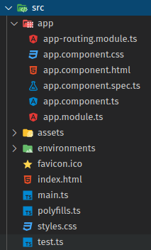

# Day 2: EXPLORE ANGULAR APP

## BRIEF OVERVIEW OF ANGULAR PROJECT STRUCTURE

Angular application project structure would be intimidating to you as a first timer, but actually it's pretty well-organised. Let me walk you through and try my best to prove you that!



Firstly, let's investigate `index.html` file inside of `src` folder: you would see a XML-like tag that doesn't seem like a legit HTML tag, `app-root` in most cases. To make an assumption, this tag seems to be customised tag or selector that wraps around something more intricate that magically render the whole application. As we gradually go to the end of this section, you will get closer to understanding of `app-root`'s true nature.

```html
<!--src/index.html-->

<!--other stuffs-->
<body>
  <app-root></app-root>
</body>
<!--other stuffs-->
```

Next file we'll investigate is `main.ts`, which is the entry point of this Angular application. It's a typical TypeScript module file, which initiated by ES6 import statements that exposes needed utilities to the entire file. There is nothing special about this file; these are just some functions being called to bootstrap our application.

```typescript
/* src/main.ts */

import { enableProdMode } from '@angular/core';
import { platformBrowserDynamic } from '@angular/platform-browser-dynamic';

import { AppModule } from './app/app.module';
import { environment } from './environments/environment';

if (environment.production) {
  enableProdMode();
}

platformBrowserDynamic().bootstrapModule(AppModule)
  .catch(err => console.error(err));
```

Another file worth investigating is `app/app.module.ts`: At the first glimpse, you would have an impression that this module file declares and exports a Angular-specific class component. You may get that idea when seeing `@Component`. This is the syntax of decorator in TypeScript. In this scenario, `Component` decorator acts as a factory adding more configuration into the class being defined below it, thus make this class a `NgModule`. 

> You can learn about *decorators* from [this TS official tutorial link](https://www.typescriptlang.org/docs/handbook/decorators.html).

```typescript
/* src/app/app.module.ts */

import { BrowserModule } from '@angular/platform-browser';
import { NgModule } from '@angular/core';

import { AppRoutingModule } from './app-routing.module';
import { AppComponent } from './app.component';

@NgModule({
  declarations: [
    AppComponent
  ],
  imports: [
    BrowserModule,
    AppRoutingModule
  ],
  providers: [],
  bootstrap: [AppComponent]
})
export class AppModule { }
```

At this point, you might be confused between the concepts of TypeScript module and `NgModule`. A TS module, in the simplest sense, is a set of functions, variables, etc. being logically grouped together. A TS module can import other TS modules; and it can also "export" selected functions, variables, etc. for other modules to consume. On the other hand, `NgModule` is specifically a building block of Angular application, each of them perform an distinct functionality. As you can see, the configuration object of `NgModule` inside `app.module.ts` has an `imports` property to describe which other `NgModule` instances that the root `AppModule` needs to rely upon. 

> At the time of writing, there are heated discussions (to give an instance, [this one](https://github.com/angular/angular/issues/37904)) on whether `NgModule` should be deprecated in the future Angular releases.

Back to the `AppModule` class being mentioned: its `declarations` property is an array currently having only one element named `AppComponent` imported from `app.component.ts`. Conventionally, every element being placed inside this array has to be a *declarable*, which can be either a *component*, a *directive* or a *pipe*. *Directives* and *pipes* will be topics for other posts. For the scope of this tutorial, we will only study *components* hands-on as we attempt to create a new component in the next section. Normally, most of the time we develop an Angular application are spent on writing components.

> Actually, *component* is also a type of *directive*. But for the sake of simplicity, we shouldn't dive deep into their interrelationship yet, and instead, we should think of component as its own kind.

```typescript
/* src/app/app.components.ts */

import { Component } from '@angular/core';

@Component({
  selector: 'app-root',
  templateUrl: './app.component.html',
  styleUrls: ['./app.component.css']
})
export class AppComponent {
  title = 'first-application';
}
```

For each component being defined in Angular, the will be a corresponding *view*, which is defined by [Angular official documentation](https://angular.io/guide/architecture) as "sets of screen elements that Angular can choose among and modify according to your program logic and data". If developing an Angular application is like building a house, then `NgModule`s can be comparable to systems that can be constructed independently from each other, i.e. floor framing system, electrical system, etc. Each of these system need to be made up of multiple components. Analogously, the view of an Angular application is a composition of well-integrated components, i.e. header, navigation bar, content area, sidebar, footer, etc. Each of these components can also be made up of other micro-components. 

`AppComponent` being mentioned earlier is special, because it's the root component of our application. As you can see inside `app.component.ts`, the decorator `Component` specifies what HTML and styling template to be used to render this component's view through `templateUrl` and `styleUrls` config value respectively, an its view tag name through `selector` config value. 

Do you remember the assumption we made very early into this tutorial about `app-root` XML-like tag? Before moving on to the next section, please be sure that you can figure out for yourself what this tag really is. When you're ready, let's try creating a new Angular component!

## CREATING A NEW ANGULAR CLASS 

Placing the to-be-created class inside `AppComponent` is possible, but doing so will result in an overlong code file which is horrible to read and maintain. Hence, we'll try to create `hello.component.ts` file and try to place it in the same folder with `app.component.ts`.

```typescript
/* src/app/hello.component.ts */

export class HelloComponent {}
```

In order to be recognised as a valid Angular component, this class need to be "enpowered" by `Component` decorator as follow.

```typescript
/* src/app/hello.component.ts*/

import { Component } from "@angular/core";
@Component({
  selector: "app-hello",
  template: ` <h2>Hello there!</h2> `,
})
export class HelloComponent {}
```

Could this component be used interchangably with `AppComponent`? Let's experiment by appending this line into `app.component.html` file, and then save it and run the application using `ng serve` command as demonstrated in [day-1 tutorial](../Day001-Installation.md):

```html
<app-hello></app-hello>
```

If your intuition told you that maybe there is something seriously wrong, then it's right: The app's crashed and you're presented with this error message:

```zsh
error NG8001: 'app-hello' is not a known element:

1. If `app-hello` is an Angular component, then verify that it is part of this module.
2. If `app-hello` is a Web Component then add 'CUSTOM_ELEMENTS_SCHEMA' to the '@NgModule.schemas' of this component to suppress this message.
```

We made this mistake by assuming that `HelloComponent` is "smart" enough to automatically know which `NgModule` it belongs to. It's like placing a new employee inside your office and let him figuring out for themself who their manager is and where their office is. To fix this, we have to "attach" this component into `AppModule`, which is the only `NgModule` at the moment.

But where to "attach" it to? I hinted at the answer in the first section, in the part where I introduced *declarables*. You don't have to memorise everything, instead, let your IDE refresh your memory by hovering your cursor over `declaration` keyword inside `app.module.ts`:

  > **The set of components, directives, and pipes (declarables) that belong to this module.**
  
  > `@usageNotes` — The set of selectors that are available to a template include those declared here, and those that are exported from imported NgModules.
  Declarables must belong to exactly one module. The compiler emits an error if you try to declare the same class in more than one module. Be careful not to declare a class that is imported from another module.

I'll leave the properly edited `app.module.ts` below. Before taking a peek, please stop reading for a minute and try to coming up with the answer by your own.

```typescript
/* keep the original import statements and add below import statement */
import { HelloComponent } from './hello.component';

@NgModule({
  declarations: [
    AppComponent,
    HelloComponent
  ],
  /* keep the other stuffs intact */
})
export class AppModule { }
```

The app should be running at expected now. You see, creating a component manually isn't so hard. By "manually", I mean that you can also achieve the same goal of creating `HelloComponent` by using this Angular CLI command:

```shell
ng generate component hello 
```

When I was introduced to this stuff, I found myself asking: "What kind of dark magic is that?" The trick is that Angular has a naming convention for generating new component using that CLI command: if you order a component `${name}` to be initiated, the exported class will be named `${name.charAt(0).toUpperCase() + name.slice(1)}Component` and its CSS cursor will be named `app-${name}`.

That's enough magic for today! For the next day, we'll introduce you **data binding**!

## Youtube Video

[Vietnamese] [https://youtu.be/jgFw8tAgKNs](https://youtu.be/jgFw8tAgKNs)

## HASHTAGS

`#100DaysOfCodeAngular` 
`#100DaysOfCode`
`#AngularVietNam100DoC_Day2`

## REFERENCES

- [https://angular.io/guide/architecture](https://angular.io/guide/architecture)
- [https://angular.io/guide/architecture-modules](https://angular.io/guide/architecture-modules)
- [https://angular.io/guide/architecture-components](https://angular.io/guide/architecture-components)
 

## AUTHORS

- [Tiep Phan](https://github.com/tieppt)
- Translator: [Minh Tu Hoang](https://github.com/m1nhtu99-hoan9)